# 11 - 提示词与输出解析

---

**本章课程目标：**

- 理解 **Prompt** 从「纯字符串」到「多角色消息」的演化，以及 LangChain 中的**消息类型**（System / Human / AI / Tool）。
- 掌握**提示词模板**（PromptTemplate、ChatPromptTemplate）的用法，以及**模型调用方式**（invoke、stream、batch）。
- 理解**输出解析器（Output Parser）**的作用与分类，会使用 **StrOutputParser**、**JsonOutputParser** 及**结构化输出**（TypedDict、Pydantic）。

**前置知识建议：** 已学习第 9 章「LangChain 概述与快速上手」、第 10 章「Model I/O 与 Ollama 本地部署」，了解 Model I/O 三件套（输入、模型、输出）及聊天模型的基本调用方式。

---

## 1、提示词（Prompt）与模型调用

本章对应 Model I/O 中的**输入**与**模型调用**两部分：先建立「Prompt 与消息」的概念，再说明如何用模板组织提示词，以及模型有哪些调用方式（同步/异步、单条/流式/批处理）。

### 1.1 官方资源与入门

#### 1.1.1 DeepSeek 提示词样例

DeepSeek 官方提供了丰富的提示词示例，可用于学习如何写好 system / user 等角色内容：

- **DeepSeek 提示词库**：https://api-docs.deepseek.com/zh-cn/prompt-library/

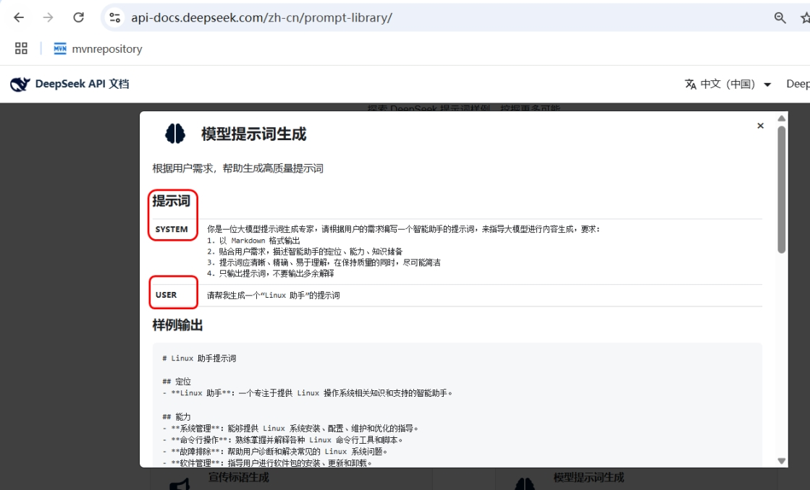

#### 1.1.2 LangChain Prompt 相关文档

- **Prompts API（核心）**：https://reference.langchain.com/python/langchain_core/prompts/  
- **Prompt 工程概念（LangSmith）**：https://docs.langchain.com/langsmith/prompt-engineering-concepts  

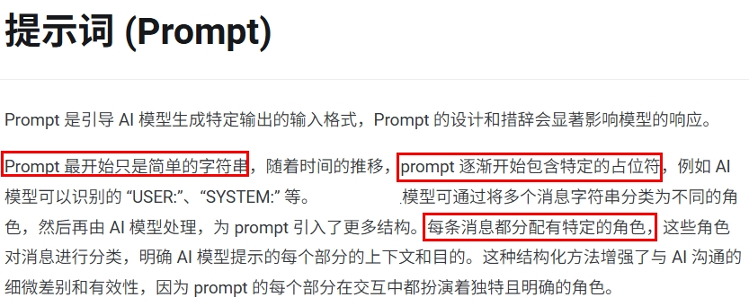

---

### 1.2 从 API 到 Prompt：概念与演化

#### 1.2.1 最简单的理解层次

在与大模型交互时，可以近似理解为三层抽象（从粗到细）：

- **Prompt**：发给模型的完整「输入」。
- **Message**：把输入拆成多条**带角色的消息**（如 system、user、assistant）。
- **String / Question**：最底层的纯字符串问题。

即：**Prompt ≥ Message ≥ String Question**。实际开发中，我们更多用 **Message** 或 **Prompt 模板** 来组织输入，而不是手写一大段字符串。

#### 1.2.2 Prompt 的演化历程

1. **简单纯字符串**  
   最初的 Prompt 就是一段纯文本，直接作为用户问题发给模型。

2. **占位符（Prompt Template）**  
   引入占位符（如 `{topic}`、`{question}`），在运行时把变量填入模板，生成不同的提示。这样同一套模板可复用于多轮、多场景。

3. **多角色消息**  
   将输入拆成不同**角色**（如 system、user、assistant、tool），用于设定模型行为边界、区分用户与助手、支持多轮对话和工具调用。这也是当前聊天模型（如 GPT-3.5/4、通义、DeepSeek）的主流用法。

不同框架对多角色消息的命名略有差异，但思想一致。下图为 **LangChain4J**、**Spring AI**、**LangChain（Python）** 中的对应关系。

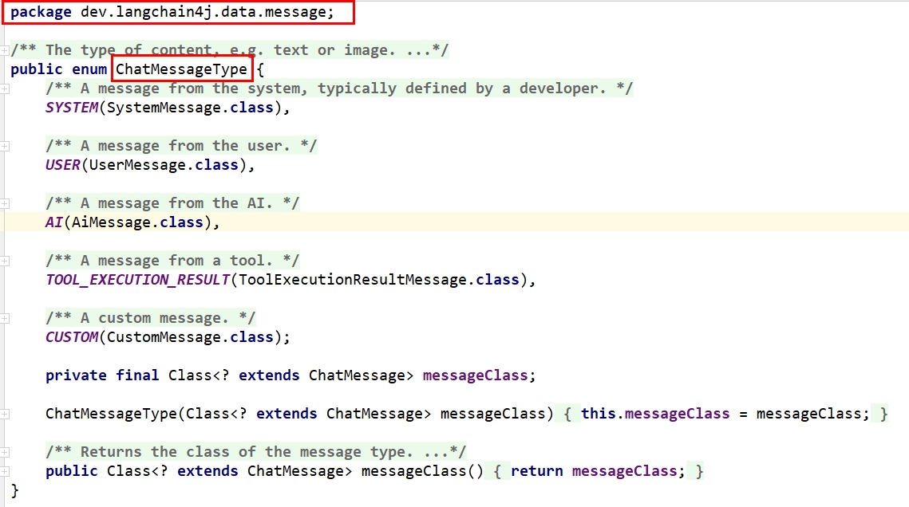

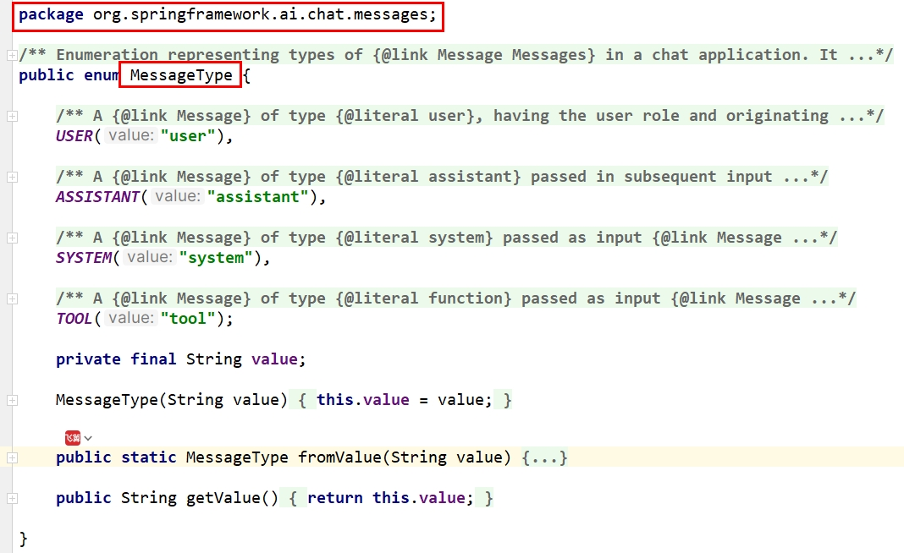

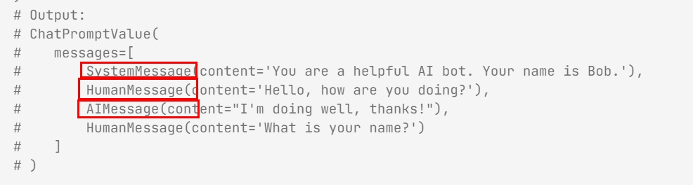

> **说明**：上述多角色设计也常被称为 **Prompt 中的四大角色（Role）**：System、User、Assistant、Tool（或 Function）。System 定规则与身份，User 表用户输入，Assistant 表模型回复，Tool 表工具/函数调用相关消息。

---

### 1.3 消息类型（多角色）：Spring AI 与 LangChain

#### 1.3.1 Spring AI 中的消息类型（参考）

在 Spring AI 中，消息类型与用途大致如下：

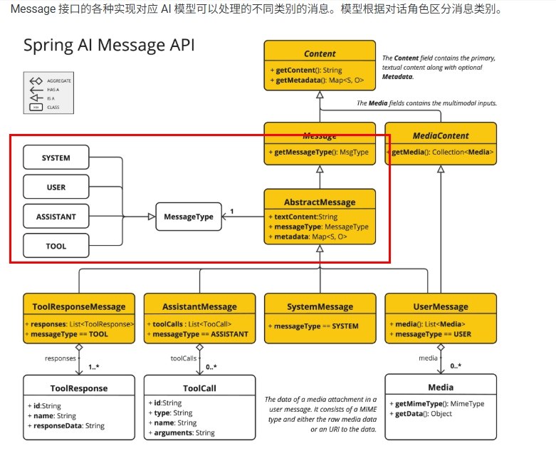

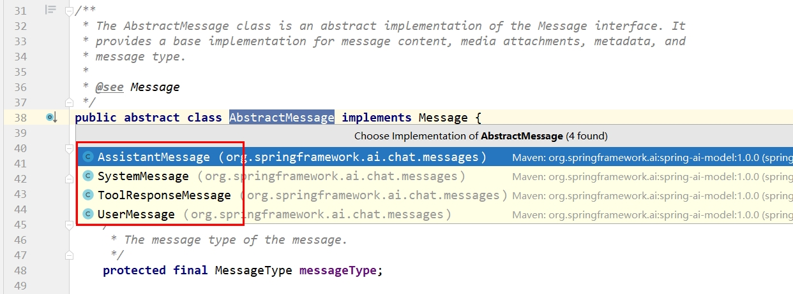

| 角色 / 类型 | 说明 |
| ----------- | ------ |
| **SYSTEM (value: "system")** | 设定 AI 的行为边界、角色与定位，指导模型如何理解和回复输入。 |
| **USER (value: "user")** | 用户原始输入，代表用户向 AI 提出的问题、命令或陈述。 |
| **ASSISTANT (value: "assistant")** | AI 返回的响应，用于多轮对话时保持上下文连贯，也可用于「记忆」中积累历史回答。 |
| **TOOL (value: "tool")** | 与外部服务/工具桥接，用于函数调用（如支付、数据查询等），对应后续章节中的工具调用。 |

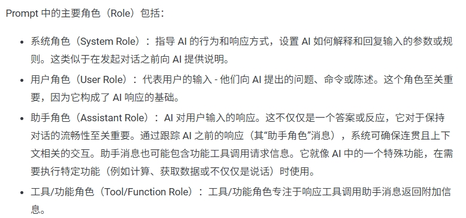

#### 1.3.2 LangChain 中的消息类型

- **文档**：https://docs.langchain.com/oss/python/langchain/messages  

| 类型 | 说明 |
| ------ | ------ |
| **SystemMessage** | 系统消息，`type` 为 `"system"`，用于设定背景与行为规则。注意：并非所有模型提供商都支持 system 消息。 |
| **HumanMessage** | 人类消息，`type` 为 `"user"`，表示用户输入。 |
| **AIMessage** | 模型输出，`type` 为 `"ai"`，可以是纯文本，也可以是工具调用请求。 |
| **ToolMessage (v1.0) / FunctionMessage (v0.3)** | 工具/函数调用结果的消息类型，`type` 为 `"tool"`。 |

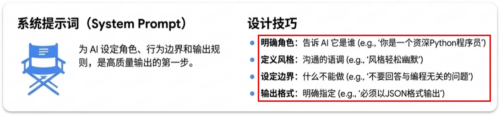

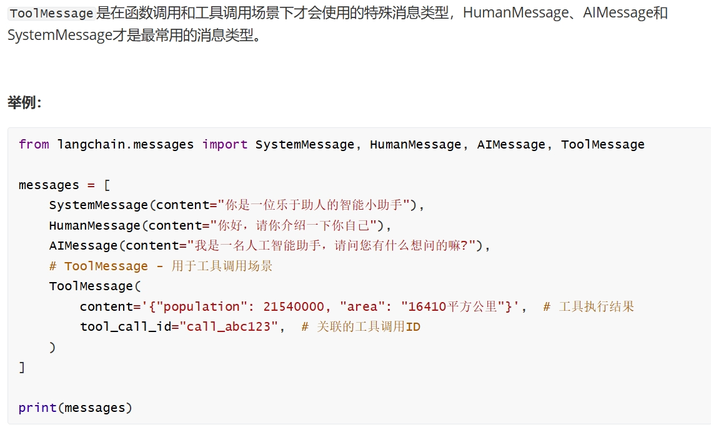

#### 1.3.3 LangChain 0.3 与 1.0 版本对比

部分 API 在 0.3 与 1.0 中有命名或用法差异（如 FunctionMessage → ToolMessage），使用时以当前版本文档为准。

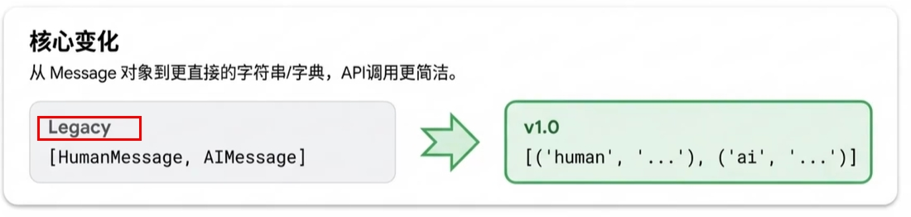

---

### 1.4 模型调用方法

LangChain 的聊天模型提供多种调用方式，适用于「单条请求」「流式输出」「批量请求」以及「同步/异步」等不同场景。具体案例可参考随堂讲解与示例代码。

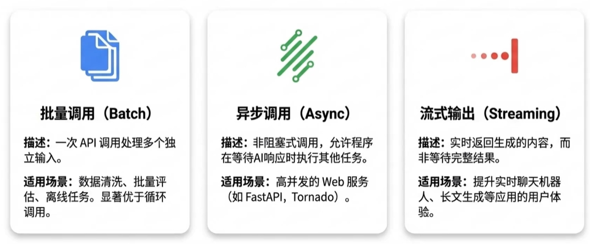

#### 1.4.1 普通调用

- **invoke**：同步调用，传入单条输入，等待模型完整推理完成后返回结果。最常用的单次调用方式。
- **ainvoke**：异步调用，在异步环境（如 `async/await`）中调用模型，适合高并发、大批量请求或 Web 服务（如 FastAPI）中不阻塞主线程。

#### 1.4.2 流式调用

- **stream**：流式响应，模型生成一点就返回一点，内容分批次实时返回给客户端，而不是等全部生成完毕再一次性返回。适合聊天界面「打字机」效果。
- **astream**：异步流式响应，在异步上下文中使用。

#### 1.4.3 批处理

- **batch**：批量输入，一次性向模型提交多条输入并并行处理，提高吞吐量。
- **abatch**：异步批量处理。

#### 1.4.4 小结

| 场景     | 同步       | 异步        |
| -------- | ---------- | ----------- |
| 单条     | invoke     | ainvoke     |
| 流式     | stream     | astream     |
| 批量     | batch      | abatch      |

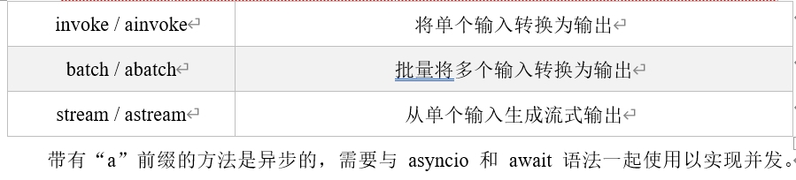

---

### 1.5 提示词模板（PromptTemplate）

#### 1.5.1 为什么需要「模板」

在与大模型交互时，通常不会直接把用户的原始输入丢给模型，而是先做**包装、组织和格式化**，以便更清晰表达意图、更好发挥模型能力。这套结构化的提示构建方式，在 LangChain 中就是**提示词模板（PromptTemplate）**。

应用场景多变，提示词不宜写死。通过**模板 + 变量**，可以在同一套结构下生成不同具体内容，便于复用和维护。

可以类比为函数中的「形参」：模板里用占位符（如 `{name}`），调用时传入实参，得到不同的提示字符串。

```python
def hello(name: str) -> None:
    print(f"你好：{name}")

if __name__ == "__main__":
    hello("李四")
```

#### 1.5.2 提示词模板分类（概览）

- **PromptTemplate**：面向**文本生成模型**的提示词模板，用字符串 + 占位符生成提示。
- **ChatPromptTemplate**：面向**聊天模型**（如 GPT-3.5/4、通义等），支持多角色消息列表，是最常用的对话提示模板。
- **FewShotPromptTemplate**（了解）：少样本学习，在模板中嵌入若干示例，教模型按格式回答。
- **PipelinePrompt**（了解）：将多个子提示按管道方式组合使用。

消息级别的子模板包括：ChatMessagePromptTemplate、SystemMessagePromptTemplate、HumanMessagePromptTemplate、AIMessagePromptTemplate 等，多与 ChatPromptTemplate 配合使用。

#### 1.5.3 PromptTemplate：文本提示词模板

**是什么**：PromptTemplate 是 LangChain 中最基础的模板，针对文本生成模型，通过「模板字符串 + 变量」在 `invoke` 时格式化成最终提示词。

**主要参数**：

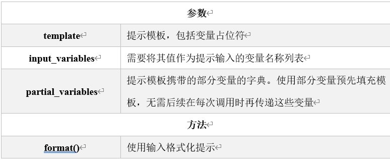

| 参数 | 说明 |
| ------ | ------ |
| **template** | 模板字符串，内含占位符（如 `{name}`）。 |
| **input_variables** | 列表，指定模板中需要**每次传入**的变量名。 |
| **partial_variables** | 字典，用于**预先固定**部分变量，其余变量在调用时再传入。例如先固定「系统角色」，再按用户输入补齐。 |

**常用方法**：

- **format(**kwargs)**：为 `input_variables` 赋值，返回格式化后的**字符串**。若占位符未全部赋值会报错。
- **invoke(input)**：格式化后返回 **PromptValue** 对象，可再用 `.to_string()` 或 `.to_messages()` 查看内容。
- **partial(**kwargs)**：固定部分变量，返回一个**新的提示词模板**，可继续格式化。

**创建方式**：使用构造函数，或 `PromptTemplate.from_template(...)`。  
**组合使用**：可将多个子 Prompt 按逻辑组合，实现多消息、多阶段、多输入源等复杂提示结构。

---

### 1.6 对话提示词模板（ChatPromptTemplate）

#### 1.6.1 是什么

ChatPromptTemplate 是 LangChain 中专门用于**多角色、多轮对话**的提示模板，比普通 PromptTemplate 更贴合 GPT、通义等聊天模型。参数通常是一个「消息」列表，每条消息由 **(role, content)** 或消息类实例组成。

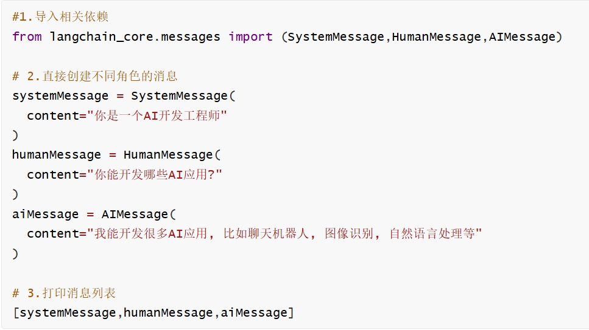

**参数形式**：列表，元素可为：

- **(role, content)** 元组：`role` 为字符串（如 `"system"`、`"human"`、`"ai"`），`content` 为字符串或消息内容结构。
- 字典、Message 实例、各类 MessagePromptTemplate 等。

官方文档中元组格式为：`(role: str | type, content: str | list[dict] | list[object])`。

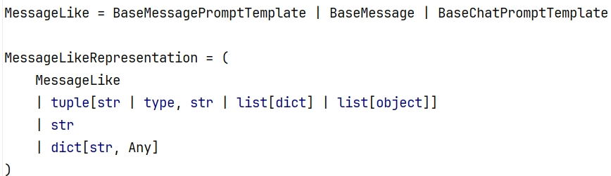

#### 1.6.2 创建方式与版本差异

- 使用**构造函数**传入消息列表。
- 使用 **from_messages**（常用）：`ChatPromptTemplate.from_messages([...])`。

0.3 与 1.0 在部分 API 上存在差异，以当前版本文档为准（参见前文 1.3.3 的对比图）。


#### 1.6.3 实例化参数类型

列表中的每一项可以是：**字符串**、**字典**、**(role, content) 元组**、**Message 类型**（SystemMessage、HumanMessage、AIMessage）、**提示词模板 / 消息模板**等。这样既能写死某条消息，也能用模板或占位符在调用时再填充。

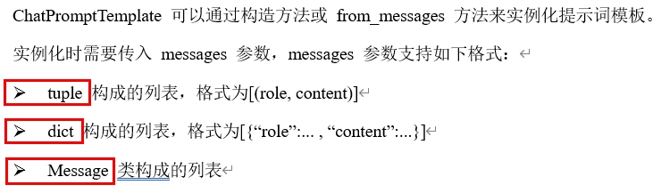

#### 1.6.4 MessagesPlaceholder：消息占位符

**是什么**：当消息条数或内容在**调用时**才确定（例如插入「聊天历史」），可以在 ChatPromptTemplate 中使用 **MessagesPlaceholder**，在 `invoke` 时把对应的消息列表填入占位符位置。

- **显式使用**：在 `from_messages` 中加入 `MessagesPlaceholder(variable_name="history")`，调用时传入 `{"history": [ ... ]}`。
- **隐式使用**：通过变量名与占位符约定，在调用时传入消息列表。

---

### 1.7 外部加载 Prompt

可以将提示词保存为 **JSON、YAML** 等格式文件，在代码中根据路径加载并得到 Prompt 或模板。这样便于对提示词做版本管理、多人协作和 A/B 测试，而不必把长文本写死在代码里。

---

## 2、输出解析器（Output Parser）

本章对应 Model I/O 中的**输出**部分：把模型的**文本输出**转成程序易用的**结构化数据**（如字符串、JSON、强类型对象）。

### 2.1 官网与为什么需要输出解析器

- **Output Parsers API**：https://reference.langchain.com/python/langchain_core/output_parsers/  
- **结构化输出（Structured Output）**：https://docs.langchain.com/oss/python/langchain/models#structured-output  

大模型返回的通常是**纯文本**。而在实际应用中，我们往往需要**固定格式**的数据（如 JSON、列表、对象）以便做后续逻辑、入库或展示。**输出解析器（Output Parser）** 负责把模型的原始输出转换成所需格式，并可在解析失败时进行重试或修复，是 Model I/O 中不可或缺的一环。

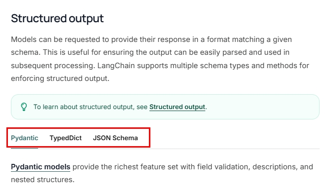

---

### 2.2 什么是输出解析器

**输出解析器**是 LangChain 中位于「模型输出」和「最终数据」之间的**中间层**，主要作用包括：

- **指定格式输出**：将模型文本转换为 JSON、XML、YAML 等目标格式。
- **数据校验**：确保输出符合预期的结构和类型。
- **错误处理**：解析失败时进行重试或修正。
- **格式说明注入**：通过 **get_format_instructions()** 等方法生成「希望模型输出何种格式」的说明文本，拼入提示词，引导模型直接生成可解析的内容。

---

### 2.3 输出解析器分类与两大方法

#### 2.3.1 分类概览

LangChain 提供多种输出解析器，如：StrOutputParser、JsonOutputParser、PydanticOutputParser、StructuredOutputParser 等，分别对应「纯字符串」「JSON」「Pydantic 模型」「自定义结构」等场景。

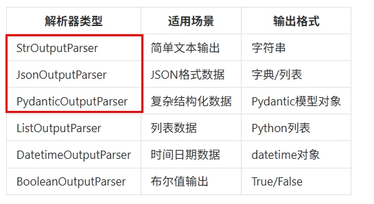

#### 2.3.2 两大常用方法

- **parse(result)**：将模型返回的**原始结果**（如 AIMessage）解析成**指定格式**并返回（如 dict、str、Pydantic 对象）。
- **get_format_instructions()**：返回一段**格式说明字符串**，描述「希望模型输出成什么样子」（如 JSON 的键与类型）。把这段说明拼进 Prompt，可提高模型输出可解析的成功率。

---

### 2.4 常用输出解析器用法

#### 2.4.1 StrOutputParser（字符串解析器）

**是什么**：LangChain 中最简单的输出解析器，从模型返回中取出 **content** 字段并转为字符串，不做额外结构解析。

**示例用法**（结合 ChatPromptTemplate + init_chat_model）：

```python
"""
字符串解析器 StrOutputParser：将模型输出的 content 转为字符串。
"""
from langchain_core.output_parsers import StrOutputParser
from langchain_core.prompts import ChatPromptTemplate
import os
from langchain.chat_models import init_chat_model
from loguru import logger

chat_prompt = ChatPromptTemplate.from_messages([
    ("system", "你是一个{role}，请简短回答我提出的问题"),
    ("human", "请回答：{question}")
])

prompt = chat_prompt.invoke({"role": "AI 助手", "question": "什么是 LangChain？简洁回答 100 字以内"})
logger.info(prompt)

model = init_chat_model(
    model="qwen-plus",
    model_provider="openai",
    api_key=os.getenv("aliQwen-api"),
    base_url="https://dashscope.aliyuncs.com/compatible-mode/v1"
)

result = model.invoke(prompt)
logger.info(f"模型原始输出：\n{result}")

parser = StrOutputParser()
response = parser.invoke(result)
logger.info(f"解析后的结构化结果：\n{response}")
logger.info(f"结果类型：{type(response)}")
```

#### 2.4.2 JsonOutputParser（JSON 解析器）

**是什么**：将模型的**自由文本输出**解析为**结构化 JSON**。

**两种常见用法**：

1. **在提示词中直接写明**「请以 JSON 格式返回，包含字段 xxx、yyy」。
2. **借助 JsonOutputParser.get_format_instructions()**：用该方法得到一段格式说明，拼进 Prompt，让模型按该格式输出，再用 `JsonOutputParser().parse(...)` 解析。

案例可参考随堂代码：`JsonOutputParserDemo.py`（手写提示词）、`JsonOutputParser_GetFormatInstructions.py`（使用 get_format_instructions）。

---

### 2.5 输出解析器进阶：结构化输出（Pro+）

当需要**强类型、带校验**的结构时，可使用「结构化输出」：用 **TypedDict** 或 **Pydantic** 定义目标结构，由 LangChain 生成格式说明并解析模型输出为对应类型。

- **官方文档**：https://docs.langchain.com/oss/python/langchain/models#structured-output  


#### 2.5.1 TypedDict（Python 3.8+）

使用标准库 **typing.TypedDict** 定义期望的 JSON 结构，LangChain 可根据该结构生成格式说明并解析。

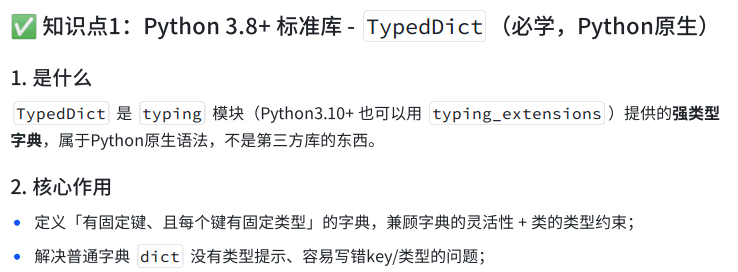

#### 2.5.2 Annotated（Python 3.9+）与 Pydantic

- **Annotated**：在类型注解中附加元数据（如描述、约束），便于生成更精确的格式说明。  
- **Pydantic**：通过 Pydantic 模型定义结构，支持校验与默认值，LangChain 可据此生成提示并解析为 Pydantic 对象。

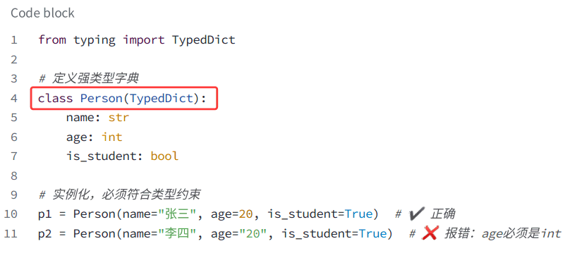

**案例参考**：  
- TypedDict：`StructuredOutput_TypedDict.py`、`AnnotatedTypedDict.py`  
- Pydantic：`StructuredOutput_Pydantic.py`、`AnnotatedPydantic.py`  

---

**本章小结：**

- **提示词**：从纯字符串到多角色消息（System / User / Assistant / Tool），LangChain 用 **PromptTemplate** 与 **ChatPromptTemplate** 管理输入；模型支持 **invoke / stream / batch** 及异步版本。
- **输出解析**：**Output Parser** 把模型文本转为结构化数据；**StrOutputParser**、**JsonOutputParser** 满足大部分基础需求；**TypedDict / Pydantic** 可实现强类型结构化输出，便于后续业务处理。

与第 10 章的 Model I/O 三件套结合：**输入**用本章的 Prompt 与模板，**模型**用第 10 章的接入方式，**输出**用本章的 Parser，即可形成完整的「提问 → 推理 → 结构化结果」链路。
