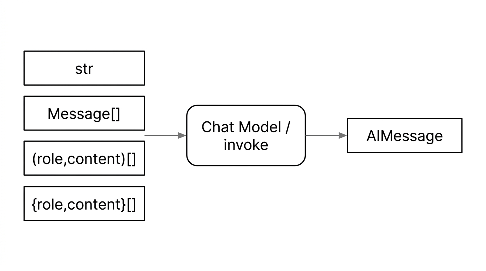

# 13 - 提示词与消息模板

---

**本章课程目标：**

- 理解 **Prompt** 从「纯字符串」到「多角色消息」的演化，以及 LangChain 中的**消息类型**（System / Human / AI / Tool）；知道 **`invoke` 还可接收元组列表、OpenAI 式 `role`/`content` 字典列表**，返回值多为 **`AIMessage`**。
- 掌握**提示词模板**（PromptTemplate、ChatPromptTemplate）的用法，以及**模型调用方式**（invoke、stream、batch）。
- 会从 **JSON / YAML** 文件加载提示词，便于版本管理与协作。

**前置知识建议：** 已学习 [第 9 章 LangChain 概述与架构](9-LangChain概述与架构.md)、[第 10 章 快速上手与 HelloWorld](10-LangChain快速上手与HelloWorld.md)、[第 11 章 Model I/O 与模型接入](11-Model-I-O与模型接入.md)，了解 Model I/O 三件套（输入、模型、输出）及聊天模型的基本调用方式。若使用本地开源模型，可先浏览 [第 12 章 Ollama 本地部署与调用](12-Ollama本地部署与调用.md)。

---

## 1、Prompt 简介

本章对应 [Model I/O](11-Model-I-O与模型接入.md) 中的**输入格式化（Format）**与**模型调用（Predict）**两部分：第 1 节明确 **Prompt** 是什么；第 2 节说明调用聊天模型时 **`invoke` 等可传入哪些类型的对象**；第 3 节归纳各类 **Message** 的含义；第 4 节归纳 **invoke / stream / batch** 等调用方式；第 5～7 节讲 **PromptTemplate / ChatPromptTemplate** 等模板；第 8 节从 **JSON / YAML** 文件加载提示词。

### 1.1 定义

**Prompt（提示词）** 就是你**发给大模型的那段输入**。

你问一句「什么是 LangChain？」，这句话就是一次 Prompt；你让模型「用 Python 写个冒泡排序」，这也是 Prompt。模型会根据你给的这段话来决定怎么回答，所以**写得好不好、写什么内容，会直接影响模型的输出**。

在实际开发里，Prompt 会从「简单一句问话」慢慢变成更结构化的形式：比如先写死一句「你是法律助手」，再写用户的问题（**多角色**）；或者把问题里的关键词留空，运行时再填（**占位符 / 模板**）。

需要查「怎么写好 system / user 内容」或「LangChain 里模板、消息怎么用」时，可参考：

- **DeepSeek 提示词库**（官方示例，学写多角色提示）：https://api-docs.deepseek.com/zh-cn/prompt-library/
- **LangChain Prompts API**（模板与消息的代码用法）：https://reference.langchain.com/python/langchain_core/prompts/
- **Prompt 工程概念**（LangSmith，偏设计与最佳实践）：https://docs.langchain.com/langsmith/prompt-engineering-concepts


---

## 2、调用大模型的入参类型

**怎么选入参形态**：
直接传入**字符串**时，等价于「只有一句用户话」，适合**不需要保留多轮角色结构**的快捷生成。

需要**系统人设 + 用户问题**、或要把**历史对话**按角色交给模型时，更稳妥的做法是传入**消息列表**——列表在语义上就是一段「聊天记录」：每一条的**类型**对应不同**角色**（system / user / assistant / tool），模型会按角色解释上下文，而不是把一切都当成同一段纯文本。

### 2.1 入参形态总览

同一次 `invoke`，左侧可以是多种类型的输入，中间经聊天模型处理，右侧典型返回为 `AIMessage`（正文一般用 `.content` 读取）。



对应关系：

| 入参形态                                                        | 调用时大致长什么样                                      | 对应正文                                                                                       |
| --------------------------------------------------------------- | ------------------------------------------------------- | ---------------------------------------------------------------------------------------------- |
| `str`                                                           | `model.invoke("……")`，传入单个字符串                    | 2.2；2.3 在 `template.format(...)` 之后得到的也是字符串，invoke 时与 2.2 同属图中 `str` 这一支 |
| 消息对象列表（如 `HumanMessage`、`SystemMessage` 等组成的列表） | `model.invoke([SystemMessage(...), HumanMessage(...)])` | 2.4（含 `ChatPromptValue(...).to_messages()`，本质仍是消息列表）                               |
| `(role, content)` 元组列表                                      | `[("system", "..."), ("user", "...")]`                  | 2.5（元组写法）                                                                                |
| `{role, content}` 字典列表                                      | `[{"role":"system","content":"..."}, ...]`              | 2.5（OpenAI 风格字典写法）                                                                     |

[LLM_Invoke_InputTypes.py](案例与源码-2-LangChain框架/04-prompt/invoke/LLM_Invoke_InputTypes.py ":include :type=code")

### 2.2 写法一：纯字符串

把整段说明写在一个字符串里交给模型，适合快速试接口、或单轮一句话任务。

**与上文示意图对应**：属于 **`str`** 入参——整段文本作为一次调用的输入（在模型侧常被视作单条用户消息）。

```python
resp = model.invoke("用一句话解释什么是 LangChain")
print(resp.content)
```

### 2.3 写法二：模板 + 占位符

同一套句式只改 `{topic}`、`{question}` 等变量，避免复制粘贴长文本。`format` 之后得到**字符串**，再 `invoke`（与第 **6** 节 `PromptTemplate` 一致）。

**与上文示意图对应**：`invoke` 收到的仍是 `str`，与 **2.2** 同属图中左侧「字符串」这一支；本节与 **2.2** 的差别在于**是否用模板管理可变片段**，而不是入参类型不同。

```python
from langchain_core.prompts import PromptTemplate

template = PromptTemplate.from_template(
    "用不超过 50 字介绍：{topic} 是什么？"
)
prompt_str = template.format(topic="LangChain")
resp = model.invoke(prompt_str)
print(resp.content)
```

### 2.4 写法三：多角色消息列表

把「人设 / 用户话 / 历史回复」拆开成不同 **Message**，模型能稳定区分角色；多轮时在列表末尾继续追加 `AIMessage`、`HumanMessage` 即可。

**与上文示意图对应**：`invoke` 传入的是 **消息对象列表**（图中「`Message[]` / 列表里每条带角色」那一类），也是多轮对话、系统提示 + 用户问题并存时的**推荐写法**。

```python
from langchain_core.messages import SystemMessage, HumanMessage, AIMessage

messages = [
    SystemMessage(content="你是只回答技术问题的助手，回答要简短。"),
    HumanMessage(content="什么是 LangChain？"),
    # 多轮示例（取消注释可试）：
    # AIMessage(content="LangChain 是用于编排 LLM 应用的框架……"),
    # HumanMessage(content="它和直接调 API 有什么区别？"),
]
resp = model.invoke(messages)
print(resp.content)
```

与 **写法三** 等价的一种包装：链或模板里有时会把消息列表放进 `ChatPromptValue`，再 `.to_messages()` 交给 `invoke`，本质仍是「多角色列表」。

```python
from langchain_core.messages import SystemMessage, HumanMessage, AIMessage
from langchain_core.prompt_values import ChatPromptValue

prompt_value = ChatPromptValue(
    messages=[
        SystemMessage(content="You are a helpful AI bot. Your name is Bob."),
        HumanMessage(content="Hello, how are you doing?"),
        AIMessage(content="I'm doing well, thanks!"),
        HumanMessage(content="What is your name?"),
    ]
)
resp = model.invoke(prompt_value.to_messages())
```

### 2.5 写法四：元组列表与字典列表

除 `SystemMessage`、`HumanMessage` 等类之外，聊天模型的 `invoke` 通常还支持两种**等价**的简写。

**与上文示意图对应**：分别对应图中的 **`(role, content)` 元组列表**与 **`{role, content}` 字典列表**；语义上与 **2.4** 的多角色列表一致，只是更贴近 OpenAI 式 JSON / 手写列表习惯。

- **元组列表**：每项为 `(角色, 正文)`，例如 `("system", "...")`、`("user", "...")`。
- **字典列表**：OpenAI 式 `{"role": "...", "content": "..."}`，便于与 JSON 日志、网关透传的数据结构对齐。

```python
import os
from langchain_openai import ChatOpenAI

llm = ChatOpenAI(
    model="gpt-4o-mini",
    temperature=0.0,
    base_url=os.getenv("OPENAI_BASE_URL"),
    api_key=os.getenv("OPENAI_API_KEY"),
)

# 以下两种入参在聊天模型侧通常等价
messages_as_tuples = [
    ("system", "你是一个专业的数学助手"),
    ("user", "你好，你是谁"),
]
messages_as_dicts = [
    {"role": "system", "content": "你是一个专业的数学助手"},
    {"role": "user", "content": "你好，你是谁"},
]

resp = llm.invoke(messages_as_tuples)
print(type(resp))   # <class 'langchain_core.messages.ai.AIMessage'>
print(resp.content)

resp2 = llm.invoke(messages_as_dicts)
print(resp2.content)
```

无论上面哪一种入参，**同步 `invoke` 的返回值类型一般都是 `AIMessage`**，正文在 `.content`；与 **2.1** 示意图右侧一致。

### 2.6 扩展：Java 生态中的多角色

**LangChain4J**、**Spring AI** 用枚举表达与 Python 相同的角色思想；本课程正文以 LangChain Python 为主，下列源码仅供对照。

**LangChain4J：**

```java
package dev.langchain4j.data.message;

public enum ChatMessageType {
    /** 系统消息，通常由开发者设定 */
    SYSTEM(SystemMessage.class),
    /** 用户消息 */
    USER(UserMessage.class),
    /** AI 模型回复 */
    AI(AiMessage.class),
    /** 工具执行结果（Agent 将工具输出回传给模型时使用） */
    TOOL_EXECUTION_RESULT(ToolExecutionResultMessage.class),
    /** 自定义消息类型 */
    CUSTOM(CustomMessage.class);

    private final Class<? extends ChatMessage> messageClass;

    ChatMessageType(Class<? extends ChatMessage> messageClass) {
        this.messageClass = messageClass;
    }

    public Class<? extends ChatMessage> messageClass() {
        return messageClass;
    }
}
```

**Spring AI：**

```java
package org.springframework.ai.chat.messages;

public enum MessageType {
    /** 用户角色消息 */
    USER("user"),

    /** 助手（AI）角色消息，用于多轮输入中的后续消息 */
    ASSISTANT("assistant"),

    /** 系统消息，作为输入传入 */
    SYSTEM("system"),

    /** 工具/函数类型消息，作为输入传入 */
    TOOL("tool");

    private final String value;

    MessageType(String value) {
        this.value = value;
    }

    /** 根据字符串值解析为枚举，便于与 API / JSON 互转 */
    public static MessageType fromValue(String value) { ... }

    public String getValue() {
        return this.value;
    }
}
```

> **说明**：多角色设计也常被称为 **System、User、Assistant、Tool** 四类角色。System 定规则与身份，User 为用户输入，Assistant 为模型回复，Tool 为工具/函数调用相关消息（详见 **第 3 节**）。

---

## 3、入参的消息类型

- **文档**：https://docs.langchain.com/oss/python/langchain/messages （英文）；https://docs.langchain.org.cn/oss/python/langchain/messages (中文)

| 类型                                        | 说明                                                                                                                                                 |
| ------------------------------------------- | ---------------------------------------------------------------------------------------------------------------------------------------------------- |
| SystemMessage                               | 系统消息，`type` 为 `"system"`。常作为初始指令：设定语气、角色与回答方针（即「系统提示词」）。注意：并非所有模型提供商都支持或同等对待 system 消息。 |
| HumanMessage                                | 人类 / 用户消息，`type` 为 `"user"`，表示用户输入。需要时可在消息对象上附带额外元数据（如 `additional_kwargs`，进阶用法见官方文档）。                |
| AIMessage                                   | 模型输出，`type` 为 `"ai"`。除文本内容外，还可携带工具调用请求、token 用量等元数据（随模型与集成版本而异）。                                         |
| ToolMessage (v1.0) / FunctionMessage (v0.3) | 工具/函数调用结果的消息类型，`type` 为 `"tool"`，表示某次工具执行的输出（多配合 `tool_call_id` 与前面的 `AIMessage` 里工具调用对应）。               |

**SystemMessage 说明与设计技巧**

- **系统提示词（System Prompt）**：为 AI 设定角色、行为边界和输出规则，是高质量输出的第一步。
- **设计技巧**：
  - **明确角色**：告诉 AI 它是谁（例如：「你是一个资深 Python 程序员」）。
  - **定义风格**：沟通的语调（例如：「风格轻松幽默」）。
  - **设定边界**：什么不能做（例如：「不要回答与编程无关的问题」）。
  - **输出格式**：明确指定（例如：「必须以 JSON 格式输出」）。

**消息类型小结与 ToolMessage 举例**

ToolMessage 是在**函数调用 / 工具调用**场景下才会使用的特殊消息类型；**HumanMessage、AIMessage、SystemMessage** 才是最常用的三种。

```python
from langchain_core.messages import SystemMessage, HumanMessage, AIMessage, ToolMessage

messages = [
    SystemMessage(content="你是一位乐于助人的智能小助手"),
    HumanMessage(content="你好，请你介绍一下你自己"),
    AIMessage(content="我是一名人工智能助手，请问您有什么想问的吗？"),
    # ToolMessage - 用于工具调用场景，把工具执行结果回传给模型
    ToolMessage(
        content='{"population": 21540000, "area": "16410平方公里"}',  # 工具执行结果
        tool_call_id="call_abc123",  # 关联的工具调用 ID
    ),
]
print(messages)
```

---

## 4、调用大模型的调用方式

LangChain 的聊天模型提供多种调用方式，适用于「单条请求」「流式输出」「批量请求」以及「同步/异步」等不同场景。

除了一次性同步 `invoke`之外，同一模型实例还支持 **异步**（`ainvoke` 等）、**流式**（`stream` / `astream`）与 **批量**（`batch` / `abatch`）等接口，便于在生产环境里做高并发、打字机式输出或离线批任务。

**模型调用方法总览**

| 方式         | 说明                                                                               | 适用场景                                                       |
| ------------ | ---------------------------------------------------------------------------------- | -------------------------------------------------------------- |
| **普通调用** | 单次 API 调用，传入一条输入，等待模型完整推理后返回（`invoke` / `ainvoke`）。      | 单轮问答、简单请求。                                           |
| **流式输出** | 实时返回生成内容，边生成边返回，不必等完整结果（`stream` / `astream`）。           | 实时聊天机器人、长文生成等，提升「打字机」式体验。             |
| **批量调用** | 一次提交多条独立输入，底层常并行调度多条请求后统一回收结果（`batch` / `abatch`）。 | 数据清洗、批量评估、离线任务；通常比循环单次 `invoke` 更高效。 |
| **异步调用** | 非阻塞调用，等待模型响应时可执行其他任务（`ainvoke` / `astream` / `abatch`）。     | 高并发 Web 服务（如 FastAPI、Tornado）、需要并发的脚本。       |

### 4.1 普通调用（invoke / ainvoke）

【案例源码】`案例与源码-2-LangChain框架/04-prompt/invoke/LLM_Invoke.py`（invoke）、`LLM_aInvoke.py`（ainvoke）

- **invoke**：同步调用，传入单条输入，等待模型完整推理完成后返回结果。最常用的单次调用方式。
- **ainvoke**：异步调用，在异步环境（如 `async/await`）中调用模型，适合高并发、大批量请求或 Web 服务（如 FastAPI）中不阻塞主线程。

**基本案例（invoke）**：用消息列表（SystemMessage + HumanMessage）调用模型，取 `response.content` 即文本回复。完整可运行代码见 `LLM_Invoke.py`。

```python
import os
from langchain.chat_models import init_chat_model
from langchain_core.messages import HumanMessage, SystemMessage

model = init_chat_model(
    model="qwen-plus", model_provider="openai",
    api_key=os.getenv("aliQwen-api"),
    base_url="https://dashscope.aliyuncs.com/compatible-mode/v1"
)
messages = [
    SystemMessage(content="你是一个法律助手，只回答法律问题，超出范围回答：非法律问题无可奉告"),
    HumanMessage(content="简单介绍下广告法，一句话 50 字以内")
]
response = model.invoke(messages)
print(type(response))  # 一般为 langchain_core.messages.ai.AIMessage
print(response.content)
```

[LLM_Invoke.py](案例与源码-2-LangChain框架/04-prompt/invoke/LLM_Invoke.py ":include :type=code")

[LLM_aInvoke.py](案例与源码-2-LangChain框架/04-prompt/invoke/LLM_aInvoke.py ":include :type=code")

### 4.2 流式调用（stream / astream）

【案例源码】`案例与源码-2-LangChain框架/04-prompt/invoke/LLM_Stream.py`（stream）、`LLM_aStream.py`（astream）

- **stream**：流式响应，模型生成一点就返回一点，内容分批次实时返回给客户端，而不是等全部生成完毕再一次性返回。适合聊天界面「打字机」效果。
- **astream**：异步流式响应，在异步上下文中使用。

**基本案例（stream）**：`model.stream(messages)` 返回可迭代对象，逐块打印即「打字机」效果。完整代码见 `LLM_Stream.py`。

```python
messages = [
    SystemMessage(content="你叫小问，是一个乐于助人的AI助手"),
    HumanMessage(content="你是谁")
]
for chunk in model.stream(messages):
    print(chunk.content, end="", flush=True)
print()
```

[LLM_Stream.py](案例与源码-2-LangChain框架/04-prompt/invoke/LLM_Stream.py ":include :type=code")

[LLM_aStream.py](案例与源码-2-LangChain框架/04-prompt/invoke/LLM_aStream.py ":include :type=code")

### 4.3 批处理（batch / abatch）

【案例源码】`案例与源码-2-LangChain框架/04-prompt/invoke/LLM_Batch.py`（batch）、`LLM_aBatch.py`（abatch）

- **batch**：第一个参数是「多条输入」组成的 **Python 列表**；列表中**每一项**的类型规则与单次 `invoke` 相同。底层往往在线程池等机制下**并行**发起多条请求，再按顺序汇总结果，因此通常比手写 `for` 循环里多次 `invoke` 更高效。
- **abatch**：异步批量处理。

**基本案例（batch）**：传入**字符串列表**，返回与之一一对应的响应列表；每条为 AIMessage，用 `.content` 取文本。完整代码见 `LLM_Batch.py`。

```python
questions = [
    "什么是 redis？简洁 100 字以内",
    "Python 的生成器是做什么的？简洁 100 字以内",
]
response = model.batch(questions)
for q, r in zip(questions, response):
    print(f"问题：{q}\n回答：{r.content}\n")
```

[LLM_Batch.py](案例与源码-2-LangChain框架/04-prompt/invoke/LLM_Batch.py ":include :type=code")

[LLM_aBatch.py](案例与源码-2-LangChain框架/04-prompt/invoke/LLM_aBatch.py ":include :type=code")

### 4.4 小结

| 场景 | 同步   | 异步    | 说明                                             |
| ---- | ------ | ------- | ------------------------------------------------ |
| 单条 | invoke | ainvoke | 将**单个输入**转换为一次输出。                   |
| 流式 | stream | astream | 从**单个输入**生成**流式输出**（边生成边返回）。 |
| 批量 | batch  | abatch  | **批量**将多个输入转换为多条输出。               |

带 **`a` 前缀**的方法（ainvoke、astream、abatch）为**异步**，需在异步环境中与 **`asyncio`** 及 **`await`** 一起使用，以实现并发、不阻塞主线程；适合高并发 Web、批量任务等场景。

---

## 5、提示词模板概览

### 5.1 提示词简介

在应用开发中，固定的提示词限制了模型的灵活性和适用范围。通过提示词模板，我们可以将变量（占位符）插入到模板中，从而创建出不同的Prompt。
**占位符**就是模板里**先留空、运行时再填**的那一块。例如模板里写「你是一个{role}，请回答：{question}」，其中的 `{role}`、`{question}` 就是占位符。调用时传入
`role="Python 工程师"`、`question="快速排序怎么写"`，就会得到一条完整的句子：「你是一个 Python 工程师，请回答：快速排序怎么写」。
下面用 Python **f-string** 类比「先留坑、后填值」：`{name}` 相当于模板里的 `{变量名}`。

```python
def hello(name: str) -> None:
    print(f"你好：{name}")

if __name__ == "__main__":
    hello("李四")
```

### 5.2 提示词模板类型

LangChain 里常见的**具体类型**如下表；本课程重点掌握前两种即可。

| 类型                      | 说明                                                                                                             | 本课程      |
| ------------------------- | ---------------------------------------------------------------------------------------------------------------- | ----------- |
| **PromptTemplate**        | 纯文本模板。占位符填完后得到**一条字符串**，是最基础的一种，先学它便于理解「模板+占位符」。                      | 第 6 节详讲 |
| **ChatPromptTemplate**    | 多角色对话模板。占位符填完后得到**多条带角色的消息**（System / Human / AI），是聊天模型（GPT、通义等）最常用的。 | 第 7 节详讲 |
| **FewShotPromptTemplate** | 在模板中嵌入若干「示例输入—输出」，教模型按格式回答（少样本学习）。                                              | 了解即可    |
| **PipelinePrompt**        | 把多个子提示按管道方式拼在一起使用。                                                                             | 了解即可    |

---

## 6、文本提示词模板（PromptTemplate）

### 6.1 简介

PromptTemplate 是 LangChain 中最基础的模板，通过「模板字符串 + 占位符变量」在调用时格式化成一条最终提示词字符串。

### 6.2 常用参数

| 参数                  | 说明                                                                                                                               |
| --------------------- | ---------------------------------------------------------------------------------------------------------------------------------- |
| **template**          | 提示模板字符串，内含变量占位符（如 `{name}`）。                                                                                    |
| **input_variables**   | 列表，指定模板中需要**每次调用时传入**的变量名；其值将作为提示的输入。                                                             |
| **partial_variables** | 字典，用于**预先固定**部分变量并带入模板，这些变量无需在后续每次调用时再传。例如先固定「系统角色」，调用时只传用户输入等其余变量。 |

**partial_variables 补充说明**：在**创建模板时**（构造函数或 `from_template(..., partial_variables={...})`）就固定一部分占位符的值，后续 `format` 时只需传入**剩余变量**。若 `format` 时仍传入已固定的变量名，会**覆盖** `partial_variables` 中的预设值。典型用法：先固定「系统角色、当前时间」等，每次只传用户问题。与「在已有模板上再固定变量」的 **partial()** 方法对比见下方案例。

### 6.3 常用方法

| 方法    | 返回值              | 使用场景                                                                               | 案例源码                                                  |
| ------- | ------------------- | -------------------------------------------------------------------------------------- | --------------------------------------------------------- |
| format  | 一条 str            | 填完占位符直接拿字符串，再传给 `model.invoke(prompt)` 或自己拼进别处。最常用。         | `prompt_templates/method/PromptTemplate_FormatMethod.py`  |
| invoke  | PromptValue 对象    | 需要接入 LangChain 链（LCEL）或后续要 `.to_messages()` 转成消息列表时用。              | `prompt_templates/method/PromptTemplate_InvokeMethod.py`  |
| partial | 新的 PromptTemplate | 先固定一部分变量（如 role），后面多次只传剩余变量（如 question），避免重复写同一套话。 | `prompt_templates/method/PromptTemplate_PartialMethod.py` |

```python
from langchain_core.prompts import PromptTemplate

template = PromptTemplate.from_template(
    "你是一个专业的{role}工程师，请回答我的问题，我的问题是：{question}"
)

# 1）format：得到 str，直接给模型或做字符串拼接
prompt_str = template.format(role="python开发", question="二分查找怎么写？")
# type(prompt_str) == str；可 model.invoke(prompt_str)

# 2）invoke：得到 PromptValue，可 .to_string() 或 .to_messages()，便于接 LCEL 链
prompt_value = template.invoke({"role": "python开发", "question": "冒泡排序怎么写？"})
prompt_value.to_string()   # 整段字符串
prompt_value.to_messages() # 转成消息列表，供链使用

# 3）partial：固定 role，得到新模板，之后只传 question（适合多轮同角色、不同问题）
new_template = template.partial(role="python开发")
prompt_str = new_template.format(question="快速排序怎么写？")
```

**partial_variables 与 partial() 区别**：`partial_variables` 在**创建**模板时固定变量；`partial()` 在**已有**模板上固定部分变量并返回新模板。二者都能实现「先固定一部分、后续只传剩余变量」，完整示例（含构造函数、from_template、format 覆盖行为）见下方 PromptTemplate_PartialVariables.py。

【案例源码】format：`案例与源码-2-LangChain框架/04-prompt/prompt_templates/method/PromptTemplate_FormatMethod.py`；invoke：`PromptTemplate_InvokeMethod.py`；partial：`PromptTemplate_PartialMethod.py`

[PromptTemplate_FormatMethod.py](案例与源码-2-LangChain框架/04-prompt/prompt_templates/method/PromptTemplate_FormatMethod.py ":include :type=code")

[PromptTemplate_InvokeMethod.py](案例与源码-2-LangChain框架/04-prompt/prompt_templates/method/PromptTemplate_InvokeMethod.py ":include :type=code")

[PromptTemplate_PartialMethod.py](案例与源码-2-LangChain框架/04-prompt/prompt_templates/method/PromptTemplate_PartialMethod.py ":include :type=code")

### 6.4 创建方式

构造函数指定 `template` + `input_variables`，或 `from_template("...")` 自动推断变量；`format(...)` 得到字符串后可传给 `model.invoke(prompt)`（部分模型支持纯字符串输入）。

```python
from langchain_core.prompts import PromptTemplate

# 方式一：构造函数
template = PromptTemplate(
    template="你是一个专业的{role}工程师，请回答：{question}",
    input_variables=["role", "question"]
)
prompt = template.format(role="python开发", question="快速排序怎么写？")

# 方式二：from_template（自动推断变量）
template = PromptTemplate.from_template("请给我一个关于{topic}的{type}解释。")
prompt = template.format(topic="量子力学", type="详细")  # 请给我一个关于量子力学的详细解释。

# 将格式化后的字符串传给模型（若模型支持）
# result = model.invoke(prompt)
```

【案例源码】构造函数创建 PromptTemplate：`案例与源码-2-LangChain框架/04-prompt/prompt_templates/PromptTemplate_Constructor.py`；from_template 创建 PromptTemplate：`PromptTemplate_FromTemplate.py`

[PromptTemplate_Constructor.py](案例与源码-2-LangChain框架/04-prompt/prompt_templates/PromptTemplate_Constructor.py ":include :type=code")

[PromptTemplate_FromTemplate.py](案例与源码-2-LangChain框架/04-prompt/prompt_templates/PromptTemplate_FromTemplate.py ":include :type=code")

**组合多个模板**：可将多个子 Prompt 按逻辑拼接成更长的整体提示（多阶段、多输入源等）。写法上，两个 `PromptTemplate` 用 **`+`** 相加得到新的「组合模板」，或一个模板与一段带占位符的字符串用 `+` 拼接；`format` 时传入**所有**占位符即可。案例见下。

[PromptTemplate_Combined.py](案例与源码-2-LangChain框架/04-prompt/prompt_templates/PromptTemplate_Combined.py ":include :type=code")

**partial_variables 与 partial() 完整示例**（创建时固定、方法固定、format 覆盖行为）：

[PromptTemplate_PartialVariables.py](案例与源码-2-LangChain框架/04-prompt/prompt_templates/PromptTemplate_PartialVariables.py ":include :type=code")

---

## 7、对话提示词模板（ChatPromptTemplate）

### 7.1 简介

ChatPromptTemplate 是 LangChain 中专门用于**多角色、多轮对话**的提示模板，比纯文本 PromptTemplate（第 **6** 节）更贴合 GPT、通义等聊天模型。构造时传入一个「消息」列表，每条消息由 **(role, content)** 元组或 **Message 类实例**（SystemMessage、HumanMessage、AIMessage）组成；模板中的占位符如 `{role}`、`{question}` 在 **format_messages** 或 **invoke** 时再传入具体值。

```python
from langchain_core.messages import SystemMessage, HumanMessage, AIMessage

# 按角色创建消息，再组成列表，可传给模型或用于构建 ChatPromptTemplate
messages = [
    SystemMessage(content="你是一个AI开发工程师"),
    HumanMessage(content="你能开发哪些AI应用?"),
    AIMessage(content="我能开发很多AI应用，比如聊天机器人、图像识别等")
]
```

### 7.2 常用参数

消息列表（`from_messages([...])` 或构造函数的第一参数）中的每一项可以是：

| 类型                    | 说明                                                                              | 案例源码                             |
| ----------------------- | --------------------------------------------------------------------------------- | ------------------------------------ |
| **元组**                | `role` 为 `"system"` / `"human"` / `"ai"` 等，`content` 为字符串（可含 `{变量}`） | `ChatPromptTemplate_TupleParam.py`   |
| **字典**                | `{"role": "system", "content": "..."}`                                            | `ChatPromptTemplate_DictParam.py`    |
| **Message 类**          | SystemMessage、HumanMessage、AIMessage                                            | `ChatPromptTemplate_MessageParam.py` |
| **MessagesPlaceholder** | 占位符，调用时再填入消息列表（如聊天历史）                                        | 见 7.5 节                            |

【案例源码】元组：`案例与源码-2-LangChain框架/04-prompt/chat_prompt_template/parameter/ChatPromptTemplate_TupleParam.py`；字典：`ChatPromptTemplate_DictParam.py`；Message 类：`ChatPromptTemplate_MessageParam.py`

[ChatPromptTemplate_TupleParam.py](案例与源码-2-LangChain框架/04-prompt/chat_prompt_template/parameter/ChatPromptTemplate_TupleParam.py ":include :type=code")

[ChatPromptTemplate_DictParam.py](案例与源码-2-LangChain框架/04-prompt/chat_prompt_template/parameter/ChatPromptTemplate_DictParam.py ":include :type=code")

[ChatPromptTemplate_MessageParam.py](案例与源码-2-LangChain框架/04-prompt/chat_prompt_template/parameter/ChatPromptTemplate_MessageParam.py ":include :type=code")

**元组类型说明**：

官方文档中元组格式：`(role: str | type, content: str | list[dict] | list[object])`。

- **role**：字符串或类型。常用字符串如 `"system"`（系统设定）、`"human"` / `"user"`（用户）、`"ai"` /
  `"assistant"`（助手）；也可为消息类如 `SystemMessage`、`HumanMessage`、`AIMessage`。
- **content**：字符串（可含占位符 `{变量名}`）；或结构化内容（如 `list[dict]`、`list[object]`，用于多模态等场景）。

**基本案例**：

```python
from langchain_core.messages import SystemMessage, HumanMessage
from langchain_core.prompts import ChatPromptTemplate

# 方式一：元组 (role, content)
prompt1 = ChatPromptTemplate.from_messages([
    ("system", "你是助手，名字叫{name}。"),
    ("human", "{question}")
])
print(prompt1.format_messages(name="小问", question="什么是 LangChain"))

# 方式二：字典
prompt2 = ChatPromptTemplate.from_messages([
    {"role": "system", "content": "你是助手，名字叫{name}。"},
    {"role": "user", "content": "{question}"}
])
print(prompt2.format_messages(name="小问", question="什么是 LangChain"))

# 方式三：Message 类
prompt3 = ChatPromptTemplate.from_messages([
    SystemMessage(content="你是助手，名字叫{name}。"),
    HumanMessage(content="{question}")
])
print(prompt3.format_messages(name="小问", question="什么是 LangChain"))

# 方式四：MessagesPlaceholder 用法见 7.5 节
```

**从模板到模型的一次完整串联**（多角色 + 多变量）：下面示例与「固定写死」对比，能看出同一模板只需改字典里的 `product`、`aspect1`、`aspect2` 即可复用。模板侧使用 **`ChatPromptTemplate.from_messages`**；对模板 **`invoke` 得到的 `PromptValue`（见第 7.3 节）可直接传入** `init_chat_model(...).invoke(...)`，无需再手动 `.to_messages()`。运行前请配置 **`OPENAI_API_KEY`**（若走兼容网关，可同时设置 **`OPENAI_BASE_URL`**，与 [第 11 章](11-Model-I-O与模型接入.md) 一致）。

```python
import os

from langchain.chat_models import init_chat_model
from langchain_core.prompts import ChatPromptTemplate


def prompt_template_demo() -> None:
    chat_prompt_template = ChatPromptTemplate.from_messages(
        [
            ("system", "你是一个专业的评论员"),
            (
                "human",
                "请评价{product}的优缺点，包括{aspect1}和{aspect2}。",
            ),
        ]
    )
    prompt_value = chat_prompt_template.invoke(
        {"product": "iPhone 15", "aspect1": "性能", "aspect2": "外观"}
    )
    init_kw = {
        "model": "gpt-4o-mini",
        "model_provider": "openai",
        "api_key": os.getenv("OPENAI_API_KEY"),
    }
    if os.getenv("OPENAI_BASE_URL"):
        init_kw["base_url"] = os.getenv("OPENAI_BASE_URL")
    llm = init_chat_model(**init_kw)
    resp = llm.invoke(prompt_value)
    print(resp.content)


if __name__ == "__main__":
    prompt_template_demo()
```

> **说明**：部分资料会把本节这类示例误标为「用 `PromptTemplate` 演示」；**`PromptTemplate` 面向单条字符串模板**，而上面多角色对话场景应使用 **`ChatPromptTemplate`**。

### 7.3 常用方法

| 方法                        | 返回值                                                  | 使用场景                                                                                                     |
| --------------------------- | ------------------------------------------------------- | ------------------------------------------------------------------------------------------------------------ |
| **format_messages(kwargs)** | 消息列表 `List[BaseMessage]`                            | 填完占位符得到消息列表，交给 `model.invoke(prompt_value)`；最常用。                                          |
| **invoke({"变量名": 值})**  | **PromptValue**（可 `.to_string()` / `.to_messages()`） | 传字典填充占位符，同样得到消息列表，便于接 LCEL 或直接 `model.invoke`。                                      |
| **format(kwargs)**          | 一条 **str**                                            | 得到拼接后的纯文本。多数聊天模型也可直接接收字符串，但会丢失显式角色结构，实战中更推荐用 `format_messages`。 |

与模型对话时：优先 **`format_messages` → `model.invoke(messages)`**，或 **`invoke` 得到 `PromptValue` → `model.invoke(prompt_value)`**。

**基本案例**：

```python
from langchain_core.prompts import ChatPromptTemplate

chat_prompt = ChatPromptTemplate.from_messages([
    ("system", "你是一个{role}，请回答我提出的问题"),
    ("human", "请回答：{question}")
])
# 方式一：format_messages 得到消息列表，再交给模型
messages = chat_prompt.format_messages(role="python开发工程师", question="堆排序怎么写")
result = model.invoke(messages)

# 方式二：invoke 得到 PromptValue，可直接交给模型（也可 .to_messages() 显式转成列表）
prompt_value = chat_prompt.invoke({"role": "python开发工程师", "question": "快速排序怎么写"})
result = model.invoke(prompt_value)

# 方式三：format 得到整段字符串（非消息列表），适合查看拼接结果；多数聊天模型可接收字符串，但会失去明确的角色边界
prompt_str = chat_prompt.format(role="python开发工程师", question="快速排序怎么写")
print(prompt_str)  # 纯文本；若追求角色清晰与可维护性，优先使用消息列表调用
```

【案例源码】`案例与源码-2-LangChain框架/04-prompt/chat_prompt_template/ChatPromptTemplate_FormatMessages.py`

[ChatPromptTemplate_FormatMessages.py](案例与源码-2-LangChain框架/04-prompt/chat_prompt_template/ChatPromptTemplate_FormatMessages.py ":include :type=code")

### 7.4 创建方式

**构造函数** `ChatPromptTemplate([(...), (...)])` 直接传入消息列表；**from_messages**（常用）`ChatPromptTemplate.from_messages([...])`。两种方式传入同一消息列表，效果一致。

**基本案例**：

```python
from langchain_core.prompts import ChatPromptTemplate

messages = [
    ("system", "你是一个{role}，请回答我提出的问题"),
    ("human", "请回答：{question}")
]
# 方式一：from_messages
chat_prompt1 = ChatPromptTemplate.from_messages(messages)
# 方式二：构造函数
chat_prompt2 = ChatPromptTemplate(messages)
# 二者等价，填参后得到相同消息列表
print(chat_prompt1.format_messages(role="python开发工程师", question="堆排序怎么写"))
print(chat_prompt2.format_messages(role="python开发工程师", question="堆排序怎么写"))
```

【案例源码】`案例与源码-2-LangChain框架/04-prompt/chat_prompt_template/ChatPromptTemplate_Constructor.py`

[ChatPromptTemplate_Constructor.py](案例与源码-2-LangChain框架/04-prompt/chat_prompt_template/ChatPromptTemplate_Constructor.py ":include :type=code")

### 7.5 MessagesPlaceholder：消息占位符

**是什么、为什么需要**

前面用 `("system", "...")`、`("human", "{question}")` 时，每条消息在写模板时就已经定好了。但有些场景下，**消息条数或内容要等到调用时才知道**，例如：

- 把「历史对话」插进当前提示词，让模型根据上下文回答；
- 根据业务逻辑动态插入若干条系统或用户消息。

若不用占位符，就要在代码里手动拼很多条 `HumanMessage`、`AIMessage`，既难维护又容易出错。**MessagesPlaceholder** 的作用是：在模板里先占一个「坑」，在 `invoke` 时再传入一个**消息列表**，该列表会整块插入到这个位置。

**两种写法**

- **显式**：在 `from_messages` 里写 `MessagesPlaceholder("变量名")`，例如 `MessagesPlaceholder("memory")`。调用时传入的字典键要与变量名一致：`{"memory": [HumanMessage(...), AIMessage(...), ...]}`。
- **隐式**：用元组 `("placeholder", "{变量名}")`，例如 `("placeholder", "{memory}")`，等价于 `MessagesPlaceholder("memory")`。调用时同样传入 `{"memory": [...]}`。隐式写法更简短，效果与显式相同。

**典型用法（多轮对话）**

模板结构一般为：**系统设定 + [历史消息占位] + 当前用户问题**。每次调用时：

- 占位符对应的变量传入「上一轮或前几轮的对话列表」（若干条 `HumanMessage`、`AIMessage`）；
- 再传入当前这一轮的用户问题（如 `question`）。

模型收到的就是「系统设定 + 历史对话 + 当前问题」，从而能基于上下文回复。后续在 LangChain/LangGraph 里做多轮对话或 RAG 时，会经常用到这种写法。

**基本案例**

下面用**显式**写法演示：模板里预留 `memory` 占位，invoke 时传入模拟的「上一轮」对话和当前问题，最后用 `.to_string()` 查看拼接后的整段内容（实际使用时可将 `prompt_value` 交给 `model.invoke(prompt_value)`）。

```python
from langchain_core.messages import HumanMessage, AIMessage
from langchain_core.prompts import ChatPromptTemplate, MessagesPlaceholder

# 模板：系统消息 + 占位符 memory（这里会插入历史对话）+ 当前用户问题
prompt = ChatPromptTemplate.from_messages([
    ("system", "你是一个资深的Python应用开发工程师，请认真回答我提出的Python相关的问题"),
    MessagesPlaceholder("memory"),   # 显式：变量名为 "memory"，invoke 时传入同名键
    ("human", "{question}")
])

# invoke 时传入：memory = 历史消息列表，question = 当前问题
prompt_value = prompt.invoke({
    "memory": [
        HumanMessage(content="我的名字叫亮仔，是一名程序员"),
        AIMessage(content="好的，亮仔你好")
    ],
    "question": "请问我的名字叫什么？"
})

# 查看拼接后的整段内容（系统 + 历史 + 当前问题）；实际可 model.invoke(prompt_value)
print(prompt_value.to_string())
```

【案例源码】显式：`案例与源码-2-LangChain框架/04-prompt/chat_prompt_template/placeholder/ChatPromptTemplate_ExplicitPlaceholder.py`；隐式：`ChatPromptTemplate_ImplicitPlaceholder.py`

[ChatPromptTemplate_ExplicitPlaceholder.py](案例与源码-2-LangChain框架/04-prompt/chat_prompt_template/placeholder/ChatPromptTemplate_ExplicitPlaceholder.py ":include :type=code")

[ChatPromptTemplate_ImplicitPlaceholder.py](案例与源码-2-LangChain框架/04-prompt/chat_prompt_template/placeholder/ChatPromptTemplate_ImplicitPlaceholder.py ":include :type=code")

隐式写法只需把 `MessagesPlaceholder("memory")` 换成 `("placeholder", "{memory}")`，调用方式不变。

---

## 8、从文件加载提示词

可以将提示词保存为 **JSON、YAML** 等格式文件，在代码中根据路径 **`load_prompt(...)`** 加载为模板对象，便于版本管理、多人协作和 A/B 测试，而不必把长文本写死在代码里。YAML 用法与 JSON 相同，文件中同样需声明 `_type` 与占位相关字段（见 `PromptLoadDemo02.py` 与配套 `prompt.yaml`）。

**基本案例（从 JSON 加载）**：`load_prompt("prompt.json", encoding="utf-8")` 得到 **`PromptTemplate`**，再 `.format(...)` 填入变量。JSON 需包含 `_type`（如 `"prompt"`）、`input_variables`、`template`。完整可运行见 `load_external/PromptLoadDemo01.py`（运行前请在 `load_external` 目录执行或传入正确路径）。

**prompt.json 示例**（与课程案例一致）：

```json
{
  "_type": "prompt",
  "input_variables": ["name", "what"],
  "template": "请{name}讲一个{what}的故事"
}
```

**代码示例**：

```python
from langchain_core.prompts import load_prompt

template = load_prompt("prompt.json", encoding="utf-8")
print(template.format(name="张三", what="搞笑"))  # 请张三讲一个搞笑的故事
```

【案例源码】`案例与源码-2-LangChain框架/04-prompt/load_external/PromptLoadDemo01.py`、`PromptLoadDemo02.py`（配合 `prompt.json`、`prompt.yaml`）。

[PromptLoadDemo01.py](案例与源码-2-LangChain框架/04-prompt/load_external/PromptLoadDemo01.py ":include :type=code")

[PromptLoadDemo02.py](案例与源码-2-LangChain框架/04-prompt/load_external/PromptLoadDemo02.py ":include :type=code")

---

**本章小结：**

- **提示词**：从纯字符串到多角色消息（System / User / Assistant / Tool），LangChain 用 **ChatPromptTemplate**（多轮对话）与 **PromptTemplate**（文本占位符）管理输入；模型支持 **invoke / stream / batch** 及异步版本（ainvoke、astream、abatch），与 [第 11 章](11-Model-I-O与模型接入.md) 的调用方式一致。
- **模板**：PromptTemplate 的 format / invoke / partial；ChatPromptTemplate 的 format_messages / invoke / format，以及 **MessagesPlaceholder** 用于多轮历史（结合 [第 16 章 记忆](16-记忆与对话历史（含Redis基础）.md) 使用）；可从 JSON/YAML 文件 **load_prompt** 加载模板。

**建议下一步：** 学习 [第 14 章 输出解析器](14-输出解析器.md)，掌握 StrOutputParser、JsonOutputParser 及结构化输出（TypedDict、Pydantic），与 [第 11 章 Model I/O](11-Model-I-O与模型接入.md)、本章提示词形成完整的「输入 → 模型 → 输出解析」闭环；再用 [第 15 章 LCEL 与链式调用](15-LCEL与链式调用.md) 将三件套串成链。
