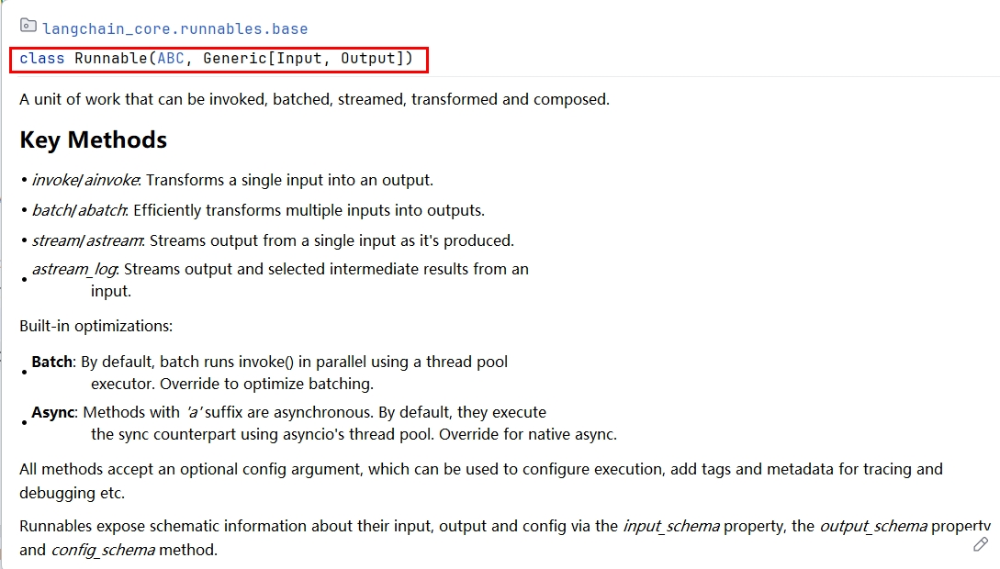

# 15 - LCEL 与链式调用

---

**本章课程目标：**

- 理解 **Runnable** 的定位与「统一调用方式」的意义，掌握 **LCEL**（LangChain 表达式语言）及管道符 `|` 的用法。
- 掌握 **Chain** 的典型结构（提示词模板 + 大模型 + 输出解析器），理解链本身也是 Runnable、可继续组合。
- 能使用 **RunnableSequence**、**RunnableBranch**、**RunnableParallel**、**RunnableLambda** 等组合方式，会阅读并编写顺序链、分支链、串行链、并行链与函数链的示例代码。

**前置知识建议：** 已学习 [第 9 章 - LangChain 概述与架构](9-LangChain概述与架构.md)、[第 10 章 - LangChain 快速上手与 HelloWorld](10-LangChain快速上手与HelloWorld.md)，了解 LangChain 的六大模块与基本调用方式；建议已学 [第 13 章 - 提示词与消息模板](13-提示词与消息模板.md)、[第 14 章 - 输出解析器](14-输出解析器.md)，便于理解「提示 → 模型 → 解析」在链中的位置。

**学习建议：** 先动手跑通一条 `prompt | model | parser` 顺序链，再依次尝试分支链、串行链、并行链与函数链；链式调用是后续 [第 16 章 - 记忆与对话历史](16-记忆与对话历史.md)、[第 17 章 - 工具调用](17-工具调用.md) 以及 LangGraph 的基础。

---

## 1、Runnable 与统一调用方式

### 1.1 什么是 Runnable

**Runnable** 是 LangChain 中的**抽象基类**（定义在 `langchain_core.runnables`），为所有「可执行」的组件提供**统一的操作接口**。

- **定位**：LangChain 核心抽象接口，统一组件调用方式。
- **目标**：无论组件是提示模板、模型、解析器还是整条链，都支持同一套方法（如 `invoke`、`stream`、`batch`），并支持 LCEL 组合。
- **核心理念**：一切可执行的对象都应有统一的调用方式，从而具备「即插即用」的能力。



> **说明**：上图为 Runnable 的定位示意。Prompt、Model、Parser、Chain 等只要实现 Runnable 接口，就可以用相同方式调用（如 `invoke`）并用管道符 `|` 组合成链。

### 1.2 为什么需要统一调用方式

若没有统一接口，各组件调用方式不一致，组合时需要手动适配，例如：

- 提示词渲染用 `.format()` 或 `.invoke()`
- 模型调用用 `.invoke()`
- 解析器用 `.parse()` 或 `.invoke()`
- 工具用 `.run()` 或 `.invoke()`

**使用 Runnable 之后**：所有组件都通过同一套方法（如 `invoke`）调用，例如：

```python
prompt.invoke({"topic": "AI"})      # 提示模板
model.invoke(prompt_value)           # 语言模型
parser.invoke(ai_message)            # 输出解析器
chain.invoke({"question": "你好"})   # 整条链
```

本质是：**接口统一让组件具备了「即插即用」的能力**，便于用管道符串联和替换。

### 1.3 Runnable 接口与核心方法

实现 **Runnable** 接口的对象表示「可以执行的数据流节点」，既可以是**单个组件**，也可以是**整条链**或**复合结构**。具体包括：

- **单个组件**：如 Prompt 模板、Model、Output Parser
- **顺序流程**：如 prompt → model → parser 串联而成的一条链
- **复合结构**：并行、多路、多输入多输出的组合（如 RunnableParallel、RunnableBranch）

只要实现了 Runnable 接口，就可以像函数一样用 **invoke()** 调用，或用管道符 **|** 与其他 Runnable 组合成新链。

**Runnable 接口中定义的常用方法如下：**

- <strong>invoke(input)</strong>：同步执行，处理单个输入；最常用，适用于交互式或单次调用。
- <strong>batch(inputs)</strong>：批量执行，一次处理多个输入；适用于批量任务，提升吞吐与效率。
- <strong>stream(input)</strong>：流式执行，逐步返回结果；典型场景为大模型逐字/逐 token 输出，需实时展示生成内容时使用。
- <strong>ainvoke(input)</strong>：异步执行，处理单个输入；用于高并发、非阻塞 I/O 场景。

此外还有 <strong>astream(input)</strong>（异步流式）、<strong>abatch(inputs)</strong>（异步批量）等变体，与上述方法语义一致，仅改为异步调用，便于在 asyncio 或高并发框架中与其他异步逻辑配合使用。

---

## 2、LCEL 是什么

### 2.1 定义与一句话

<strong>LCEL</strong>（LangChain Expression Language，LangChain 表达式语言）是专门用于<strong>组合 Runnable 组件</strong>的声明式语法，其<strong>核心操作符是管道符 `|`</strong>。

**一句话**：通过 LCEL（管道符 `|`、RunnableSequence、RunnableParallel 等）快速将多个 Runnable 拼接成复杂工作流，支持顺序、条件分支、并行执行等。

**典型写法示例**：

```python
chain = prompt | model | output_parser
result = chain.invoke({"question": "什么是 LangChain？"})
```

核心思想：用 `|` 把多个 Runnable 像拼积木一样组合起来，数据从左到右依次流过。

### 2.2 可组合性

LCEL 强调**可组合性**：将多个组件按特定顺序或分支组合成一条「链」（Pipeline），以完成复杂任务。链本身也是 Runnable，可以继续被组合。

---

## 3、Chain 结构

- 使用 LCEL 创建的 Runnable 我们称为**「链」（Chain）**；链本身也是 Runnable，可以继续用 `|` 或 RunnableParallel 等组合。
- **Chain 的典型结构**由三部分组成：
  1. **提示词模板**（Prompt）
  2. **大模型**（LLM / Chat Model）
  3. **结果结构化解析器**（Output Parser，可选）

**管道运算符 `|`** 是 LCEL 最具特色的语法：多个 Runnable 通过 `|` 串联，形成清晰的数据处理链，例如：`输入 → Prompt → Model → Parser → 输出`。


> **说明**：上图表示一条链的数据流——用户输入经提示词模板渲染后交给模型，模型输出再经解析器得到最终结构化结果。

---

## 4、链式调用基础用法与案例

下面按类型介绍几种常用链的用法，并给出对应案例源码路径与核心代码说明。

### 4.1 RunnableSequence（顺序链）

**顺序链**即最常见的「Prompt → Model → Parser」一条线执行，数据依次经过每个节点。

**RunnableSequence**（可运行序列）按顺序「链接」多个可运行对象：前一个对象的输出作为后一个对象的输入。LCEL 重载了管道符 **`|`**，用两个 Runnable 即可创建 RunnableSequence，因此下面两种写法等价：

- 使用管道符：`chain = runnable1 | runnable2`
- 使用显式构造函数：`chain = RunnableSequence([runnable1, runnable2])`

在典型顺序链中即为：`chain = prompt | model | parser`，对应「提示模板 → 模型 → 输出解析器」的数据流。

【案例源码】`案例与源码-4-LangGraph框架/06-lcel/LCEL_RunnableSequenceDemo.py`

[LCEL_RunnableSequenceDemo.py](案例与源码-4-LangGraph框架/06-lcel/LCEL_RunnableSequenceDemo.py ":include :type=code")

---

### 4.2 RunnableBranch（分支链）

**RunnableBranch** 实现**条件分支**：根据输入决定走哪一条子链，类似 if-else if-else。

- 初始化时传入若干 `(条件, Runnable)` 对和一个**默认分支**。
- 执行时对输入依次求值条件，**第一个为 True 的条件**对应的 Runnable 会在该输入上运行；若无一为 True，则运行默认分支。

典型用法：根据用户输入中的关键词（如「日语」「韩语」）选择不同翻译提示词与子链。

【案例源码】`案例与源码-4-LangGraph框架/06-lcel/LCEL_RunnableBranchDemo.py`

[LCEL_RunnableBranchDemo.py](案例与源码-4-LangGraph框架/06-lcel/LCEL_RunnableBranchDemo.py ":include :type=code")

---

### 4.3 RunnableSerializable / 串行链（多步串联）

当需要**多次调用大模型**、把多个步骤串联起来时，可以把多条子链用 `|` 或 lambda 串成一条「串行链」：前一步的输出作为后一步的输入。

例如：先让模型用中文介绍某主题，再把该介绍作为输入交给另一条链翻译成英文。

【案例源码】`案例与源码-4-LangGraph框架/06-lcel/LCEL_RunnableSerializableDemo.py`

[LCEL_RunnableSerializableDemo.py](案例与源码-4-LangGraph框架/06-lcel/LCEL_RunnableSerializableDemo.py ":include :type=code")

---

### 4.4 RunnableParallel（并行链）

**并行链**指**同时运行多条子链**，待全部完成后汇总结果。

适用场景举例：

- 同一问题用中英文各答一遍并聚合
- 多个模型同时跑同一问题取最优或综合
- 多路径推理、多模态（如图片 + 文本）并行处理

【案例源码】`案例与源码-4-LangGraph框架/06-lcel/LCEL_RunnableParallelDemo.py`

[LCEL_RunnableParallelDemo.py](案例与源码-4-LangGraph框架/06-lcel/LCEL_RunnableParallelDemo.py ":include :type=code")

> **延伸**：并行链的图结构可配合 `get_graph().print_ascii()` 查看，为后续学习 LangGraph 做铺垫。

---

### 4.5 RunnableLambda（函数链）

**RunnableLambda** 将**普通 Python 函数**包装成 Runnable，从而可以放入 LCEL 链中，与其他组件用 `|` 连接。

- 作用：把自定义逻辑（如打印中间结果、数据格式转换）变成链中的一个节点。
- 用法：用 `RunnableLambda(函数)` 或直接把函数放在 `|` 之间（LangChain 会自动包装）。

【案例源码】`案例与源码-4-LangGraph框架/06-lcel/LCEL_RunnableLambdaDemo.py`

[LCEL_RunnableLambdaDemo.py](案例与源码-4-LangGraph框架/06-lcel/LCEL_RunnableLambdaDemo.py ":include :type=code")

---

**本章小结：**

- **Runnable** 是 LangChain 中「可执行组件」的统一接口，通过 `invoke`、`stream`、`batch` 等方法调用；一切可执行对象具备统一调用方式，便于用管道符 `|` 串联和替换。
- **LCEL**（LangChain 表达式语言）用管道符 `|` 将多个 Runnable 组合成链，支持顺序、分支、并行与函数节点；链本身也是 Runnable，可继续组合。
- **Chain 典型结构**为「提示词模板 + 大模型 + 输出解析器」；**顺序链**（RunnableSequence）、**分支链**（RunnableBranch）、**串行链**（多步 `|` 串联）、**并行链**（RunnableParallel）、**函数链**（RunnableLambda）是五种常见组合方式，可按业务选择或组合使用。

**建议下一步：** 在本地依次运行顺序链、分支链、串行链、并行链与函数链案例，理解数据在链中的流向；接着学习 [第 16 章 - 记忆与对话历史](16-记忆与对话历史.md)，实现多轮连贯对话。
