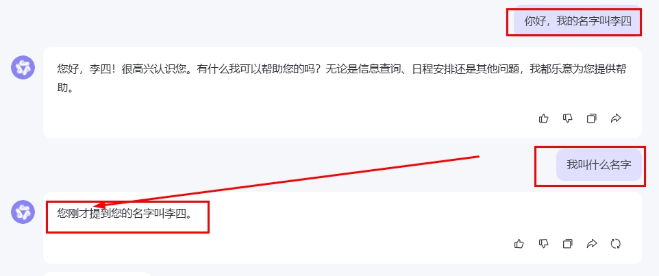
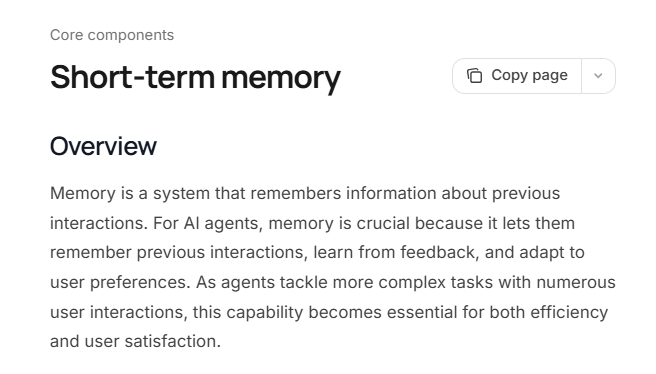
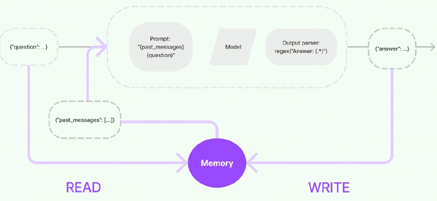
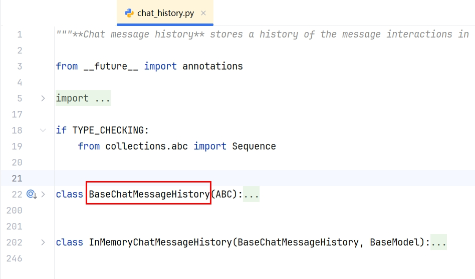
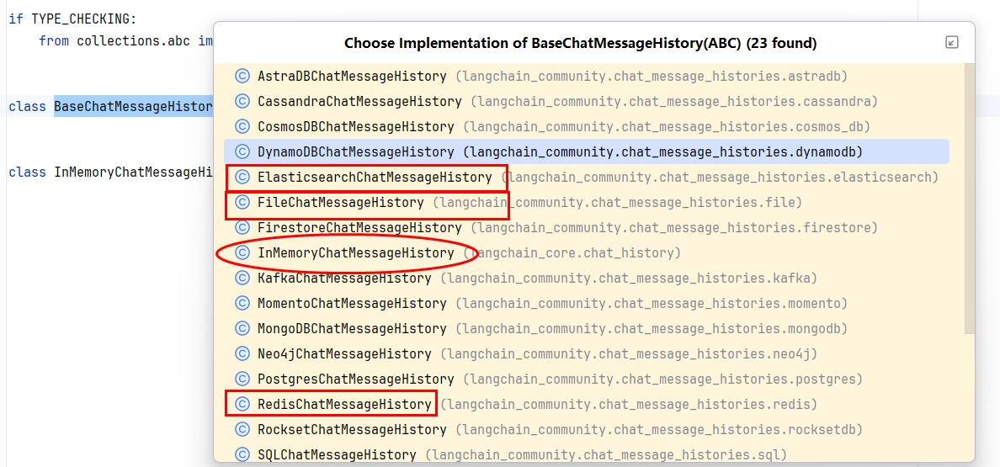
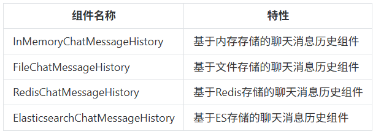
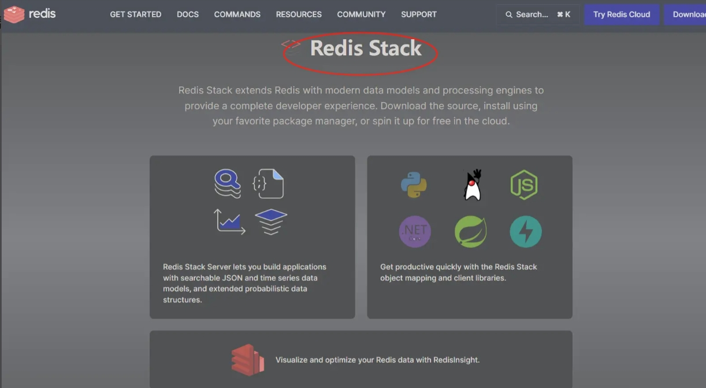
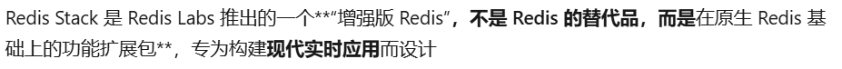
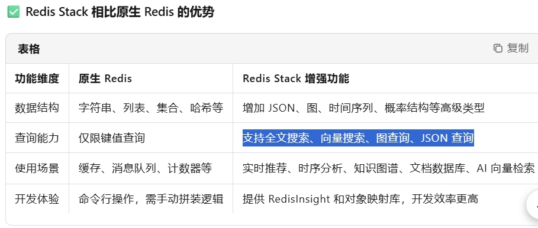

# 16 - 记忆与对话历史

---

**本章课程目标：**

- 理解**记忆（Memory）**在对话中的作用与必要性，掌握「读历史 → 拼入提示 → 调模型 → 写回历史」的实现思路。
- 了解 **RunnableWithMessageHistory** 与 **BaseChatMessageHistory** 的定位与用法，会选用内存版（InMemoryChatMessageHistory）实现进程内多轮对话。
- 掌握使用 **Redis**（Redis Stack）持久化对话历史的方案，会配置环境、运行 Redis 版案例并理解 session_id 与持久化写入。

**前置知识建议：** 已学习 [第 9 章 - LangChain 概述与架构](9-LangChain概述与架构.md)、[第 10 章 - LangChain 快速上手与 HelloWorld](10-LangChain快速上手与HelloWorld.md)、[第 15 章 - LCEL 与链式调用](15-LCEL与链式调用.md)，了解链的构建与调用方式；建议已学 [第 13 章 - 提示词与消息模板](13-提示词与消息模板.md)、[第 14 章 - 输出解析器](14-输出解析器.md)。

**学习建议：** 先运行「无记忆」演示体会问题，再跑通内存版带历史对话，最后在本地启动 Redis Stack 并运行 Redis 持久化案例；复杂场景可后续结合 LangGraph 的 persistence 学习。

---

## 1、为什么需要记忆

**现象**：若只用「Prompt + Model + Parser」且不保存历史，每次请求相互独立，模型无法知道上一轮说过什么。例如先问「我叫张三」，再问「我叫什么？」，模型会回答「我不知道你是谁」。

**需求**：聊天系统需要**记忆组件**存储和管理对话的上下文，使 AI 能够根据历史内容给出连贯、个性化的回复，即「前言可以搭后语」。

**官方文档**（短期记忆）：https://docs.langchain.com/oss/python/langchain/short-term-memory

> **说明**：记忆是让 AI 记住先前互动、从反馈中学习并适应用户偏好的能力，在涉及多轮交互的复杂任务中非常重要。

---

## 2、记忆是什么与能干什么

- **是什么**：记忆缓存是聊天系统中用于**存储和管理对话上下文**的组件，让 AI 能够「记住」之前的对话内容。
- **能干什么**：在多轮对话中提供上下文，使回复**连贯、可延续**（前言搭后语），并可根据历史做简单个性化。

---

## 3、「我不知道」演示：无记忆时的行为

下面示例演示：同一程序内连续两次调用链，第一次告诉模型「我叫张三」，第二次问「你知道我是谁吗？」——若不注入历史，模型会回答「我不知道」。

【案例源码】`案例与源码-4-LangGraph框架/07-memory/Memory_IDontKnow.py`

[Memory_IDontKnow.py](案例与源码-4-LangGraph框架/07-memory/Memory_IDontKnow.py ":include :type=code")

---

## 4、实现原理

要实现记忆，需要**额外模块**保存与模型对话的上下文，并在每次请求时：

1. **读**：从记忆组件读取历史对话。
2. **写**：在链执行完毕后，将本轮用户输入与模型回复写入记忆组件。
3. **用**：在下一次请求前，把历史消息与当前用户输入一起放入提示词，再交给模型，模型即可基于完整上下文生成回复。

因此，一个记忆组件至少需要三种能力：**读取历史**、**写入历史**、**存储消息**。在 LangChain 中，负责该能力的模块统称为 **Memory（记忆）**，用于存储用户与模型交互的历史信息。

> **说明**：上图概括了带记忆的调用流程——链执行前从记忆组件读取历史并和用户输入一起填入提示；执行后将本轮输入与输出写回记忆组件。

---

## 5、实现类介绍：0.3 与 1.0+

**ConversationChain** 是 LangChain 早期用于简化对话的类，内部集成内存与固定提示模板，适合快速写简单对话，但存在：

- 灵活性不足，难以支持复杂对话流程
- 与新 API、现代聊天模型（如带工具调用的模型）兼容性差
- 与 LCEL / Runnable 的模块化设计理念不一致

**RunnableWithMessageHistory** 是 LangChain 推荐的替代方案（0.3.x 起稳定，1.0 中保留），优势包括：

- **模块化**：可自由组合提示模板、模型与记忆逻辑
- **灵活**：支持自定义历史存储（内存、Redis 等）与复杂流程
- **兼容**：与 LCEL 及现代聊天模型无缝集成

**官方建议**：

- **简单聊天**：使用 **BaseChatMessageHistory** 与 **RunnableWithMessageHistory** 配合。BaseChatMessageHistory 是保存聊天消息历史的抽象基类，常用实现包括 InMemoryChatMessageHistory（内存）、RedisChatMessageHistory（Redis）等。
- **复杂场景**：可考虑 LangGraph 的 persistence（Checkpointer + 记忆中间件等）。

**BaseChatMessageHistory 简介**：

- **属性**：`messages: List[BaseMessage]`，只读，用于读取历史消息。
- **方法**：`add_message(msg)`、`add_messages(msgs)`、`clear()`；具体存储由实现类完成。

---

## 6、案例代码

### 6.1 内存版（进程内，重启即丢失）

【案例源码】`案例与源码-4-LangGraph框架/07-memory/Memory_RunnableWithMessageHistory.py`

[Memory_RunnableWithMessageHistory.py](案例与源码-4-LangGraph框架/07-memory/Memory_RunnableWithMessageHistory.py ":include :type=code")

【案例源码】`案例与源码-4-LangGraph框架/07-memory/Memory_RunnableWithMessageHistoryV2.py`

[Memory_RunnableWithMessageHistoryV2.py](案例与源码-4-LangGraph框架/07-memory/Memory_RunnableWithMessageHistoryV2.py ":include :type=code")

### 6.2 持久化：Redis 存储

**设计要求**：将用户与大模型的对话保存到 **Redis**，实现持久化记忆，重启后仍可恢复历史。

- **文档**：https://python.langchain.ac.cn/docs/integrations/memory/redis_chat_message_history/
- 本课程使用 **Redis Stack** 作为存储（在 Redis 基础上提供搜索、JSON、图等能力）。

**Redis Stack 简介**：

- **是什么**：Redis Stack = 原生 Redis + 搜索 + 图 + 时间序列 + JSON + 概率结构 + 可视化与开发框架支持。
- **核心组件**（了解即可）：RediSearch（全文/向量搜索）、RedisJSON（JSON 存储与查询）、RedisGraph（图查询）、RedisBloom（概率结构）等。
- **安装示例**（Docker）：`docker run -d --name redis-stack-server -p 26379:6379 redis/redis-stack-server`
- **Python**：LangChain 1.0+ 使用 Redis 作为后端时，建议 `pip install redis==5.3.1`。

**环境验证**：运行以下脚本确认 Redis 与 Python 包可用。

【案例源码】`案例与源码-4-LangGraph框架/07-memory/RedisEnvCheck.py`

[RedisEnvCheck.py](案例与源码-4-LangGraph框架/07-memory/RedisEnvCheck.py ":include :type=code")

**Redis 对话历史示例**：

【案例源码】`案例与源码-4-LangGraph框架/07-memory/Memory_RedisChatMessageHistory.py`

[Memory_RedisChatMessageHistory.py](案例与源码-4-LangGraph框架/07-memory/Memory_RedisChatMessageHistory.py ":include :type=code")

---

**本章小结：**

- **为什么需要记忆**：无记忆时每次请求独立，模型无法利用上一轮内容；多轮对话需要记忆组件存储上下文，实现「前言搭后语」。
- **实现原理**：链执行前从记忆组件**读取**历史并拼入提示，执行后将本轮输入与输出**写回**记忆组件；记忆组件需具备读、写与存储能力。
- **推荐实现**：使用 **RunnableWithMessageHistory** 搭配 **BaseChatMessageHistory** 的实现类；**InMemoryChatMessageHistory** 适合进程内、重启即丢；**RedisChatMessageHistory** 配合 Redis Stack 可实现持久化，需配置 `redis` 包（如 5.3.1）与 `session_id` 区分会话。

**建议下一步：** 在本地跑通内存版与 Redis 版带历史对话案例，理解 `session_id` 与历史读写时机；接着学习 [第 17 章 - 工具调用](17-工具调用.md)，让模型具备调用外部接口的能力。
