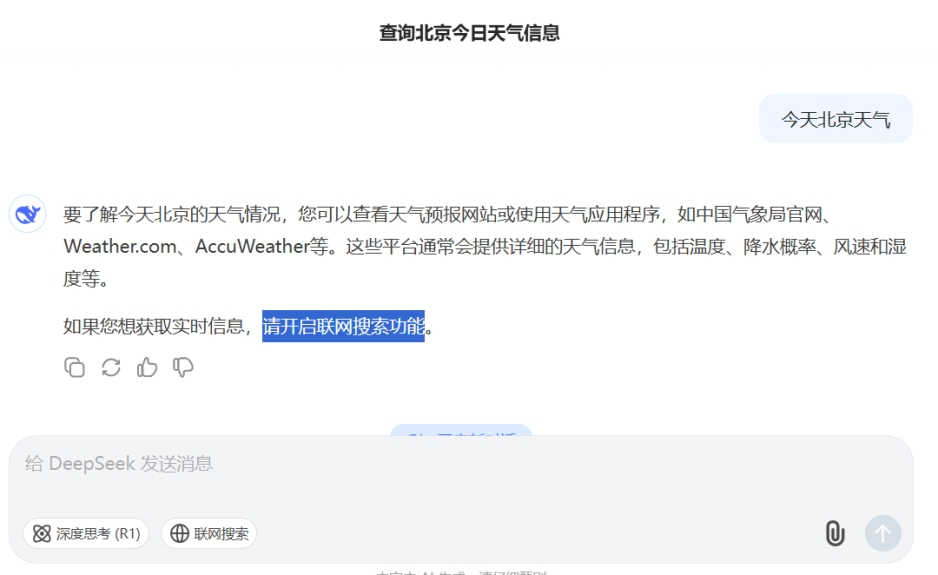
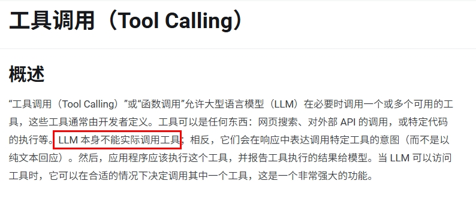
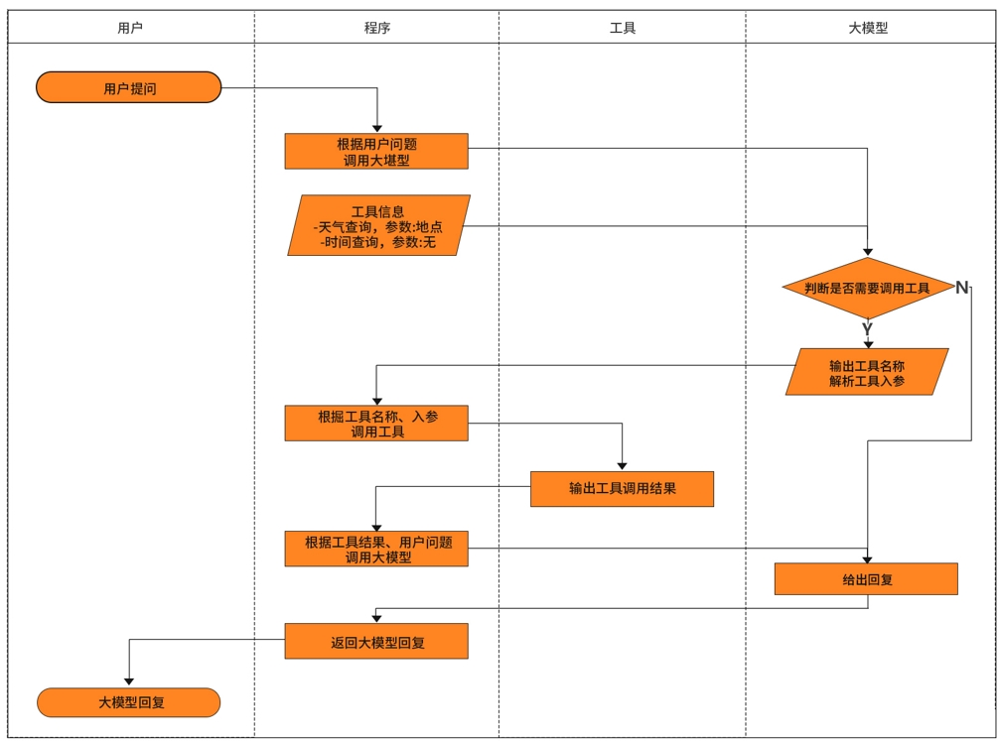
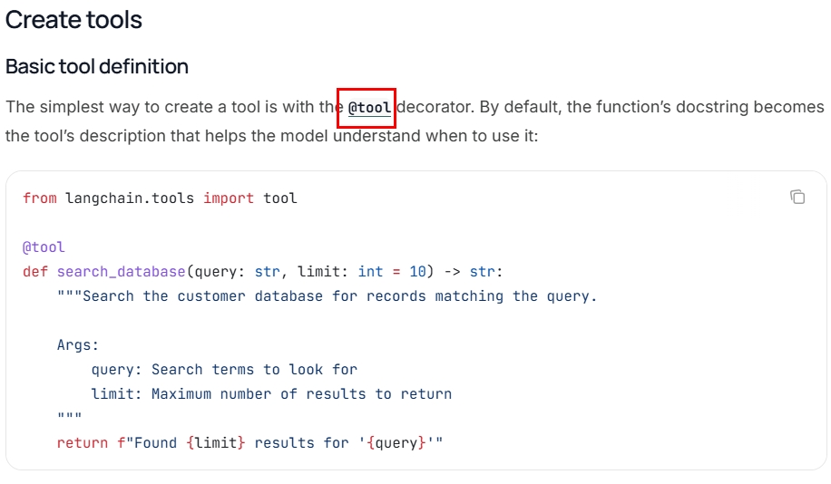
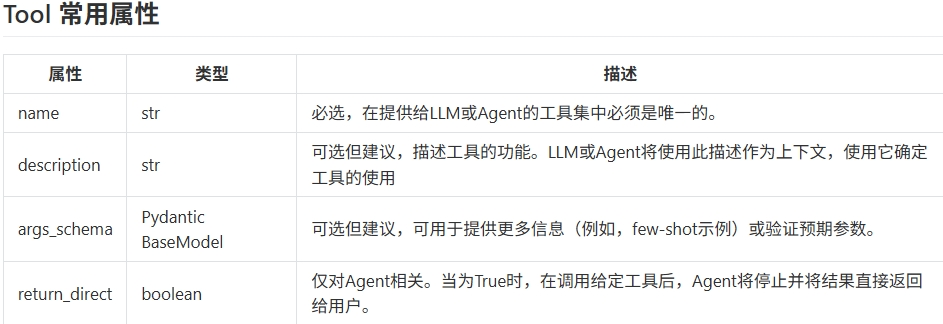
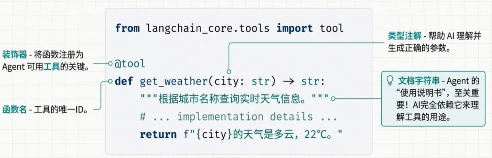
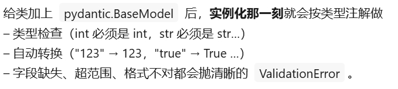
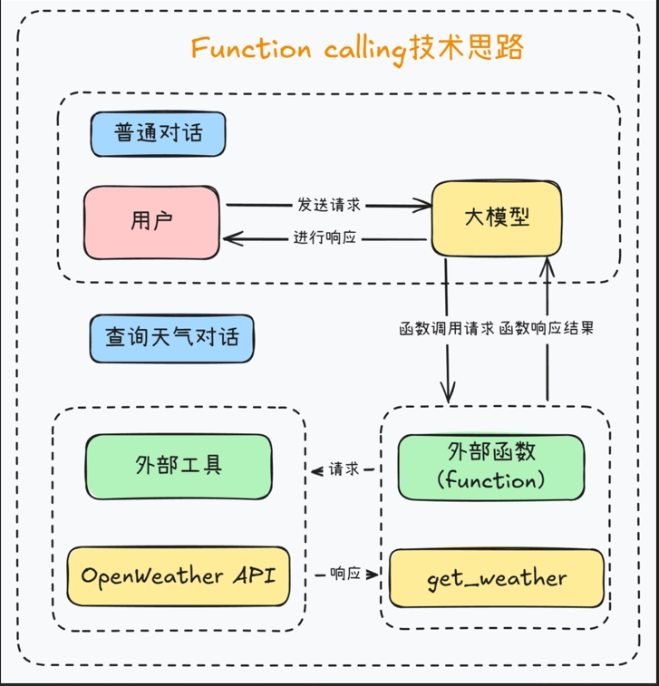

# 17 - Tools 工具调用

---

**本章课程目标：**

- 理解**工具调用（Tool / Function Calling）**是什么、能干什么，以及「模型输出调用意图、代码真正执行」的分工关系。
- 掌握使用 **@tool** 装饰器定义 LangChain 工具，会配合 **Pydantic** 定义参数 schema，并会查看工具的 name、description、args 等属性。
- 完成「天气查询助手」从定义工具、绑定模型、解析 tool_calls 到执行工具并生成自然语言回复的完整链路。

**前置知识建议：** 已学习 [第 9 章 - LangChain 概述与架构](9-LangChain概述与架构.md)、[第 10 章 - LangChain 快速上手与 HelloWorld](10-LangChain快速上手与HelloWorld.md)、[第 15 章 - LCEL 与链式调用](15-LCEL与链式调用.md)；建议已学 [第 16 章 - 记忆与对话历史](16-记忆与对话历史.md)。具备 Python 与 HTTP 请求（如 httpx）基础更佳。

**学习建议：** 先理解「为什么不调用工具有局限」与工作流程，再从小工具（加法）入手掌握 @tool 与 Pydantic，最后按步骤完成天气助手的定义、绑定与调用链。

---

## 1、为什么不调用工具会有局限

大模型虽然具备强大的语言理解与生成能力，但本质上是**静态的、不可直接交互**的：

- 不能直接访问数据库或调用外部 API
- 不能执行代码或文件操作
- 无法实时访问互联网或动态数据

因此需要**工具（Tool）**机制：由模型决定「要不要调、调哪个、传什么参数」，由我们的代码**真正执行**工具并把结果返回给模型，再由模型组织成自然语言回复。

---

## 2、是什么与能干嘛

**是什么**：通过 **Tool（工具）** 机制，让模型具备「调用外部函数」的能力，与外部系统、API 或自定义函数交互，完成仅靠文本生成无法实现的任务。

**重要提示**：Tool Calling（也称 Function Calling）允许大模型与一组 API 或工具交互，将 LLM 的智能与外部工具无缝连接。注意：**LLM 本身不执行函数**，它只输出「应调用哪个函数以及参数是什么」，真正执行工具的是你的代码。

**能干嘛**：

- **访问实时数据**：如天气、股票、新闻（通过你提供的工具接口）。若不提供工具，模型无法获取实时数据，只能依赖训练时的知识或「猜测」。

- **执行工具类/辅助操作**：如发邮件、查订单、调用支付接口、查快递等——只要把能力封装成工具并暴露给模型即可。

**一句话**：工具就是 **LLM 的「外部工具类」**，由模型决定调用方式，由程序负责执行。

**参考链接**：

- LangChain 工具文档：https://docs.langchain.com/oss/python/langchain/tools
- LangChain 内置工具列表：https://docs.langchain.com/oss/python/integrations/tools
- Spring AI 工具：https://docs.spring.io/spring-ai/reference/api/tools.html

---

## 3、工作流程概览

典型流程为：用户提问 → 模型判断是否需要调工具 → 若需要，返回 tool_calls（函数名 + 参数）→ 你的代码执行对应工具 → 将工具结果塞回对话 → 模型根据结果生成最终回复。

---

## 4、自定义 Tool

### 4.1 使用 @tool 装饰器

用 **@tool** 装饰器可以把一个 Python 函数变成 LangChain 的 Tool，模型会通过函数的**名称、文档字符串（description）和参数**来决定是否调用以及如何传参。

**Tool 常用属性**（了解即可）：name、description、args（参数 schema）、return_direct 等；可通过 `tool.name`、`tool.description`、`tool.args` 查看。

### 4.2 基础案例：加法工具

【案例源码】`案例与源码-4-LangGraph框架/08-tools/Tool_AddNumberTool.py`

[Tool_AddNumberTool.py](案例与源码-4-LangGraph框架/08-tools/Tool_AddNumberTool.py ":include :type=code")

### 4.3 Pydantic 与参数 schema

使用 **Pydantic** 定义参数模型（如 `FieldInfo`），再通过 `args_schema` 传给 `@tool`，可以更精确地描述参数类型与说明，便于模型生成正确的参数。

**一句话**：Pydantic = 「类型注解 + 自动校验 + 转换」神器，让 Python 在运行时也能享受「静态类型」的安全感。

【案例源码】`案例与源码-4-LangGraph框架/08-tools/PydanticDemo.py`

[PydanticDemo.py](案例与源码-4-LangGraph框架/08-tools/PydanticDemo.py ":include :type=code")

【案例源码】`案例与源码-4-LangGraph框架/08-tools/Tool_AddNumberToolPro.py`

[Tool_AddNumberToolPro.py](案例与源码-4-LangGraph框架/08-tools/Tool_AddNumberToolPro.py ":include :type=code")

---

## 5、天气助手实战

### 5.1 Tool Calling 原理简述

请求时把「工具列表」（名称、描述、参数 schema）一并发给模型。模型若判断需要查天气，会返回 **function_call** 类型的消息（包含工具名与参数）。你的代码根据返回结果**真正调用**天气 API，再把结果和已有对话一起发给模型，由模型整理成自然语言回复。

### 5.2 需求与准备

- **功能**：实现天气查询——调用 OpenWeather API 获取指定城市实时天气，并将结果用自然语言描述给用户。
- **步骤**：构建请求、发送 HTTP 请求、解析 JSON、格式化为中文描述。
- **API Key**：在 https://home.openweathermap.org/api_keys 免费申请，写入 `.env`（如 `OPENWEATHER_API_KEY=xxx`）。天气 API 文档：https://openweathermap.org/

### 5.3 定义天气工具

【案例源码】`案例与源码-4-LangGraph框架/08-tools/QueryWeatherTool.py`

[QueryWeatherTool.py](案例与源码-4-LangGraph框架/08-tools/QueryWeatherTool.py ":include :type=code")

### 5.4 大模型调用天气工具并生成回复

下面示例：将 `get_weather` 绑定到模型（`bind_tools`），用 `JsonOutputKeyToolsParser` 解析模型返回的 tool_calls，再执行天气工具，最后用另一条链把 JSON 天气数据转成自然语言描述。

【案例源码】`案例与源码-4-LangGraph框架/08-tools/LLMQueryWeatherDemo.py`

[LLMQueryWeatherDemo.py](案例与源码-4-LangGraph框架/08-tools/LLMQueryWeatherDemo.py ":include :type=code")

> **注意**：`LLMQueryWeatherDemo.py` 中通过 `from QueryWeatherTool import get_weather` 引用同目录下的天气工具，运行前请确保已配置 `OPENWEATHER_API_KEY`（或在 `QueryWeatherTool.py` 中按需改为从环境变量读取）。

---

**本章小结：**

- **工具调用（Tool / Function Calling）**让模型具备「调用外部函数」的能力；模型只负责输出要调用的工具名与参数，**真正执行工具的是你的代码**。
- **自定义工具**：用 **@tool** 装饰器将函数转为 Tool，通过文档字符串与参数类型供模型识别；可用 **Pydantic** 定义 `args_schema` 细化参数说明与校验。
- **完整链路**：定义工具 → 用 `bind_tools` 绑定到模型 → 解析模型返回的 tool_calls → 执行工具 → 将结果回填对话 → 模型生成自然语言回复。天气助手案例贯穿上述步骤，并借助 OpenWeather API 与输出链完成「问天气 → 查 API → 中文描述」的闭环。

**建议下一步：** 在本地配置 OpenWeather API Key 并跑通天气助手案例；若需更复杂的多步决策、多工具编排或与记忆结合，可继续学习 **LangGraph** 或 **Agent** 相关章节。
