# 20 - MCP 模型上下文协议

---

**本章课程目标：**

- 理解 **MCP（Model Context Protocol，模型上下文协议）** 是什么、解决什么痛点，以及和 Tool / RAG 的定位区别。
- 掌握 MCP 的客户端-服务器架构与两种通信模式（STDIO / SSE），能阅读和编写简单的 MCP 配置与本地服务端/客户端示例。
- 通过本地 MCP 天气服务与客户端案例，理解 MCP 的「工具暴露与调用」流程，为后续学习 [第 21 章 - Agent 智能体](21-Agent智能体.md) 打基础。

**前置知识建议：** 已学习 [第 17 章 - Tools 工具调用](17-Tools工具调用.md)，了解 Tool / Function Calling 的基本概念与 `@tool`、`bind_tools` 的用法；建议已学 [第 9 章 - LangChain 概述与架构](9-LangChain概述与架构.md)、[第 1-3 章 - RAG、微调、续训与智能体](1-3-RAG、微调、续训与智能体.md) 中关于智能体与 MCP 的概述。

**学习建议：** 先建立「为什么需要 MCP」的直观印象，再按「MCP 概念 → 架构与传输模式 → 本地案例」顺序学习；案例需 Python 3.12 及以下时会在文中标明。

---

## 1、为什么需要 MCP

### 1.1 之前痛点是什么

大模型虽然能理解和生成文本，但**不能直接访问**你的代码库、数据库、在线文档或第三方 API。早期做法是为每个应用、每个数据源单独写对接逻辑，开发与维护成本高，且难以在不同 AI 应用之间复用。

下面两图从「AI 与外部世界如何连接」的角度，对比了**没有统一协议时的割裂**与**有统一协议后的连接**，便于理解 MCP 要解决的痛点。

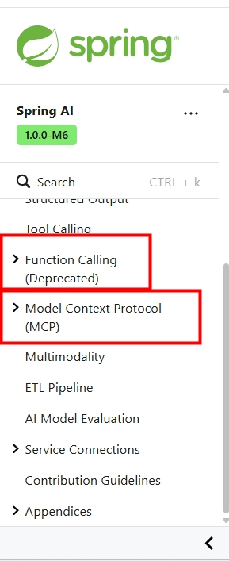

> **说明**：上图示意在缺乏统一协议时，不同数据源、工具与 AI 应用之间需要各自定制的连接方式，重复造轮子、协作困难。


> **说明**：上图示意通过统一协议（如 MCP）后，AI 应用可以用一种「语言」与多种服务和数据源交互，降低集成成本。

### 1.2 直观类比：「贾维斯」与万能适配器

很多同学都记得钢铁侠的助手「贾维斯」——一个能连接战甲、实验室、家里所有设备的智能管家。现实中，AI 也需要连接各种「外部能力」：查天气、读文档、查数据库、发邮件等。若每种能力都要单独开发接口，成本会非常高。


**为什么需要 MCP？** 可以概括为三点：

- **统一接口**：不同服务和数据库各有各的「说话方式」，AI 若逐个适配会很麻烦。MCP 提供统一的「翻译官」，让 AI 只需学一种协议就能与多种服务交互。
- **减少重复开发**：开发者不必为每个服务、每个 AI 应用单独写连接逻辑；按 MCP 规范暴露一次，支持 MCP 的应用都能复用。
- **更好协作与生态**：工具定义和元数据规范化后，更容易被社区检验和复用，跨模型、跨应用的适配成本也会降低。

下图从「AI 如何通过 MCP 与外部资源协作」的角度做了总结。

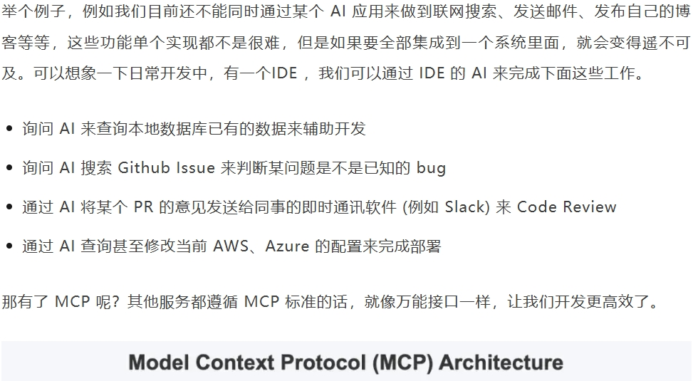

---

## 2、MCP 是什么（入门概念）

### 2.1 一句话与类比

- **一句话**：MCP（Model Context Protocol）是一套**标准化的通讯协议**，用于规范「大模型 / AI 应用」与「外部工具、数据源」之间的连接方式，让 AI 能以统一方式获取上下文（工具、资源、提示等）。
- **类比**：
  - **大模型版的 OpenFeign**：OpenFeign 用于微服务之间通讯，MCP 用于大模型与工具/数据源之间的通讯。
  - **AI 世界的「万能适配器」**：各种服务和数据库各有各的接口，MCP 像统一插头，让 AI 用同一套方式连接它们。
  - **后端同学可类比 gRPC**：gRPC 用标准化方式让不同语言的服务互相通信；MCP 则是专为 AI 设计的「接口与连接」标准，让 AI 与各种应用、数据源交互。

**官方与生态链接：**

- MCP 协议官网：https://modelcontextprotocol.io/introduction
- LangChain 对 MCP 的支持：https://docs.langchain.com/oss/python/langchain/mcp

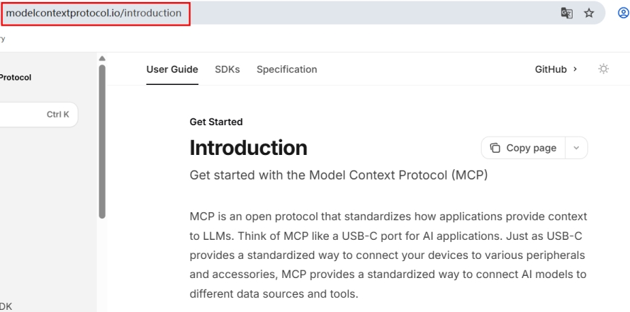
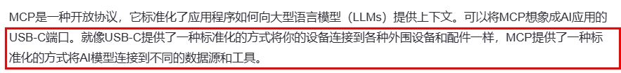

---

## 3、MCP 能做什么

### 3.1 统一接入与抽象

- **统一上下文接入**：以标准化方式把 LLM 需要的**上下文**（工具、资源、提示等）连接起来。可以把它理解为 **Agent 时代的「Type-C 协议」**——希望把不同来源的数据、工具、服务统一起来供大模型调用。
- **合久必分、分久必合**：早期每个软件（如微信、Excel）都要单独给 AI 做接口；MCP 统一标准后，类似「所有电器都用 USB-C」，AI 一个协议就能连接多种工具与数据源。
- **比 Function Calling 更高一层的抽象**：Function Calling 是「模型会调工具」的底层能力；MCP 是在此之上的**协议层**——规定工具如何暴露、如何被调用、如何被多端复用，是实现智能体的重要基础。

下面两图分别从「分」（各自为政）与「合」（统一协议）的角度做了对比。

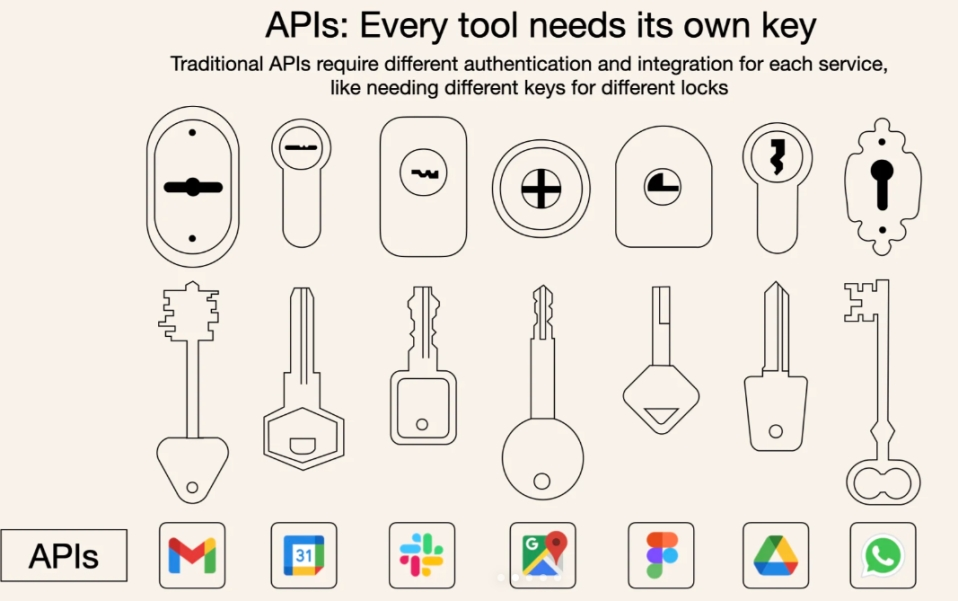

> **说明**：「分」——各应用、各数据源各自对接，重复开发、难以复用。

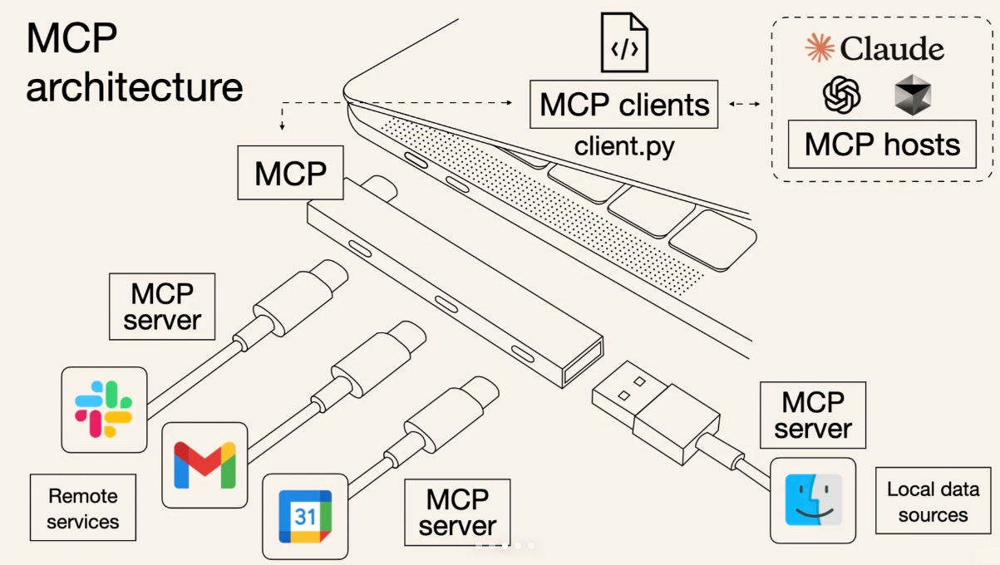

> **说明**：「合」——通过 MCP 等统一协议，一次开发、多端复用。

**小结**：MCP 的核心价值是**不用重复造轮子**；按标准暴露成 MCP 服务后，可被多个 AI 应用复用，工具定义也更规范、更易维护。

### 3.2 工作流示例

下图以「用户提问 → AI 通过 MCP 获取外部信息 → 生成回答」为例，说明 MCP 在整体流程中的位置。

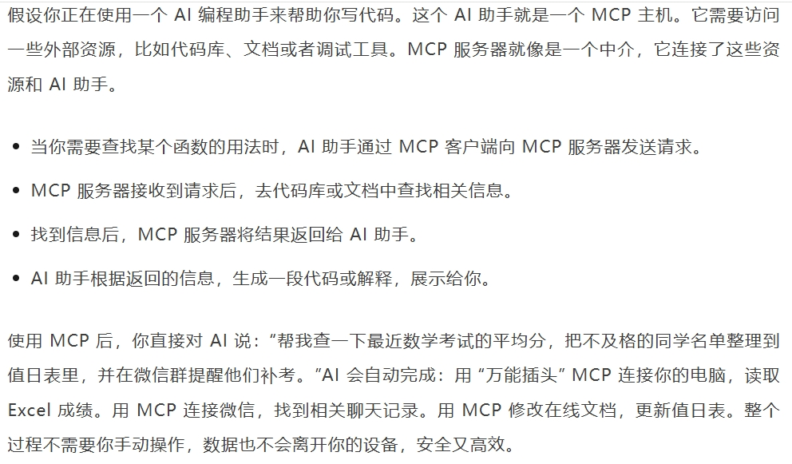

> **说明**：AI 编程助手作为 MCP 主机，通过 MCP 客户端向 MCP 服务器请求外部资源（如代码库、文档）；MCP 服务器从代码库或文档中查找信息并返回，AI 再根据结果生成代码或解释。复杂任务（如「查成绩、整理名单、发群提醒」）也可通过 MCP 连接 Excel、微信、在线文档等，在用户授权下自动完成，且数据可在本地处理，安全又高效。


---

## 4、怎么用 MCP

- **直接使用现成的 MCP 服务**：无需自己搭服务端，可到公开站点选用已部署的 MCP 服务器，在支持 MCP 的 AI 应用（如 Cursor、Claude Desktop）中配置后即可使用。
  - 例如：https://mcp.so/zh 等平台收录了大量通用 MCP 服务，可按需选用。
- **本地自建 MCP 服务端 / 客户端**：用于学习协议、调试或对接内部系统。本课程会在后文给出「本地 MCP 天气服务端 + 客户端」的案例；若要使用 LangChain + 多服务 MCP 客户端（如 `langchain-mcp-adapters`），需注意其依赖与 Python 版本（如部分适配器要求 Python 3.12 及以下）。

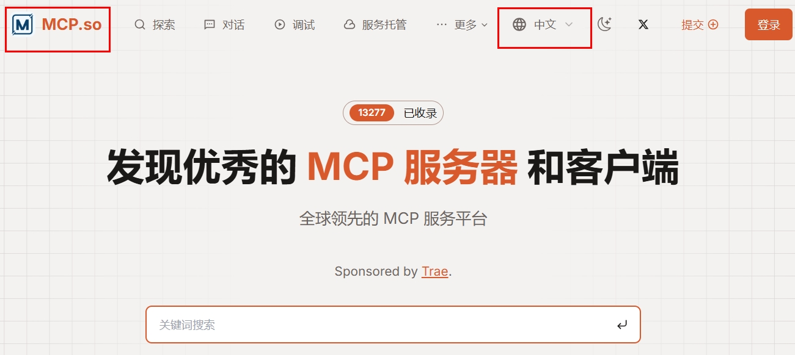

> **说明**：MCP 资源站示例，可浏览、筛选并配置到 IDE 或 AI 应用中。

---

## 5、MCP 架构知识

### 5.1 客户端-服务器架构

MCP 采用**客户端-服务器架构**，核心角色如下。


> **说明**：MCP 架构概览。**MCP 主机（MCP Hosts）**：发起请求的 AI 应用（如聊天机器人、AI 驱动的 IDE）。**MCP 客户端（MCP Clients）**：在主机内部，与 MCP 服务器保持 1:1 连接。**MCP 服务器（MCP Servers）**：为客户端提供上下文、工具和提示。**本地资源 / 远程资源**：服务器可访问的本地文件、数据库，或通过 API 访问的远程服务。

| 角色           | 说明                                                        |
| -------------- | ----------------------------------------------------------- |
| **MCP 主机**   | 发起请求的 AI 应用程序（如聊天机器人、AI 驱动的 IDE）       |
| **MCP 客户端** | 在主机程序内部，与 MCP 服务器保持 1:1 的连接                |
| **MCP 服务器** | 为 MCP 客户端提供上下文、工具和提示信息                     |
| **本地资源**   | 本地计算机中可供 MCP 服务器安全访问的资源（如文件、数据库） |
| **远程资源**   | 通过 API 等访问的远程数据或服务                             |

### 5.2 两种通信模式（STDIO / SSE）

MCP 常见有两种传输模式，分别适用于不同部署与集成场景。

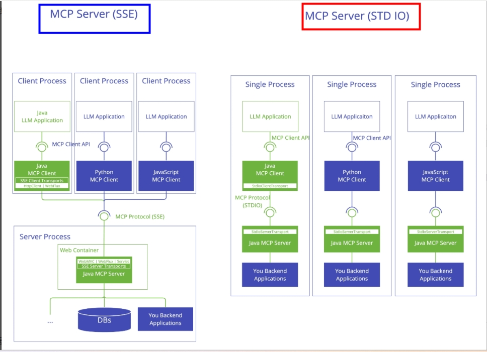

> **说明**：左为 **SSE（Server-Sent Events）** 模式，基于 HTTP，适合独立运行的服务、多客户端共享同一服务器；右为 **STDIO（标准输入/输出）** 模式，基于进程标准输入输出，适合本地进程内或父子进程间通信，如命令行工具、嵌入式场景。

| 模式                          | 说明                                          | 典型场景                                        |
| ----------------------------- | --------------------------------------------- | ----------------------------------------------- |
| **STDIO**                     | 通过标准输入/输出流通信                       | 本地集成、命令行工具、与主进程同机部署          |
| **SSE（Server-Sent Events）** | 通过 HTTP POST 与服务器到客户端的流式事件通信 | 独立部署的 MCP 服务、需要长连接或流式推送的场景 |

两者对比可概括为：SSE 适合「独立服务、多客户端、网络访问」；STDIO 适合「单机、轻量、进程内或本地管道」。

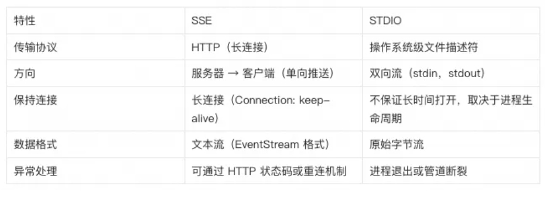

---

## 6、案例实战：本地 MCP 天气服务与客户端

本小节给出「本地 MCP 天气服务端 + 简单客户端」的完整示例，便于理解 MCP 的暴露与调用方式。若使用基于 FastMCP 的 SSE 服务或 `langchain-mcp-adapters` 的多服务客户端，需注意：**部分依赖要求 Python 3.12 及以下**，请以当前环境与官方文档为准。

### 6.1 环境与依赖

- 安装示例中用到的库（如 `httpx`、`loguru` 等）；若使用 `langchain-mcp-adapters`，请按官方说明安装并注意 Python 版本。
- 天气接口需 OpenWeather API Key，可写入 `.env`（如 `OPENWEATHER_API_KEY=xxx`），参见 [第 17 章 - Tools 工具调用](17-Tools工具调用.md) 中的天气助手准备。

### 6.2 MCP 服务端（天气查询）

本案例中，服务端将「查询指定城市天气」封装为 MCP 工具，供客户端调用。仓库中的实现使用自定义的 MCP 服务类（不依赖 FastMCP），便于在更多 Python 版本下运行；若你使用 FastMCP，则会有 `mcp.run(transport="sse")` 等写法，逻辑类似。

【案例源码】`案例与源码-4-LangGraph框架/11-mcp/McpServer.py`

[McpServer.py](案例与源码-4-LangGraph框架/11-mcp/McpServer.py ":include :type=code")

> **说明**：在基于 FastMCP 的 SSE 实现中，常用 **HTTP 202 Accepted** 表示请求已接受、结果将通过 SSE 流式返回，以适配 MCP SSE 的流式处理特性；200 OK 则多用于一次性请求-响应。本仓库中的 `McpServer.py` 为简化版，重点展示「工具注册与暴露」的思路。

### 6.3 MCP 配置文件（多服务时使用）

当使用「多 MCP 服务」客户端（如 LangChain 的 `MultiServerMCPClient`）时，通常通过配置文件声明各服务的地址与传输方式。可将以下内容保存为 `mcp.json`，放在 `案例与源码-4-LangGraph框架/11-mcp/` 目录下，供多服务客户端加载。

**配置示例说明：**

- **天气服务（SSE 模式）**：`weather` 使用 `transport: "sse"`，通过 HTTP 长连接与本地 8000 端口的 `/sse` 通信，适合独立运行的 MCP 服务。
- **网页抓取服务（STDIO 模式）**：`fetch` 使用 `transport: "stdio"`，通过 `uvx` 运行 `mcp-server-fetch`，适合本地命令行工具、无需单独网络端点。

```json
{
  "mcpServers": {
    "weather": {
      "url": "http://127.0.0.1:8000/sse",
      "transport": "sse"
    },
    "fetch": {
      "command": "uvx",
      "args": ["mcp-server-fetch"],
      "transport": "stdio"
    }
  }
}
```

- **作用**：调用 `weather` 可获取天气数据；调用 `fetch` 可抓取并解析网页内容，让 AI 能基于链接内容回答问题。

### 6.4 MCP 客户端（本地调用示例）

下面示例演示如何在本机直接调用 MCP 服务端已注册的天气工具，不依赖 LangChain Agent。若你要实现「LLM + 多 MCP 服务」的聊天代理，可参考 [1-3 章](1-3-RAG、微调、续训与智能体.md) 与官方文档，使用 `langchain-mcp-adapters` 的 `MultiServerMCPClient` 加载上述 `mcp.json`，将得到的工具列表交给 Agent 使用。

【案例源码】`案例与源码-4-LangGraph框架/11-mcp/McpClient.py`

[McpClient.py](案例与源码-4-LangGraph框架/11-mcp/McpClient.py ":include :type=code")

### 6.5 测试建议

- **问题 1（调用 MCP 天气）**：先启动 `McpServer.py`，再运行 `McpClient.py`，查询如「北京」对应城市（如 Beijing）的天气，确认能拿到 OpenWeather 返回并正确解析。
- **问题 2（若已配置 fetch 等 MCP 服务）**：在支持 MCP 的 AI 应用或自写 Agent 中，可提问如「请总结 https://github.langchain.ac.cn/langgraph/reference/mcp/ 这篇文档」，由 AI 通过 fetch 类工具抓取页面后再总结。

---

## 7、小结：Tool、RAG 与 MCP 的定位

| 技术                        | 主要作用                              | 一句话                            |
| --------------------------- | ------------------------------------- | --------------------------------- |
| **Tool / Function Calling** | 让大模型能「调用」外部能力            | 大模型使用 Util 工具              |
| **RAG**                     | 让大模型获得足够上下文                | 大模型获取检索到的知识            |
| **MCP**                     | 统一「大模型与工具/数据源」的连接方式 | 大模型与工具/服务之间的标准化通讯 |

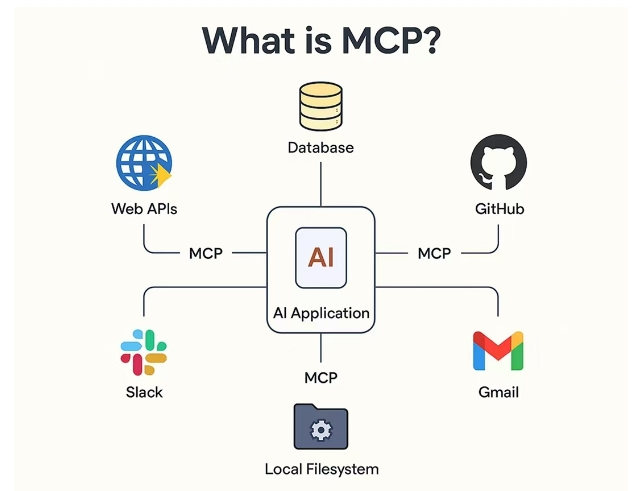
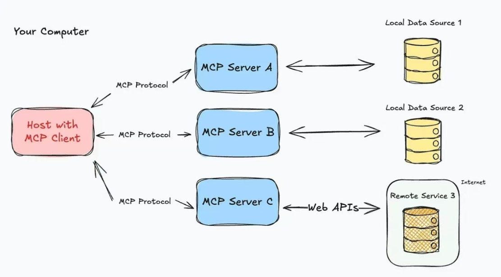
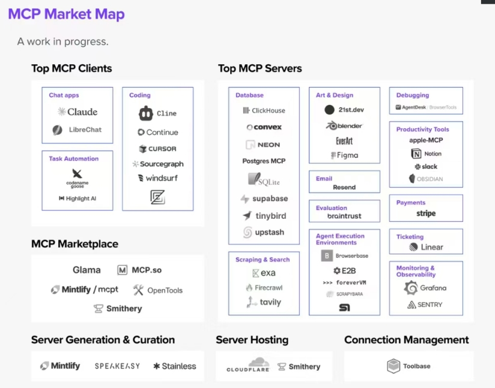

> **说明**：上图从左到右依次概括了 Tool Calling、RAG、MCP 在大模型应用中的角色，可对照表格理解三者分工。

**延伸**：MCP 在 Java 生态也有实现，例如可参考 B 站视频（74–80 集）：https://www.bilibili.com/video/BV1pvWGznEqh?spm_id_from=333.788.videopod.sections&vd_source=f3f60f7acbef49d38b97c4d660d439fc&p=74 。

---

**本章小结：**

- **MCP** 是规范「大模型与外部工具/数据源」连接的**标准化协议**，解决接口不统一、重复开发、协作难等问题；可类比「大模型版的 OpenFeign」或 AI 世界的「万能适配器」。架构上采用客户端-服务器模型，常见传输模式有 **STDIO**（本地/进程内）和 **SSE**（网络、流式）。
- 学习时可通过本地 MCP 天气服务端与客户端（`McpServer.py`、`McpClient.py`）理解「工具暴露与调用」；多服务场景可配合 `mcp.json` 与 LangChain MCP 适配器（注意 Python 版本与依赖）。
- **定位速记**：Tool 让大模型能用工具；RAG 让大模型获得检索上下文；**MCP** 让大模型与工具/服务之间的连接标准化、可复用。

**建议下一步：** 在本地跑通 `McpServer.py` 与 `McpClient.py`，巩固 MCP 的配置与调用；接着学习 [第 21 章 - Agent 智能体](21-Agent智能体.md)，理解 Tool 与 Agent 的配合及 ReAct、A2A 等案例。若需更复杂的图编排与多步工作流，可继续学习 **LangGraph** 相关章节。
