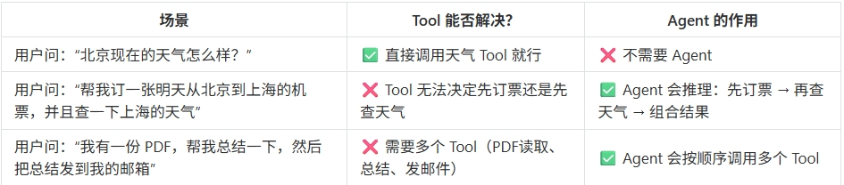
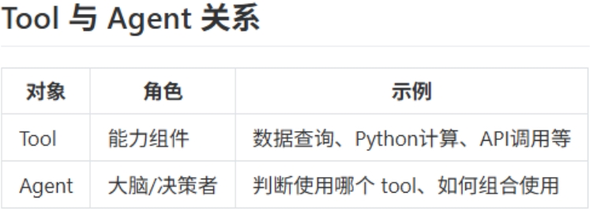
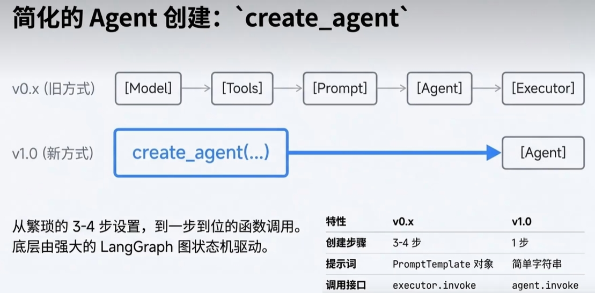
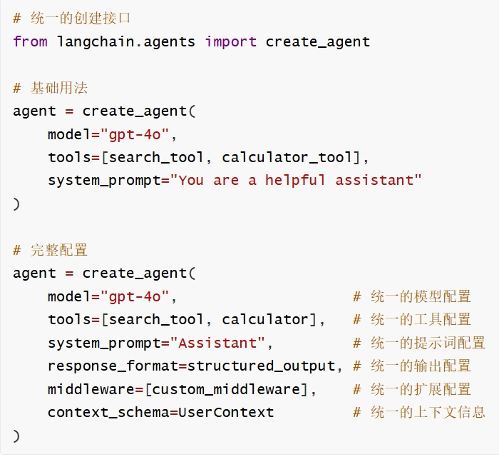

# 21 - Agent 智能体

---

**本章课程目标：**

- 理解 **Agent（智能体）** 与 **Tool（工具）** 的关系，掌握「推理 + 行动」的 ReAct 模式及 AgentExecutor 的工作流程。
- 了解 LangChain 中 Agent 从 V0.3 到 V1.0 的简化演进（多步组装 → `create_agent` 一步创建）。
- 会运行「工具 + 判断」、ReAct、A2A（Agent 与 Agent 协作）等案例代码，并理解其与 Tool、MCP 的衔接。

**前置知识建议：** 已学习 [第 17 章 - Tools 工具调用](17-Tools工具调用.md)，了解 Tool / Function Calling 与 `@tool`、`bind_tools` 的用法；建议已学 [第 20 章 - MCP 模型上下文协议](20-.md) 与 [第 1-3 章 - RAG、微调、续训与智能体](1-3-RAG、微调、续训与智能体.md) 中关于智能体的概述。

**学习建议：** 先建立「Tool 提供能力、Agent 做决策」的直观印象，再按「Tool vs Agent → 演变与原理 → 案例代码」顺序学习；案例需特定 Python 版本时文中会标明。

---

## 1、Tool 与 Agent 的关系

在 LangChain 中，**Tool** 和 **Agent** 是两个不同层次的概念：

- **Tool（工具）**：**能力的封装**。一个可调用的函数，封装了具体能力（如调用搜索引擎、查数据库、调 API）。Tool 本身**没有决策能力**，只是被动等待被调用，类似 Java 里的 Util 工具类。
- **Agent（智能体）**：**决策者**。决定**什么时候**调用哪个 Tool、根据上下文**下一步做什么**、如何处理 Tool 的返回并决定是否继续调用其他 Tool。Agent 的核心是 **推理 + 行动（Reason + Act）**，即 **ReAct 模式**。

下图左侧强调「Tool = 能力」，右侧强调「Agent = 决策 + 使用这些能力」。

**为什么有了 Tool 还需要 Agent？** 因为 Tool 只提供「能做什么」，不负责「何时做、按什么顺序做、做到什么程度为止」。Agent 负责根据用户意图和中间结果做规划和决策，从而完成多步、有条件分支的任务。

**关系类比**：Tool 像「工具箱里的螺丝刀、锤子」；Agent 像「有判断力的工匠」——知道什么时候用螺丝刀、什么时候用锤子，甚至先用螺丝刀再用锤子。下图可帮助记忆二者关系。

---

## 2、演变过程：从多步组装到一步创建

LangChain 中 Agent 的创建方式从 V0.x 的多步配置（Model → Tools → Prompt → Agent → Executor）演进到 V1.0 的 **`create_agent` 一步到位**，底层由 **LangGraph** 图状态机驱动，调用接口也简化为 `agent.invoke`。

> **说明**：左为 V0.x：需分别配置模型、工具、提示模板，再组装 Agent 与 Executor；右为 V1.0：通过 `create_agent(...)` 一次完成，由 LangGraph 驱动，调用方式为 `agent.invoke`。

下图是「第一个智能体组装」的直观示意。

---

## 3、Agent 工作原理（V0.3 视角）

在 LangChain 的 Agent 架构中，**Agent** 负责「接收输入并决定采取什么操作」，**不直接执行**这些操作；**AgentExecutor** 负责真正调用 Agent、执行其选定的工具，并把工具输出传回 Agent，形成循环，二者结合才构成完整的智能体。

> **说明**：**AgentExecutor** 实际调用 Agent、执行 Agent 选择的操作，并将操作输出传回 Agent 再重复。左侧为 Agent 接收的信息类型（Input、Model Response、History）；中间为 Agent 链（Prompt Template + LLM + output parser）决定下一步；右侧为 Agent 可调用的工具集（Tool 1…Tool n）。

**工作流程可概括为：**

1. **输入解析**：语言模型分析用户输入，理解任务目标。
2. **推理规划**：使用 ReAct 等框架决定是否调用工具、调用哪些、顺序如何；ReAct 即在每次迭代中先「推理」再「行动」。
3. **工具调用**：按规划调用工具，传入参数并获取结果，将结果反馈给语言模型。
4. **迭代推理**：模型根据工具结果更新推理，可能再次调用工具，直到满足终止条件。
5. **生成最终答案**：模型综合所有信息，生成面向用户的最终回复。

---

## 4、Agent 工作原理（V1.0）

V1.0 通过 `create_agent` 将模型、工具、系统提示等封装在一起，使用方式更简洁，底层仍遵循「推理 → 行动 → 反馈」的循环。

---

## 5、案例代码

下面按「工具 + 判断」「ReAct」「A2A」三类给出仓库中的案例路径，便于在对应知识点下运行与对照。

### 5.1 工具 + 判断（多工具、聚合回答）

- **AgentSmartSelectV0.3**：多工具并行调用（如一次问「北京和上海天气，哪个更热」），Agent 决定调用天气工具并聚合结果。对应 V0.x 的 Agent + AgentExecutor 写法。

【案例源码】`案例与源码-4-LangGraph框架/12-agent/AgentSmartSelectV0.3.py`

[AgentSmartSelectV0.3.py](案例与源码-4-LangGraph框架/12-agent/AgentSmartSelectV0.3.py ":include :type=code")

- **AgentSmartSelectV1.0**：同一类需求，使用 V1.0 的 `create_agent`，并配合结构化输出（如 `WeatherCompareOutput`），一步创建 Agent 并 `agent.invoke` 调用。

【案例源码】`案例与源码-4-LangGraph框架/12-agent/AgentSmartSelectV1.0.py`

[AgentSmartSelectV1.0.py](案例与源码-4-LangGraph框架/12-agent/AgentSmartSelectV1.0.py ":include :type=code")

### 5.2 ReAct（推理 + 行动）

- **AgentReact**：通过产品搜索、库存查询等工具，演示 Agent 如何根据用户问题自主选择工具、多步调用并给出结论，体现 ReAct 的「推理后再行动」循环。

【案例源码】`案例与源码-4-LangGraph框架/12-agent/AgentReact.py`

[AgentReact.py](案例与源码-4-LangGraph框架/12-agent/AgentReact.py ":include :type=code")

### 5.3 A2A（Agent 与 Agent 协作）

- **Agent2Agent**：模拟「订机票 + 订酒店 + 打车」的跨平台协作，多个专属 Agent（携程、美团、滴滴）各司其职，由总协调 Agent 接收用户需求、调度子 Agent、汇总结果，体现多 Agent 协作与工具封装。

【案例源码】`案例与源码-4-LangGraph框架/12-agent/Agent2Agent.py`

[Agent2Agent.py](案例与源码-4-LangGraph框架/12-agent/Agent2Agent.py ":include :type=code")

---

**本章小结：**

- **Agent** 是**决策层**，负责何时调哪个 Tool、如何组合多步；**Tool** 是**能力层**，只提供可调用函数。二者结合形成「推理 + 行动」的 ReAct 循环，由 **AgentExecutor**（或 V1.0 的 `create_agent`）驱动执行。
- LangChain 中 Agent 从 V0.x 的多步组装演进到 V1.0 的 `create_agent` 一步创建，底层由 **LangGraph** 支撑；与 [第 20 章 MCP](20-.md) 配合理解「Tool / RAG / MCP」在大模型应用中的分工，可更好把握智能体与工具链的定位。

**建议下一步：** 在本地依次运行 `AgentSmartSelectV0.3.py`、`AgentSmartSelectV1.0.py`、`AgentReact.py` 和 `Agent2Agent.py`，对照文档理解 Tool、Agent、AgentExecutor 的配合；若需更复杂的图编排与多步工作流，可继续学习 **LangGraph** 相关章节。
