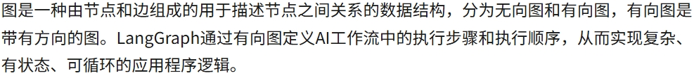
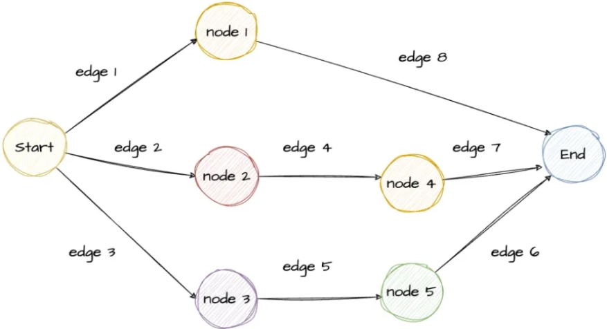
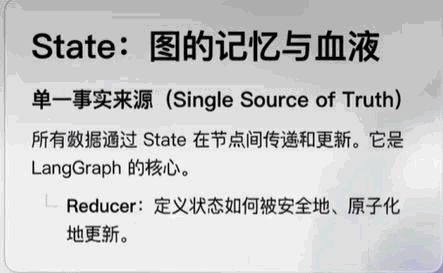
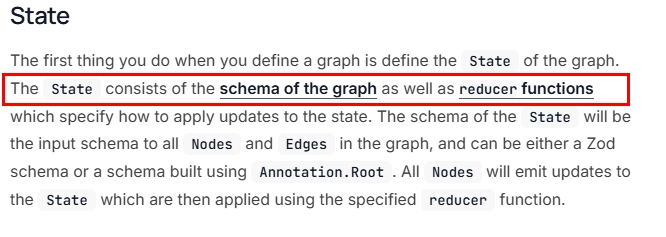
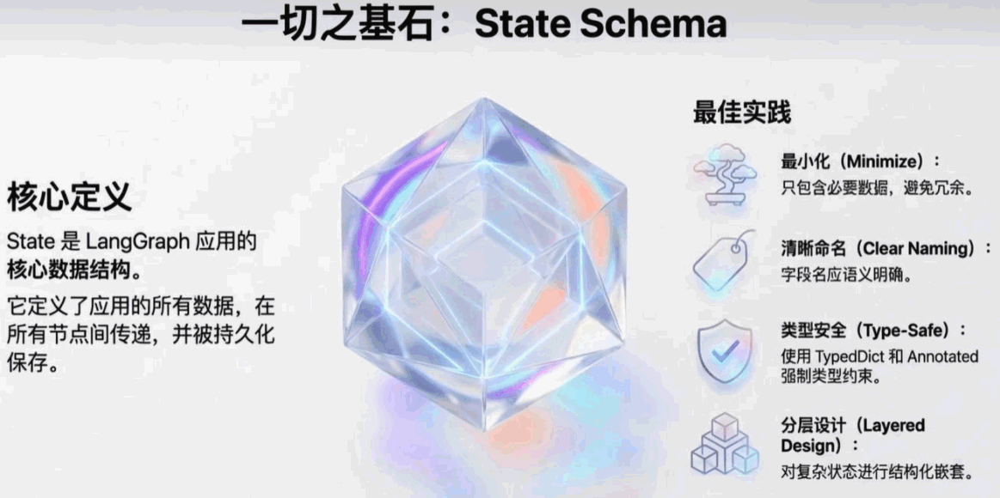
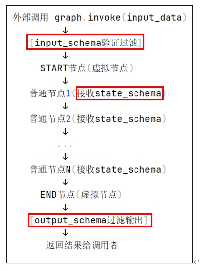
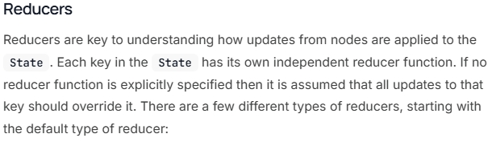
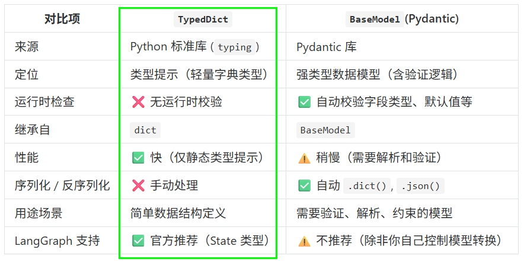

# 23 - LangGraphAPI：图与状态

---

**本章课程目标：**

- 理解 Graph API 中「图」的正式定义与有向图在工作流中的作用，会构建多节点、固定边的完整图并运行案例。
- 理解 **State** 的组成（**Schema + Reducer**）、在节点间的传递方式，以及 **state_schema / input_schema / output_schema** 三要素的含义与用法；掌握 **Reducer（规约函数）** 的常见类型（默认覆盖、add_messages、operator.add/mul、自定义），能根据业务选择合并策略。
- 会使用 **TypedDict** 或 **Pydantic BaseModel** 定义 State，能根据场景选型；会通过 `input_schema`、`output_schema` 限制图的输入输出接口。

**前置知识建议：** 已学习 [第 22 章 LangGraph 概述与快速入门](22-LangGraph概述与快速入门.md)，掌握 LangGraph 四要素（State、Nodes、Edges、Graph）、图的六步构建流程，并至少跑通 HelloWorld 或 LangGraphBiz 案例。

**学习建议：** 先通读「什么是图」「什么是 State」建立概念，再按顺序跑通 BuildWholeGraphSummary、DefState、Reducer 案例与 StateSchema。**Node（节点）、Edge（边）与 Send/Command/Runtime 等高级控制**见 [第 24 章 LangGraph Graph API 之 Node、Edge 与高级控制](24-LangGraphGraphAPI-Node与Edge与高级控制.md)。

---

## 1、Graph API 之 Graph（图）

### 1.1 什么是图

**知识出处：** https://docs.langchain.com/oss/javascript/langgraph/graph-api#graphs（概念通用，Python 版可查对应文档）

**图**是一种由**节点**和**边**组成的、用于描述节点之间关系的数据结构，分为无向图和有向图；**有向图**的边带有方向。LangGraph 通过**有向图**定义 AI 工作流中的执行步骤与执行顺序，从而实现**复杂、有状态、可循环**的应用程序逻辑。

### 1.2 构建一个完整的图

**图的构建流程**（与第 22 章 2.4 一致）：初始化 StateGraph → 加节点 → 定义边 → 设置 START/END → 编译 → 执行。

下面案例用 `input → process → output` 三个节点和固定边，演示状态（`process_data`）在节点间的传递与打印，便于对照「流程」与「状态」的关系。

【案例源码】`案例与源码-3-LangGraph框架/02-graph/BuildWholeGraphSummary.py`

[BuildWholeGraphSummary.py](案例与源码-3-LangGraph框架/02-graph/BuildWholeGraphSummary.py ":include :type=code")

---

## 2、Graph API 之 State（状态）

### 2.1 什么是 State

**知识出处：** https://docs.langchain.com/oss/javascript/langgraph/graph-api#state

在 LangGraph 中，**State** 是贯穿整个工作流执行过程的**共享数据结构**，代表当前「快照」。它存储从工作流开始到结束所需的信息（如历史对话、检索到的文档、工具执行结果等），在**各节点间共享**，且每个节点都可以按规则对其更新。State 包含两部分：一是**图的模式（Schema）**，二是**规约函数（Reducer functions）**——后者规定如何把节点产生的**更新**应用到状态上（例如追加列表、替换字段等）。

**定义图时，首先要做的就是定义图的 State。** State 由**图的 Schema** 和 **Reducer 函数**组成：Schema 描述状态有哪些字段、类型；Reducer 指定当节点返回部分更新时，如何合并到当前状态。

### 2.2 基本 State 定义示例（DefState.py）

下面用 **TypedDict** 定义一个简单状态，并构建一张「无中间节点、直接从 START 到 END」的图，用于验证 `invoke(initial_state)` 的用法。注意：`invoke()` 只接收一个核心位置参数（状态字典），不要传入多个独立参数。

【案例源码】`案例与源码-3-LangGraph框架/03-state/DefState.py`

[DefState.py](案例与源码-3-LangGraph框架/03-state/DefState.py ":include :type=code")

### 2.3 State 的组成：Schema 与三要素

**知识出处（Schema）：** https://docs.langchain.com/oss/javascript/langgraph/graph-api#schema

**一切之基石：State Schema。** State 是 LangGraph 应用的核心数据结构，它定义了应用中所有在节点间传递并被持久化的数据。设计时建议：最小化字段、清晰命名、类型安全（如 TypedDict / Annotated）、复杂状态分层嵌套。

**构成三要素：**

| 概念              | 含义                                         | 特点                                                               |
| ----------------- | -------------------------------------------- | ------------------------------------------------------------------ |
| **state_schema**  | 图的完整内部状态，包含所有节点可能读写的字段 | 必须指定，不能为空；是图的「全局状态空间」，所有节点都可访问和写入 |
| **input_schema**  | 图接受什么输入，是 state_schema 的子集       | 可选；不指定时默认等于 state_schema；用于限制图的输入接口          |
| **output_schema** | 图返回什么输出，是 state_schema 的子集       | 可选；不指定时默认等于 state_schema；用于限制图的输出接口          |

下图展示了 `graph.invoke(input_data)` 的典型流程：先按 **input_schema** 验证/过滤输入，再经 START → 普通节点（均接收 state_schema）→ END，最后按 **output_schema** 过滤输出并返回给调用者。

### 2.4 State 的组成：Reducer（规约函数）

前面 2.1 已说明：State 由 **Schema** 与 **Reducer** 组成；Schema 描述状态有哪些字段与类型，**Reducer 规定节点产生的更新如何合并到当前状态**。本节展开 Reducer 的用法与常见类型，与 Schema 一起构成「State 组成」的完整图景。

#### 2.4.1 什么是 Reducer

**知识出处：** https://docs.langchain.com/oss/javascript/langgraph/graph-api#reducers

在 LangGraph 中，**Reducer（规约函数）** 决定**节点产生的更新如何作用到 State**。State 中的每个字段都可以拥有自己的规约函数；若未显式指定，则**默认对该字段的更新为覆盖**——后执行节点返回的值会直接覆盖先执行节点的值。

- **状态合并策略**：State 在工作流中贯穿所有节点、共享数据；每个节点可读取并更新 State。Reducer 定义多个节点之间对同一字段的更新方式（覆盖、合并、追加等）。
- **Reducer 的作用**：控制状态更新方式；处理并行更新时的数据一致性；支持覆盖、追加、相加等策略；支持自定义合并逻辑，便于构建复杂工作流与并行执行场景。

#### 2.4.2 default：未指定 Reducer 时使用覆盖更新

【案例源码】`案例与源码-3-LangGraph框架/03-state/reducers/StateReducer_Default.py`

[StateReducer_Default.py](案例与源码-3-LangGraph框架/03-state/reducers/StateReducer_Default.py ":include :type=code")

#### 2.4.3 add_messages：用于消息列表追加

对话场景中需要将多轮消息**追加**到列表。使用 `Annotated[List, add_messages]`，节点只返回增量消息，由 `add_messages` 规约器自动追加。

【案例源码】`案例与源码-3-LangGraph框架/03-state/reducers/StateReducer_AddMessages.py`

[StateReducer_AddMessages.py](案例与源码-3-LangGraph框架/03-state/reducers/StateReducer_AddMessages.py ":include :type=code")

#### 2.4.4 operator.add：列表/字符串/数值追加

`operator.add` 作为 Reducer 时，对列表做 extend、对字符串做连接、对数值做累加。

**列表追加：**

【案例源码】`案例与源码-3-LangGraph框架/03-state/reducers/StateReducer_OperatorAdd.py`

[StateReducer_OperatorAdd.py](案例与源码-3-LangGraph框架/03-state/reducers/StateReducer_OperatorAdd.py ":include :type=code")

**字符串连接：**

【案例源码】`案例与源码-3-LangGraph框架/03-state/reducers/StateReducer_OperatorAdd2.py`

[StateReducer_OperatorAdd2.py](案例与源码-3-LangGraph框架/03-state/reducers/StateReducer_OperatorAdd2.py ":include :type=code")

**数值累加：**

【案例源码】`案例与源码-3-LangGraph框架/03-state/reducers/StateReducer_OperatorAdd3.py`

[StateReducer_OperatorAdd3.py](案例与源码-3-LangGraph框架/03-state/reducers/StateReducer_OperatorAdd3.py ":include :type=code")

#### 2.4.5 operator.mul：数值相乘

使用 `operator.mul` 时要注意：LangGraph 会用类型默认值（如 float 的 0.0）先做一次规约，导致 `0.0 * 初始值 = 0`，后续乘法始终为 0。**建议对乘法使用自定义 Reducer**，将「第一次」的 current 视为单位元 1.0。

【案例源码】`案例与源码-3-LangGraph框架/03-state/reducers/StateReducer_OperatorMul.py`

[StateReducer_OperatorMul.py](案例与源码-3-LangGraph框架/03-state/reducers/StateReducer_OperatorMul.py ":include :type=code")

#### 2.4.6 自定义 Reducer

当内置 Reducer 不满足需求时（如 operator.mul 的初始值问题），可自定义规约函数：签名为 `(current, update) -> new_value`，在函数内处理「第一次」等边界。

【案例源码】`案例与源码-3-LangGraph框架/03-state/reducers/StateReducer_Custom.py`

[StateReducer_Custom.py](案例与源码-3-LangGraph框架/03-state/reducers/StateReducer_Custom.py ":include :type=code")

#### 2.4.7 多种策略并存（家庭作业）

同一 State 中可对不同字段使用不同 Reducer（如 messages 用 add_messages，tags 用 operator.add，score 用 operator.add）。下面案例供自行阅读与运行。

【案例源码】`案例与源码-3-LangGraph框架/03-state/reducers/StateReducersMyChatBot家庭作业.py`

[StateReducersMyChatBot 家庭作业.py](案例与源码-3-LangGraph框架/03-state/reducers/StateReducersMyChatBot家庭作业.py ":include :type=code")

### 2.5 State 的类型：TypedDict 与 Pydantic BaseModel

State 可以是 **TypedDict**，也可以是 **Pydantic 的 BaseModel**。下表对比两者，便于选型；在 LangGraph 中通常**推荐使用 TypedDict** 作为 State 类型，简单轻量、无额外运行时校验开销。

**一句话选型：**

- 想要**轻量、无运行时开销、习惯字典写法** → 用 **TypedDict**。
- 想要**自动校验、默认值、嵌套结构、字段描述** → 用 **pydantic.BaseModel**。

两种写法在 LangGraph 里都能参与图的编译，只需按规则声明字段即可。

### 2.6 输入输出 Schema 示例（StateSchema.py）

下面案例演示如何通过 `input_schema` 和 `output_schema` 限制图的输入与输出类型，实现「调用时只传 question，返回时只拿 answer」的接口，适合需要明确对外契约的场景。

【案例源码】`案例与源码-3-LangGraph框架/03-state/schema/StateSchema.py`

[StateSchema.py](案例与源码-3-LangGraph框架/03-state/schema/StateSchema.py ":include :type=code")

---

**本章小结：**

- **Graph API（图）**：图由有向的**节点**和**边**组成，定义工作流的执行步骤与顺序；构建流程与第 22 章一致；BuildWholeGraphSummary 案例见 `02-graph/`。
- **State**：由 **Schema** 与 **Reducer** 组成，是节点间共享的「单一事实来源」。**Schema**：state_schema 为完整内部状态，input_schema / output_schema 为可选的输入输出子集。**Reducer**：规定节点更新如何合并（默认覆盖；add_messages 消息追加；operator.add 列表/字符串/数值；operator.mul 需注意默认 0；自定义 Reducer；多策略并存）。DefState、StateSchema、Reducer 案例见 `03-state/`。
- **State 类型**：常用 TypedDict（轻量），也可用 pydantic.BaseModel（校验、嵌套更强）。

**建议下一步：** 在本地运行 BuildWholeGraphSummary、DefState、Reducer 案例与 StateSchema，并尝试修改 State 字段或 Reducer 类型；接着学习 [第 24 章 LangGraph Graph API 之 Node、Edge 与高级控制](24-LangGraphGraphAPI-Node与Edge与高级控制.md)，掌握节点、边与 Send/Command/Runtime。
