# 24 - LangGraphAPI：节点、边与进阶

---

**本章课程目标：**

- 掌握 **Node（节点）** 的概念、START/END、节点缓存（CachePolicy）与重试机制（RetryPolicy），会使用 `set_entry_point` / `set_finish_point`。
- 掌握 **Edge（边）** 的类型：普通边、条件边、入口点与条件入口点，能编写路由函数实现分支与动态入口。
- 了解 **Send**（Map-Reduce 并行）、**Command**（状态更新 + 路由）与 **Runtime 上下文**（context_schema）的适用场景与基本用法。

**前置知识建议：** 已学习 [第 22 章 LangGraph 概述与快速入门](22-LangGraph概述与快速入门.md)、[第 23 章 LangGraph Graph API 与 State](23-LangGraphGraphAPI与State.md)，掌握图、State（Schema + Reducer）、TypedDict/BaseModel 及图的构建流程。

**学习建议：** 按「Node → Edge → Send/Command/Runtime」顺序学习；先跑通 Node、Edge 案例建立执行结构，再学习 Send、Command、Runtime 等高级控制。案例源码在 `案例与源码-3-LangGraph框架` 下（04-node、05-edge、06-specialApi）。

---

## 1、Graph API 之 Node（节点）

### 1.1 节点概念与知识出处

**知识出处**：[LangGraph 官方文档 - Graph API > Nodes](https://docs.langchain.com/oss/python/langgraph/graph-api#nodes)

在 LangGraph 中，节点（Node）即 Python 函数（同步或异步），可接收 `state`、`config`（RunnableConfig）、`runtime`（Runtime 对象）等参数；通过 `add_node` 将节点加入图，未指定名称时默认使用函数名。

Node 是图中的基本处理单元，代表工作流中的一个操作步骤，可绑定 Agent、大模型、工具或任意 Python 函数，具体逻辑自由实现。

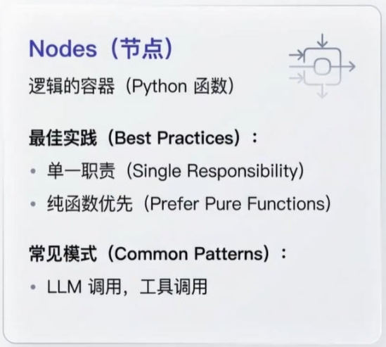

**Node 的设计原则**：单一职责；无状态设计（数据通过输入状态传递）；幂等性（相同输入产生相同输出，便于重试）；可测试性。

### 1.2 START 与 END 节点

**START** 为图的入口，可用 `add_edge(START, node_id)` 或 `set_entry_point(node_id)` 指定；**END** 为终止节点，可用 `add_edge(node_id, END)` 或 `set_finish_point(node_id)` 指定。

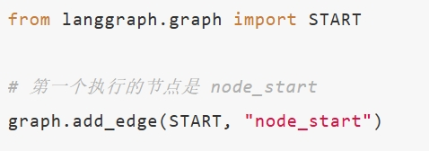
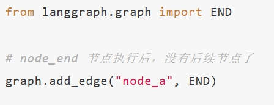

### 1.3 节点缓存（Node Caching）

LangGraph 支持基于节点输入的缓存，通过 `CachePolicy(key_func, ttl)` 配置；编译时指定缓存实现（如 `InMemoryCache()`）。缓存命中时直接返回结果，未命中时执行节点并写入缓存；ttl 控制有效期。

【案例源码】`案例与源码-3-LangGraph框架/04-node/Node_Cache.py`

[Node_Cache.py](案例与源码-3-LangGraph框架/04-node/Node_Cache.py ":include :type=code")

### 1.4 错误处理与重试机制

在 `add_node` 时传入 `retry_policy`（`RetryPolicy`，含 `max_attempts`、`retry_on` 等），可对节点配置重试；默认 `retry_on` 对多数异常重试，`ValueError`、`TypeError` 等不在重试列表中，也可自定义 `retry_on`。

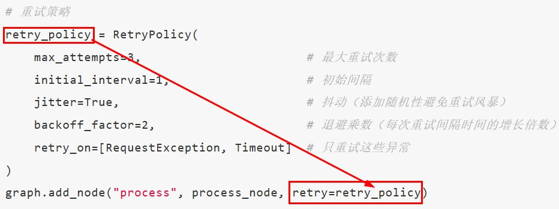

【案例源码】`案例与源码-3-LangGraph框架/04-node/Node_ExpErrRetry.py`

[Node_ExpErrRetry.py](案例与源码-3-LangGraph框架/04-node/Node_ExpErrRetry.py ":include :type=code")

---

## 2、Graph API 之 Edge（边）

### 2.1 概念与知识出处

**知识出处**：[LangGraph 官方文档 - Graph API > Edges](https://docs.langchain.com/oss/python/langgraph/graph-api#edges)

Edge 定义节点之间的连接与执行顺序；一个节点可有多个出边，多节点可指向同一节点。类型包括：普通边、条件边、入口点、条件入口点。

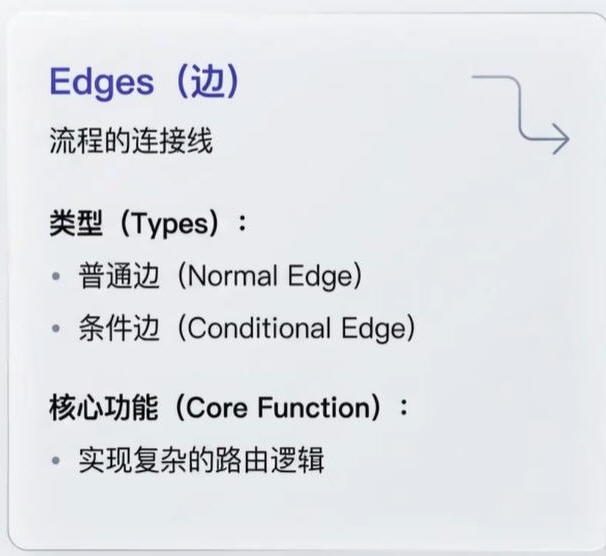
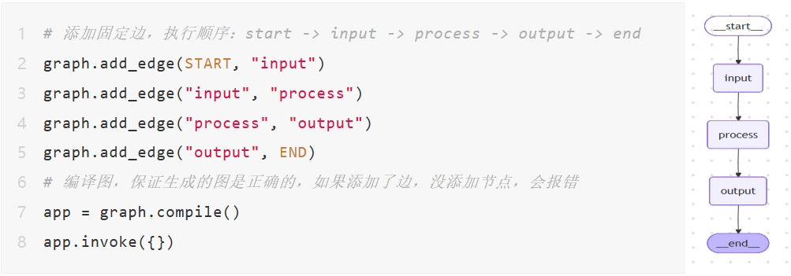
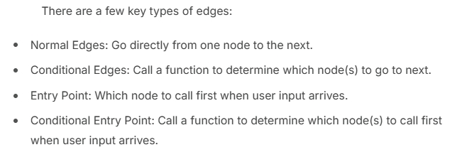
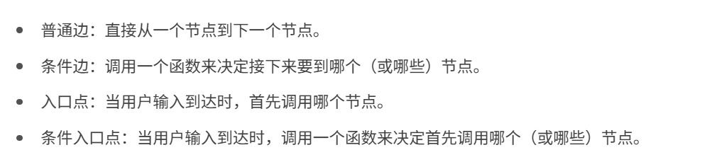

### 2.2 Normal Edges（普通边）

普通边表示无条件地从当前节点跳转到下一节点。

【案例源码】`案例与源码-3-LangGraph框架/05-edge/Edge_Normal.py`

[Edge_Normal.py](案例与源码-3-LangGraph框架/05-edge/Edge_Normal.py ":include :type=code")

### 2.3 Conditional Edges（条件边）

使用 `add_conditional_edges(节点名, 路由函数, 映射)`，根据状态选择性路由到不同节点。

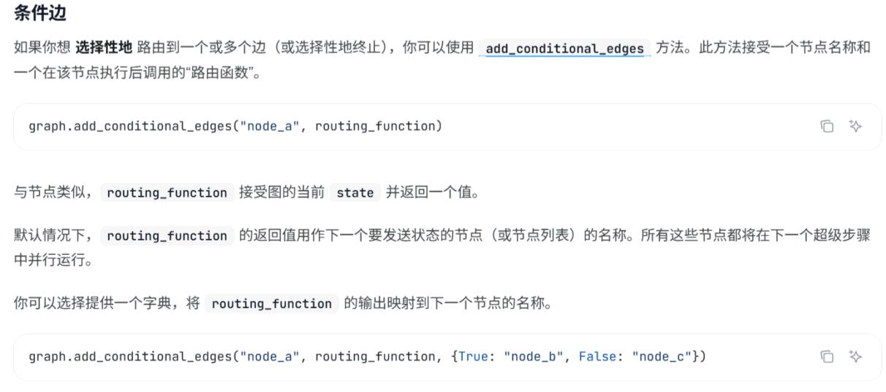
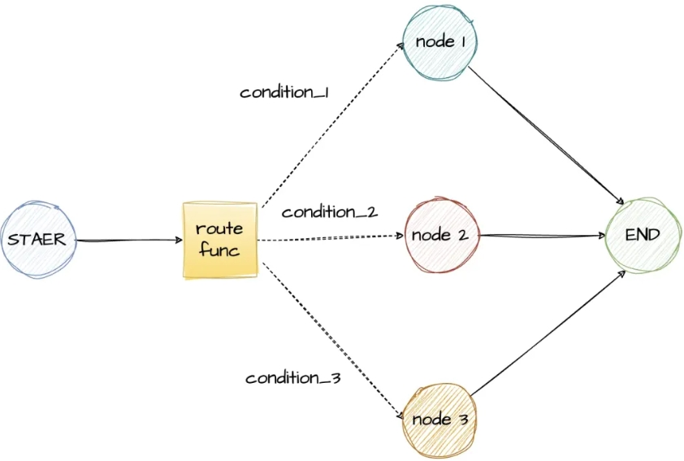

【案例源码】`案例与源码-3-LangGraph框架/05-edge/Edge_Conditional.py`、`Edge_ConditionalV2.py`

[Edge_Conditional.py](案例与源码-3-LangGraph框架/05-edge/Edge_Conditional.py ":include :type=code")
[Edge_ConditionalV2.py](案例与源码-3-LangGraph框架/05-edge/Edge_ConditionalV2.py ":include :type=code")

### 2.4 Entry Point 与 Conditional Entry Point

入口点：`set_entry_point(node_id)` 或 `add_edge(START, node_id)`。条件入口点：`add_conditional_edges(START, route_function, mapping)`，根据输入从不同节点开始。

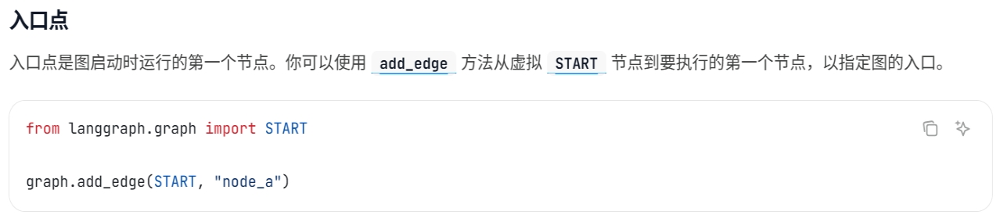
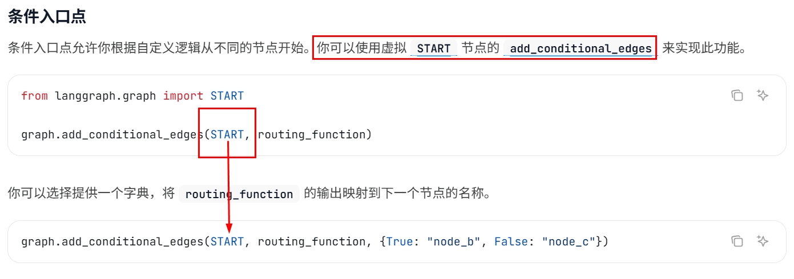

【案例源码】`案例与源码-3-LangGraph框架/05-edge/Edge_EntryPoint.py`、`Edge_ConditionalEntryPoint.py`

[Edge_EntryPoint.py](案例与源码-3-LangGraph框架/05-edge/Edge_EntryPoint.py ":include :type=code")
[Edge_ConditionalEntryPoint.py](案例与源码-3-LangGraph框架/05-edge/Edge_ConditionalEntryPoint.py ":include :type=code")

---

## 3、Send、Command 与 Runtime 上下文

### 3.1 总体概述

Send 和 Command 用于**高级工作流控制**：动态决定下一节点、是否更新状态、是否并行多路执行等。

### 3.2 Send（多路并行与 Map-Reduce）

从条件边返回 `Sequence[Send]`，可为每个 Send 指定目标节点和传入状态，LangGraph 会并行执行，常用于 Map-Reduce（拆分任务 → 并行执行 → 汇总）。Send 接受两个参数：节点名称、传递给该节点的状态。

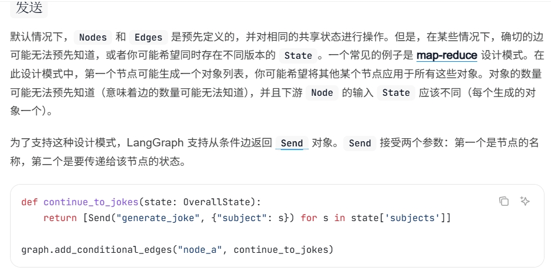
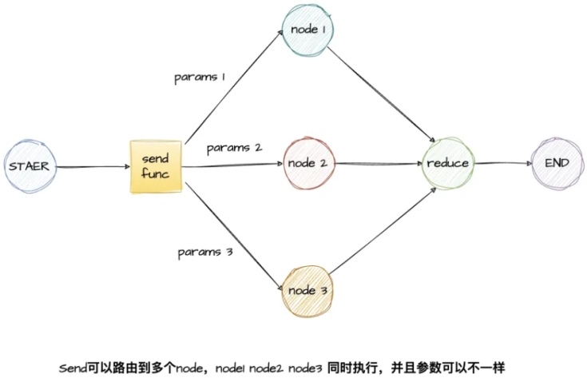
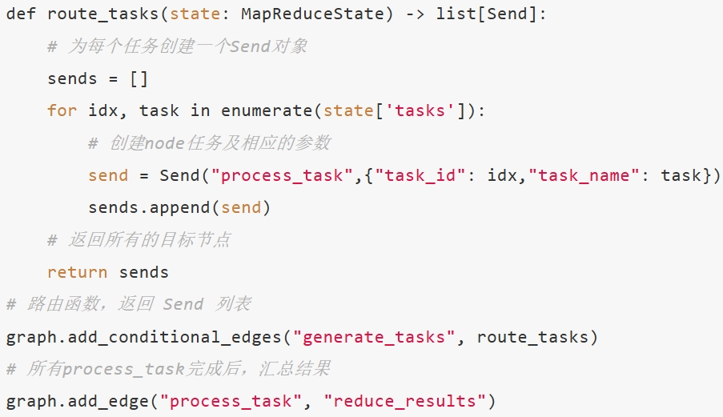
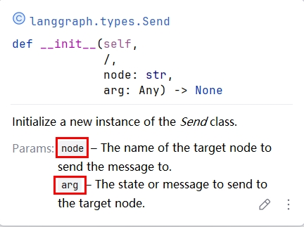
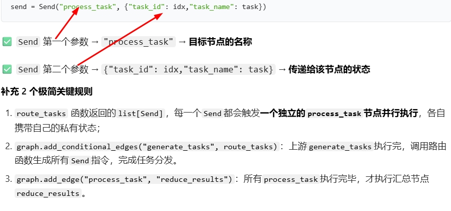

【案例源码】`案例与源码-3-LangGraph框架/06-specialApi/SendDemo.py`

[SendDemo.py](案例与源码-3-LangGraph框架/06-specialApi/SendDemo.py ":include :type=code")

### 3.3 Command（状态更新与流程控制）

Command 可同时**更新状态**和**指定下一节点**（或 END），常用于人机闭环与多智能体交接。与条件边的区别：条件边只做路由；Command 在路由的同时更新状态。

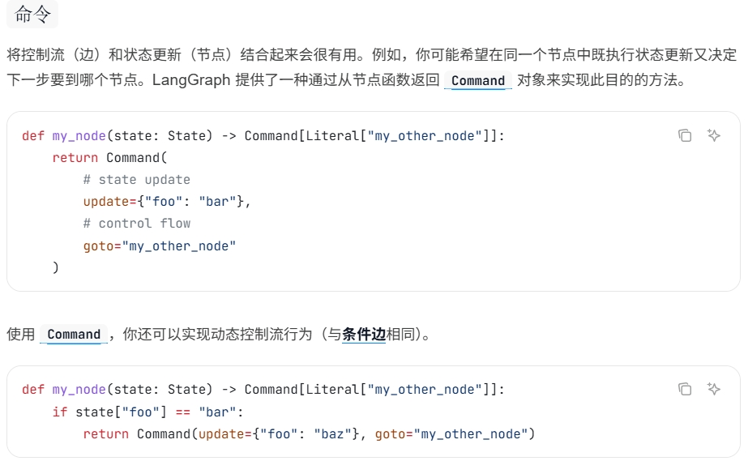
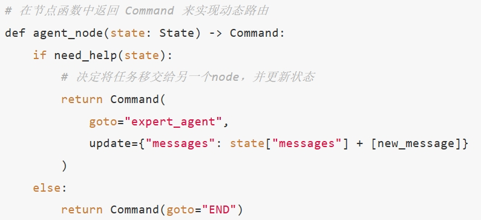

【案例源码】`案例与源码-3-LangGraph框架/06-specialApi/CommandDemo.py`

[CommandDemo.py](案例与源码-3-LangGraph框架/06-specialApi/CommandDemo.py ":include :type=code")

### 3.4 Runtime 运行时上下文

通过 `context_schema` 将**不属于图状态**的配置（如模型名、数据库连接、API 密钥）传入节点，节点通过 `runtime.context` 访问；实现配置与状态分离、类型安全、依赖统一管理。

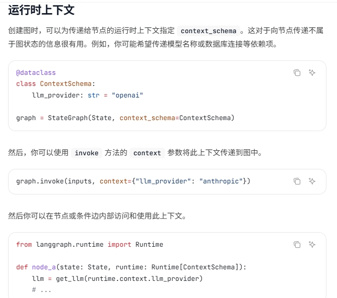
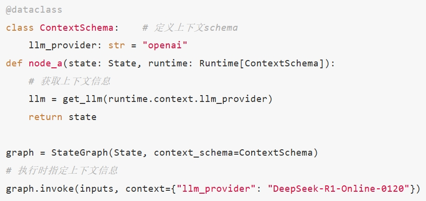
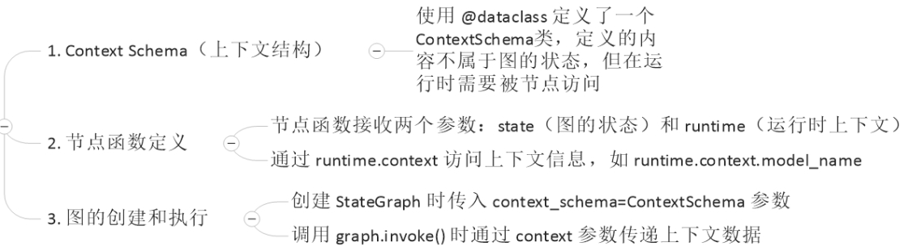

【案例源码】`案例与源码-3-LangGraph框架/06-specialApi/RuntimeContextDemo.py`

[RuntimeContextDemo.py](案例与源码-3-LangGraph框架/06-specialApi/RuntimeContextDemo.py ":include :type=code")

---

**本章小结：**

- **Node**：图的执行单元，可绑定任意函数；START/END、`set_entry_point` / `set_finish_point`；**CachePolicy**（key_func、ttl）、**RetryPolicy**（max_attempts、retry_on）；案例见 `04-node/`。
- **Edge**：普通边、条件边、入口点、条件入口点；`add_conditional_edges` 实现分支与动态入口；案例见 `05-edge/`。
- **Send / Command / Runtime**：**Send** 用于 Map-Reduce 式多路并行（条件边返回 `Sequence[Send]`）；**Command** 在节点内同时更新状态并指定下一跳（或 END）；**Runtime** 通过 `context_schema` 将配置与状态分离；案例见 `06-specialApi/`。

**建议下一步：** 在本地按顺序运行 Node、Edge、Send/Command/Runtime 案例，并尝试修改条件边路由、Command 的 update/goto、Runtime 的 context；若需子图、多智能体或持久化，可继续学习后续 LangGraph 进阶章节。
