# 25 - LangGraph 高级特性

---

**本章课程目标：**

- 理解 LangGraph 的**流式处理（Streaming）**：掌握 values、updates、messages、custom、debug 等流模式的含义与用法，能按需选择并实现「边执行边输出」的体验。
- 掌握**状态持久化（Persistence）**：理解 Checkpointer（短期记忆）与 BaseStore（长期记忆）的区别，会使用内存/SQLite 等检查点实现多轮对话与状态恢复。
- 了解**时间回溯（Time-Travel）**的适用场景与典型用法，能从历史检查点恢复执行或修改状态后重跑，用于调试与分支探索。
- 掌握**子图（Subgraphs）**：能将编译后的图作为父图节点嵌入，理解父子图共享状态与「代理节点 + 状态转换」的跨图交互模式。

**前置知识建议：** 已学习 [第 22 章 LangGraph 概述与快速入门](22-LangGraph概述与快速入门.md)、[第 23 章 图与状态](23-LangGraphAPI：图与状态.md)、[第 24 章 节点、边与进阶](24-LangGraphAPI：节点、边与进阶.md)，掌握图、State、Node、Edge 及图的构建与执行流程。

**学习建议：** 按「流式处理 → 状态持久化 → 时间回溯 → 子图」顺序学习。流式与持久化是多数应用的基础能力；时间回溯偏调试与进阶；子图用于复杂任务拆解与复用。案例源码位于 `案例与源码-3-LangGraph框架/07-senior` 下（streaming、state_persistence、time_travel、subgraph）。

---

## 1、流式处理（Streaming）

### 1.1 什么是流式处理

**官方文档：** https://docs.langchain.com/oss/python/langgraph/streaming

LangGraph 的**流式传输**让 AI 应用能**实时输出结果**，而不必等整个流程跑完，从而提升体验、便于调试。

通俗理解：

- **LangChain 的流式**：主要针对 LLM 的**长篇文字回复**，让文字像打字机一样逐字/逐句输出。
- **LangGraph 的流式**：除了 LLM 的逐 token 输出，还能**实时看到图的执行状态**（当前执行到哪个节点、状态如何变化）、子流程进度、以及自定义的进度消息。

因此，流式处理能实现：实时看流程状态、实时看子流程结果、实时看 LLM 的每一个字、自定义实时消息（如「进度 30%」）、以及调试时查看细节。

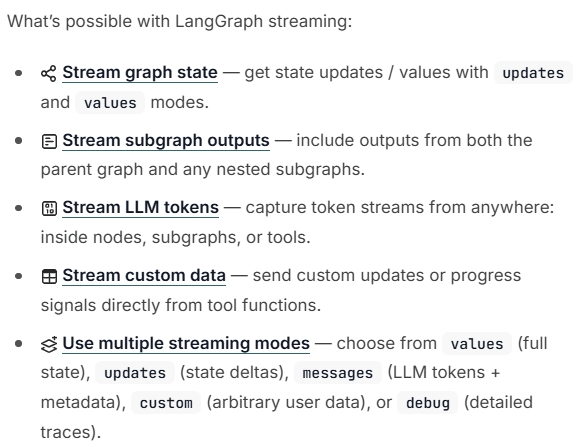

> **说明**：上图为流式传输的整体概念。图执行过程中，可同时或分别流式输出「状态更新」「LLM token」「自定义消息」等，调用方按需选择 `stream_mode` 即可。

### 1.2 流模式（stream_mode）有哪些

使用流式时，通过 **stream_mode** 指定「要流式输出什么」：

| 模式         | 含义                                                                   |
| ------------ | ---------------------------------------------------------------------- |
| **values**   | 每一步结束后，输出**完整的当前状态**（整份 state 的快照）。            |
| **updates**  | 每一步结束后，只输出**本步发生的变化**（增量更新）。                   |
| **messages** | 专门流式输出 **LLM 的每一个 token**，并带元数据（如来自哪个节点）。    |
| **custom**   | 只输出你在节点/工具里通过 `get_stream_writer()` 写入的**自定义消息**。 |
| **debug**    | 输出所有细节，便于调试。                                               |

可组合多种模式：将 `stream_mode` 设为列表（如 `["values", "updates"]`），流式结果会以 `(mode, chunk)` 元组形式返回。

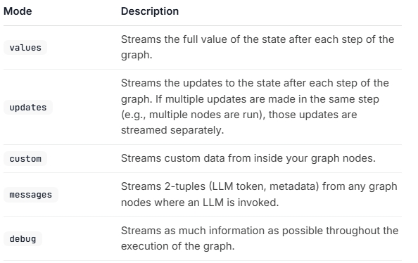

### 1.3 案例：流图状态（values / updates）

下面案例演示：在图执行时用流式传输状态，对比 **updates**（只传增量）与 **values**（传完整状态）。

- **updates**：每一步后只输出该步的**更新**（例如 `{"topic": "ice cream and cats"}`）。
- **values**：每一步后输出**当前状态的全部值**（例如 `{"topic": "ice cream and cats", "joke": ""}`，再下一步则包含 `joke`）。

【案例源码】`案例与源码-3-LangGraph框架/07-senior/streaming/StreamGraphState.py`

[StreamGraphState.py](案例与源码-3-LangGraph框架/07-senior/streaming/StreamGraphState.py ":include :type=code")

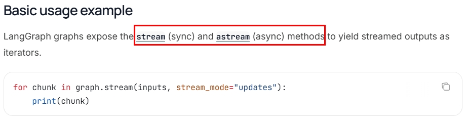

### 1.4 案例：多模式流与 debug

可以将 **stream_mode** 设为列表，同时流式传输多种模式；流式输出为 `(mode, chunk)` 元组。若包含 **debug** 模式，可看到更详细的执行信息（需环境支持）。

【案例源码】`案例与源码-3-LangGraph框架/07-senior/streaming/StreamMultipleModes.py`

[StreamMultipleModes.py](案例与源码-3-LangGraph框架/07-senior/streaming/StreamMultipleModes.py ":include :type=code")

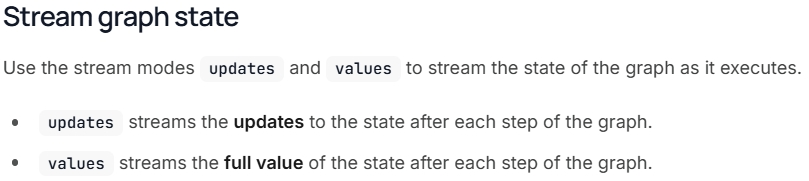

### 1.5 案例：LLM 逐 token 流式输出（messages）

使用 **messages** 流模式时，可从图中任意调用 LLM 的节点/工具/子图，**逐 token** 流式传输 LLM 的输出。每个流式项是一个元组 `(message_chunk, metadata)`：`message_chunk` 为 LLM 的 token 或消息片段，`metadata` 包含节点与调用详情。

【案例源码】`案例与源码-3-LangGraph框架/07-senior/streaming/StreamLLMTokens.py`

[StreamLLMTokens.py](案例与源码-3-LangGraph框架/07-senior/streaming/StreamLLMTokens.py ":include :type=code")

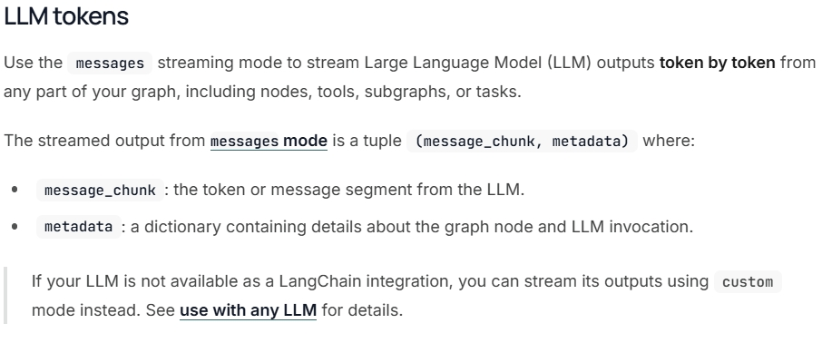

### 1.6 案例：自定义数据流（custom）

若需要在节点或工具内部**主动推送自定义数据**（如进度、阶段说明），可：

1. 在节点内通过 **get_stream_writer()** 获取流写入器，并调用 `writer({...})` 发送自定义键值。
2. 调用 **stream() / astream()** 时设置 **stream_mode="custom"**（或包含 `"custom"` 的列表，如 `["updates", "custom"]`）以在流中收到这些数据。

【案例源码】`案例与源码-3-LangGraph框架/07-senior/streaming/StreamCustomDataSimple.py`（最简示例）

[StreamCustomDataSimple.py](案例与源码-3-LangGraph框架/07-senior/streaming/StreamCustomDataSimple.py ":include :type=code")

【案例源码】`案例与源码-3-LangGraph框架/07-senior/streaming/StreamCustomData.py`（带进度与 custom+updates 组合）

[StreamCustomData.py](案例与源码-3-LangGraph框架/07-senior/streaming/StreamCustomData.py ":include :type=code")

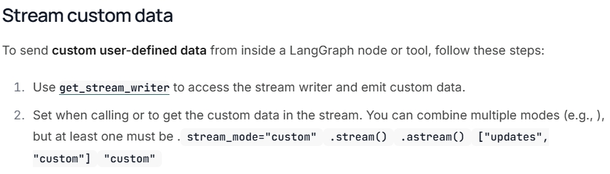

---

## 2、状态持久化（Persistence）

### 2.1 什么是状态持久化

**官方文档：** https://docs.langchain.com/oss/python/langgraph/persistence

**状态持久化**指在程序运行过程中**把当前状态保存下来**，以便在程序退出、重启或后续请求中**恢复执行**，避免任务丢失。

在 LangGraph 中，启用持久化后，工作流**每一步结束后**都会将当前图状态（变量、历史消息、下一步要执行的节点等）保存为**检查点（Checkpoint）**。检查点可按 **thread_id**（会话 ID，区别于操作系统线程 ID）区分不同会话；恢复或继续执行时，需在配置中指定 **thread_id**，例如：`{"configurable": {"thread_id": "user-001"}}`。

LangGraph 支持将检查点存于**内存、SQLite、Postgres、Redis** 等存储介质。

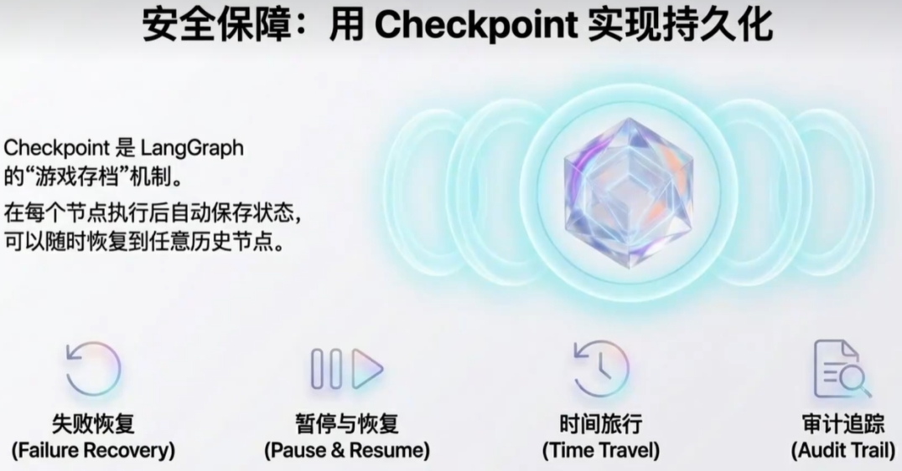

### 2.2 短期记忆：Checkpointer

**短期记忆**由 **Checkpointer** 实现（如 MemorySaver、RedisSaver、PostgresSaver 等）：

- **作用**：把每轮消息与工具调用结果序列化为图状态，按 **thread_id** 持久化；下次用相同 **thread_id** 调用时，可自动从上次状态续写。
- **原理**：每次 `invoke` / `stream` 都会维护一份 state；无 Checkpointer 时，state 仅在本次调用内有效，调用结束即丢失；启用 Checkpointer 后，state 会写入存储，下次同 thread_id 即可恢复。

### 2.3 长期记忆：BaseStore

**长期记忆**由 **BaseStore**（如 InMemoryStore、RedisStore、AsyncPostgresStore 等）提供：

- **作用**：显式保存「用户偏好」「背景事实」等高密度、跨会话信息，由应用或 LLM 主动读写；支持向量检索与命名空间隔离。
- **与 Checkpointer 的区别**：Checkpointer 保存的是**图的运行状态**（短期、同一会话内的连续对话）；Store 提供**跨线程/会话的持久化键值存储**，适合需长期保留的业务数据。

### 2.4 案例：内存检查点（MemoryPersistence）

使用 **InMemorySaver** 将检查点保存在内存中，无需额外配置；程序关闭后数据丢失，适合本地测试与验证工作流逻辑。

【案例源码】`案例与源码-3-LangGraph框架/07-senior/state_persistence/MemoryPersistence.py`

[MemoryPersistence.py](案例与源码-3-LangGraph框架/07-senior/state_persistence/MemoryPersistence.py ":include :type=code")

### 2.5 案例：SQLite 检查点（SqlitePersistence）

使用 **SqliteSaver** 将检查点存入 SQLite 数据库，适合本地或轻量生产；需安装 `langgraph-checkpoint-sqlite`。生产环境可选用 **PostgresSaver**（`langgraph-checkpoint-postgres`）。

【案例源码】`案例与源码-3-LangGraph框架/07-senior/state_persistence/SqlitePersistence.py`

[SqlitePersistence.py](案例与源码-3-LangGraph框架/07-senior/state_persistence/SqlitePersistence.py ":include :type=code")

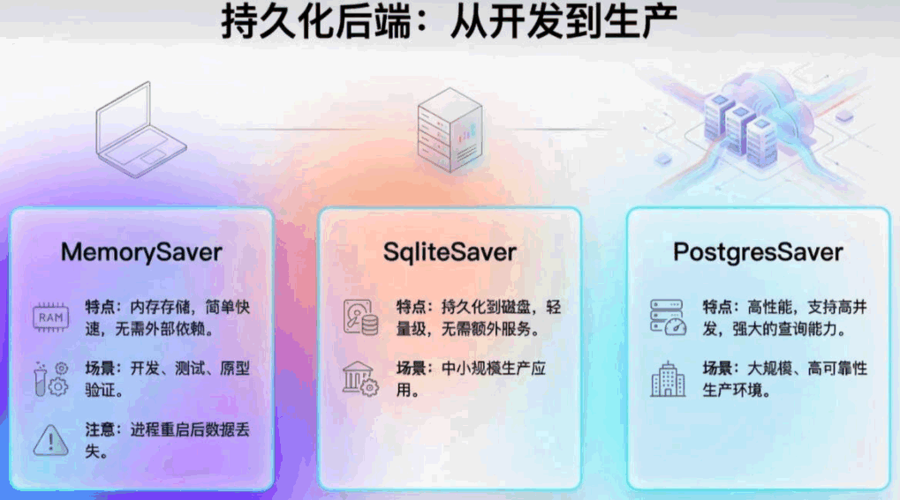

### 2.6 预构建 Agent 与记忆存储（AgentPersistence）

使用 LangGraph 的 **create_agent** 创建带工具调用的 Agent 时，可传入 **checkpointer**（如 InMemorySaver）；同一 **thread_id** 下多次 **invoke** 即形成多轮对话，Agent 会基于历史消息与状态继续回复。

【案例源码】`案例与源码-3-LangGraph框架/07-senior/state_persistence/AgentPersistence.py`

[AgentPersistence.py](案例与源码-3-LangGraph框架/07-senior/state_persistence/AgentPersistence.py ":include :type=code")

---

## 3、时间回溯（Time-Travel）

**官方文档：** https://docs.langchain.com/oss/python/langgraph/use-time-travel

在处理**非确定性系统**（如由 LLM 驱动的智能体）时，我们常需要：理解推理过程、调试错误、探索替代路径。**时间回溯**允许你从**某个历史检查点**恢复执行——既可原样重放，也可**修改该状态后**再执行，从而产生新的分支，便于调试与 what-if 分析。

通俗理解：普通对话只能按顺序进行；有了时间回溯，可以「跳到」某一步（例如某次工具调用前），从该状态继续执行，甚至尝试不同分支。

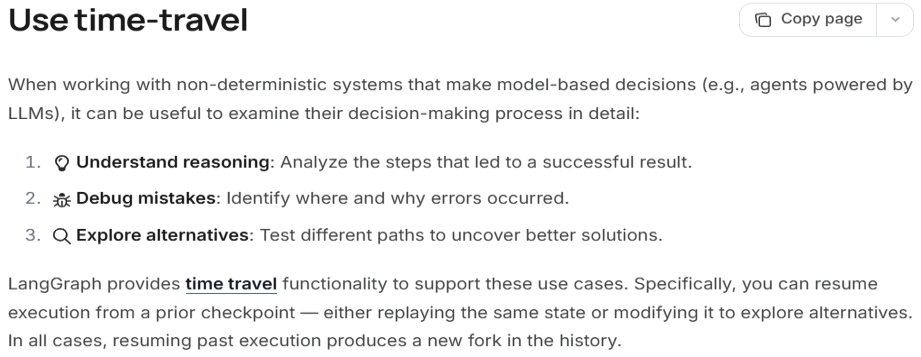

**典型用法：**

1. 用 **invoke** 或 **stream** 运行图，生成一段执行历史。
2. 用 **get_state_history(config)** 获取该 thread 的检查点历史，找到目标 **checkpoint_id**。
3. （可选）用 **update_state(config, values={...})** 修改该检查点的状态。
4. 使用 **invoke(None, new_config)** 或 **stream(None, new_config)** 从该检查点恢复执行。

**使用场景：** 调试某历史状态下的行为、修复错误后重走路径、探索分支、人类反馈（HITL）时回退并重试。

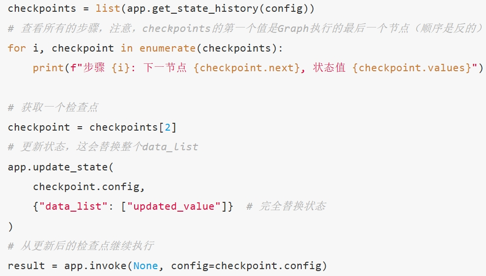

【案例源码】`案例与源码-3-LangGraph框架/07-senior/time_travel/TimeTravel.py`

[TimeTravel.py](案例与源码-3-LangGraph框架/07-senior/time_travel/TimeTravel.py ":include :type=code")

---

## 4、子图（Subgraphs）

**官方文档：** https://docs.langchain.com/oss/python/langgraph/use-subgraphs

在 LangGraph 中，**可以将一个完整的图作为另一个图的节点**嵌入使用，即**子图**。适用于：将复杂任务拆成多个专业子流程、每个子图独立开发测试与复用；子图可拥有私有数据，也可与父图共享部分状态。

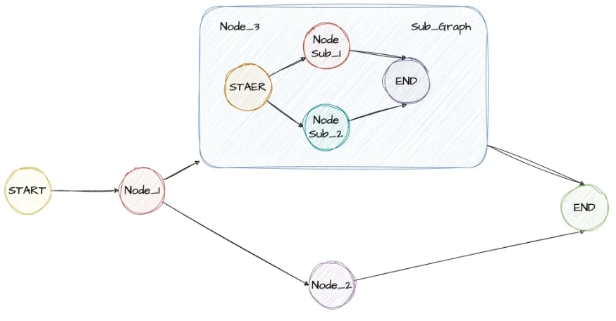

### 4.1 子图作为节点：最简示例（SubGraphHello）

子图的使用方式与普通节点类似：把**编译后的子图**作为节点加入父图即可。触发该节点时，相当于执行一次 `subgraph.invoke(state)`，子图返回的状态会按父图定义的 Reducer 合并回父图状态。

【案例源码】`案例与源码-3-LangGraph框架/07-senior/subgraph/SubGraphHello.py`

[SubGraphHello.py](案例与源码-3-LangGraph框架/07-senior/subgraph/SubGraphHello.py ":include :type=code")

### 4.2 父子图共享状态字段（SubGraphSimple）

当父子图**共享部分状态字段**（如 `parent_messages`）时，子图内可读写这些字段，父图最终得到的是合并后的状态；子图独有的字段（如 `sub_message`）仅在子图内有效，父图状态定义中若无该字段则不会出现在父图最终状态中。

【案例源码】`案例与源码-3-LangGraph框架/07-senior/subgraph/SubGraphSimple.py`

[SubGraphSimple.py](案例与源码-3-LangGraph框架/07-senior/subgraph/SubGraphSimple.py ":include :type=code")

### 4.3 从节点调用图：状态转换与代理节点（SubGraphPro）

当**父子图状态结构不同**时（例如父图只有 `user_query`、`final_answer`，子图有 `analysis_input`、`analysis_result`、`intermediate_steps`），不能直接把子图当节点挂上，而应通过**父图的一个代理节点**完成：① 父状态 → 子图输入；② 调用 `compiled_subgraph.invoke(sub_input)`；③ 子图输出 → 父状态。这是 LangGraph 中**跨图状态交互**的常见模式。

【案例源码】`案例与源码-3-LangGraph框架/07-senior/subgraph/SubGraphPro.py`

[SubGraphPro.py](案例与源码-3-LangGraph框架/07-senior/subgraph/SubGraphPro.py ":include :type=code")

---

**本章小结：**

- **流式处理**：通过 `stream_mode`（values、updates、messages、custom、debug）实现「边执行边输出」，提升体验与可观测性；可在节点内用 `get_stream_writer()` 发送自定义流数据。
- **状态持久化**：Checkpointer（如 MemorySaver、SqliteSaver）提供按 thread_id 的短期记忆，实现多轮对话与恢复；BaseStore 提供跨会话的长期存储。编译图时传入 `checkpointer` 即可启用。
- **时间回溯**：依赖 Checkpointer 保存的历史检查点，通过 `get_state_history`、`update_state` 与 `invoke(None, config)` 从某历史状态恢复或修改后重跑，用于调试与分支探索。
- **子图**：可将编译后的图作为父图的一个节点；父子图状态可共享字段，也可通过「代理节点」做状态转换后调用子图，实现复杂任务拆解与复用。

**建议下一步：** 学习 [第 26 章 LangGraphAPI：多智能体与 A2A 协议](26-LangGraphAPI：多智能体与A2A.md)，理解 A2A 与 MCP 的区别、多智能体架构形态及 Supervisor、Handoff 等案例；并在本地运行 `案例与源码-3-LangGraph框架/07-senior` 下的流式、持久化、时间回溯与子图案例以巩固本章内容。
