# 26 - LangGraph 多智能体与 A2A

---

**本章课程目标：**

- 理解 **A2A（Agent-to-Agent）协议**与 **MCP（Model Context Protocol）** 的本质区别：前者侧重代理协作，后者侧重工具访问；能用自己的话说明二者在「修车厂」等类比中的角色。
- 掌握**多智能体架构**的常见形态：单智能体、Network、Supervisor、Supervisor as tools、Hierarchical、Custom；能根据场景做大致选型。
- 会阅读并运行 **Supervisor** 与 **Handoff** 案例代码（含 V0.3 / V1.0 与 Handoff 工具），理解主管协调子 Agent、控制权交接与状态传递的用法。
- 了解 **Agent Skills** 的定位：提示词的规范化与工程化落地，可复用、可组合的技能单元。

**前置知识建议：** 已学习 [第 22 章 LangGraph 概述与快速入门](22-LangGraph概述与快速入门.md)、[第 23 章 图与状态](23-LangGraphAPI：图与状态.md)、[第 24 章 节点、边与进阶](24-LangGraphAPI：节点、边与进阶.md)、[第 25 章 流式、持久化、时间回溯与子图](25-LangGraphAPI：流式、持久化、时间回溯与子图.md)，掌握图、State、流式与持久化；建议已学 [第 17 章 工具调用](17-Tools工具调用.md)、[第 21 章 Agent 智能体](21-Agent智能体.md)。

**学习建议：** 先通读「A2A 与 MCP 的区别」和「多智能体架构形态」建立概念，再按顺序学习单智能体示例、Supervisor（V0.3 / V1.0）、Handoff；Agent Skills 可作为扩展阅读。案例源码位于 `案例与源码-3-LangGraph框架/08-multi_agent`。

---

## 1、A2A 协议与多智能体架构概览

### 1.1 概述

当前 AI 架构中，两个重要协议在重塑智能系统构建方式：**Google 的 Agent-to-Agent 协议（A2A）** 与 **Model Context Protocol（MCP）**。二者共同指向一个趋势：从**确定性编程**转向**自主协作系统**。

### 1.2 协议的本质区别：工具 vs 代理

- **MCP（Model Context Protocol）**  
  关注**工具访问**：定义大模型如何与各种工具、数据、资源交互的标准方式。可理解为：让 AI 能像程序员调用函数一样使用各类能力。

- **A2A（Agent-to-Agent Protocol）**  
  关注**代理协作**：定义智能体之间如何发现、通信、协作，使不同 AI 系统能像人类团队一样协同完成任务。

**类比：**

- **MCP** 像「工具车间」：让工人（模型）知道每个工具（API、函数）的位置和用法，但不负责工人之间的分工与协作。
- **A2A** 像「会议室」：让不同专业代理能坐在一起，理解彼此专长并协调如何共同完成复杂任务。

**修车厂例子：** MCP 让维修工知道如何使用千斤顶、扳手等工具（人 invoke 工具）；A2A 让客户能与维修工沟通（「车有异响」），并让维修工之间或与配件商代理协作（「发左轮照片」「漏液持续多久了？」）。

### 1.3 多智能体架构（Multi-Agent Architecture）

在 LangChain 体系中，**LangChain** 主要负责与大语言模型的交互，**LangGraph** 负责复杂流程调度。二者结合可实现**多智能体架构**：不是让一个大模型「包打天下」，而是由**多个专精的 Agent 协作**完成更复杂的任务。

- **单智能体（Single Agent）**：一个 LLM + 一组工具；LLM 自己决定是否调工具、完成所有逻辑。适合简单对话助手、单一领域（天气、翻译、知识库 QA 等）。
- **多智能体**：多个 Agent 节点组成一张图，通过消息传递、条件跳转与记忆协作；适合解耦复杂任务、可扩展、并可结合 HITL、时间回溯等做流程管理。

【案例源码】`案例与源码-3-LangGraph框架/08-multi_agent/LangGraphAgent.py`：一个 Agent 绑定天气工具，用户问天气时由该 Agent 调用工具并回复。

[LangGraphAgent.py](案例与源码-3-LangGraph框架/08-multi_agent/LangGraphAgent.py ":include :type=code")

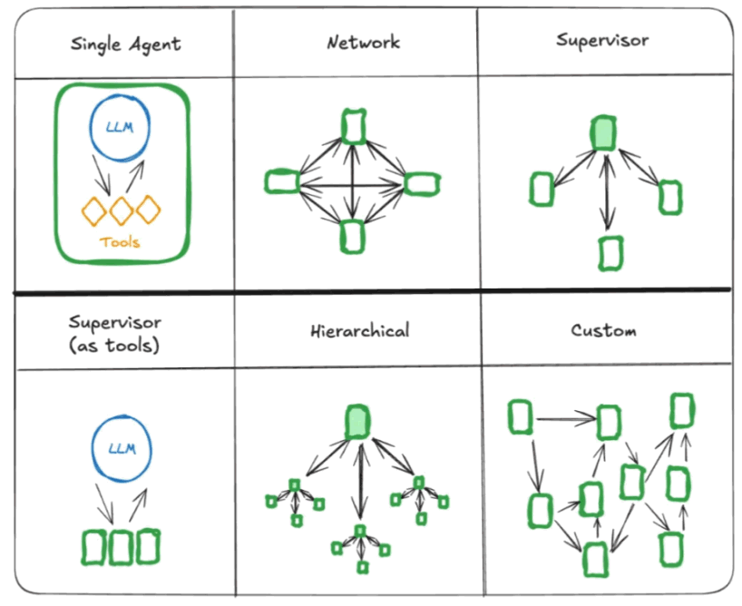

### 1.4 多智能体的常见连接方式

- **Network（网络型）**：多个 Agent 平等存在，彼此可通信，类似去中心化网络；适合多视角协作、并行搜索与汇总、研究讨论等。
- **Supervisor（监督者型）**：一个主控 Agent（Supervisor）调度其他 Agent；子 Agent 各司其职。适合企业助手（IT/HR/财务）、智能客服按领域分配专家。
- **Supervisor as tools**：一个 LLM 把不同「子智能体」当作工具调用，子智能体像专业插件。
- **Hierarchical（层级型）**：多层监督者，顶层分配任务给子 Supervisor，再下放到具体 Agent；适合大型任务拆解、复杂管道。
- **Custom（自定义）**：按业务自由组合路由、协作、监督与 HITL。

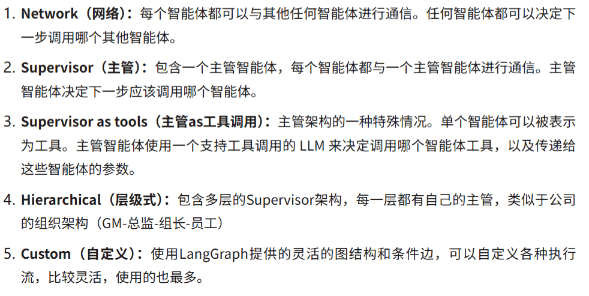

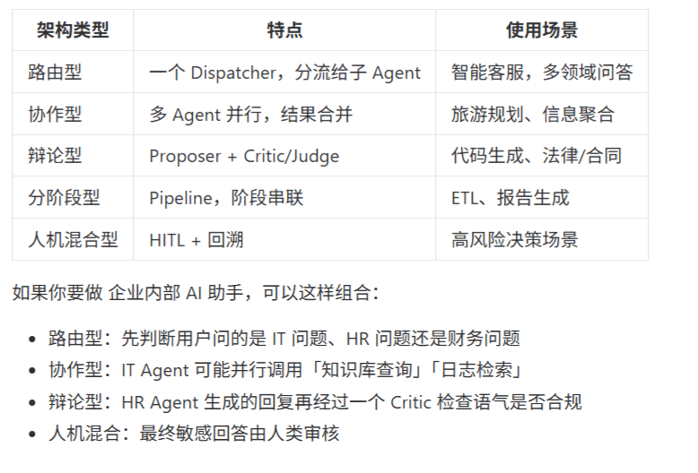

---

## 2、多智能体案例：Supervisor 与 Handoff

### 2.1 Supervisor（主管）架构

**Supervisor** 模式由一个**中央主管智能体**协调所有子智能体：主管控制通信流与任务委派，根据当前上下文与任务需求决定调用哪个子 Agent，类似企业中的「项目经理」——管理者接收任务、分解并委派给各工作者 Agent，最后整合结果。

LangGraph 提供 **langgraph-supervisor** 库（`pip install langgraph-supervisor`），可快速搭建 Supervisor 图。

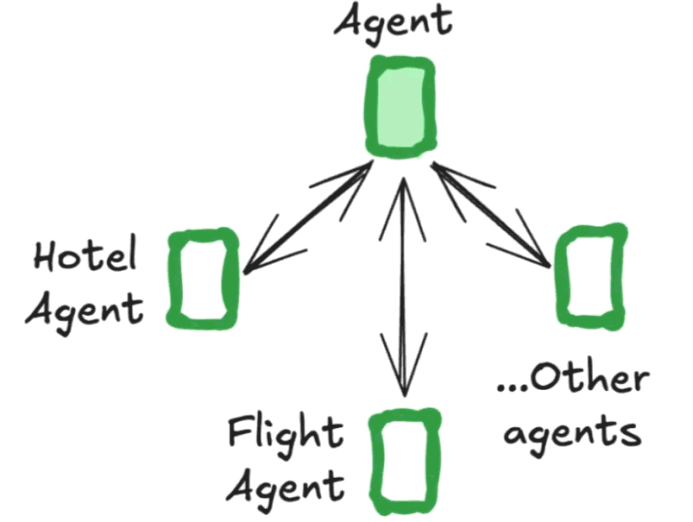

**流程说明（概念）：** 用户输入 → Supervisor 解析需求 → 按需调用 flight_assistant / hotel_assistant → 子 Agent 调用工具并回报 → Supervisor 汇总并回复用户。

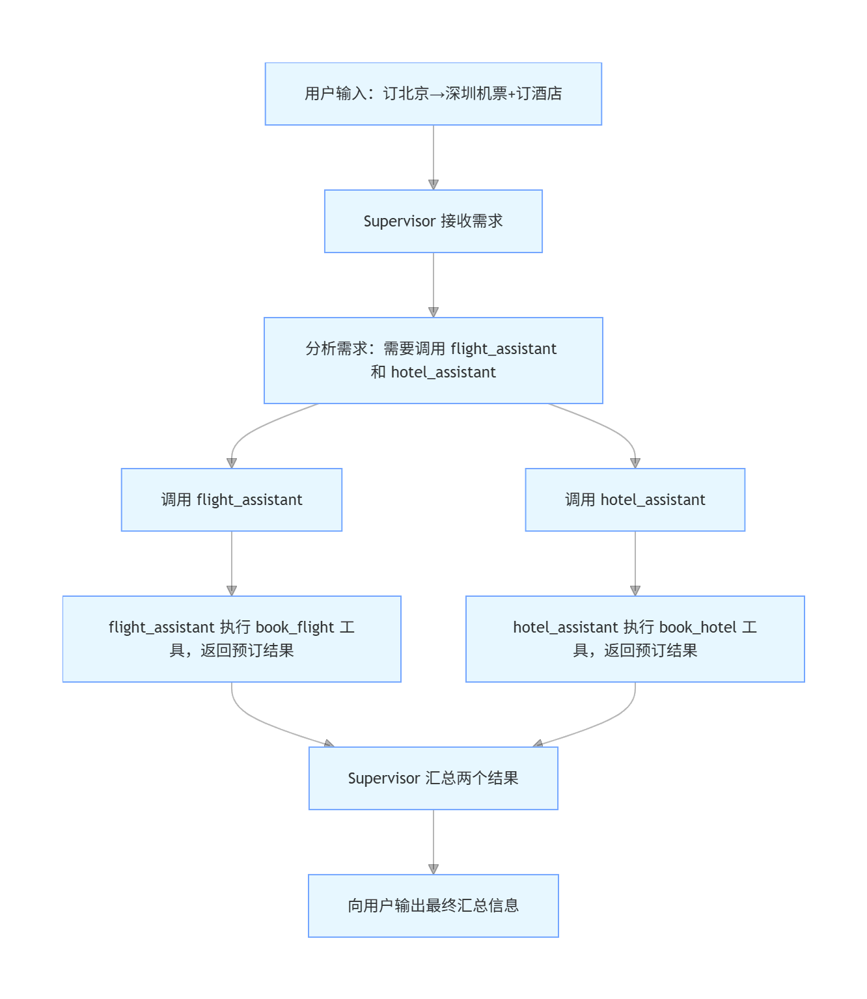

**老版本示例（V0.3，基于 create_react_agent）**  
【案例源码】`案例与源码-3-LangGraph框架/08-multi_agent/SupervisorV0.3.py`

[SupervisorV0.3.py](案例与源码-3-LangGraph框架/08-multi_agent/SupervisorV0.3.py ":include :type=code")

**新版本示例（V1.0，基于 create_agent）**  
【案例源码】`案例与源码-3-LangGraph框架/08-multi_agent/SupervisorV1.0.py`

[SupervisorV1.0.py](案例与源码-3-LangGraph框架/08-multi_agent/SupervisorV1.0.py ":include :type=code")

### 2.2 Handoff（交接）

**Handoff** 指一个智能体将**控制权与状态**交接给另一个智能体，需包含：**目的地**（下一个 Agent）与**传递给下一 Agent 的 State**。Supervisor 通常使用 `create_handoff_tool` 等移交工具；也可以**自定义 Handoff 工具**，在父图中用 Command + Send 将任务与状态交给指定 Agent。

【案例源码】`案例与源码-3-LangGraph框架/08-multi_agent/SupervisorHandoff.py`

[SupervisorHandoff.py](案例与源码-3-LangGraph框架/08-multi_agent/SupervisorHandoff.py ":include :type=code")

---

## 3、Agent Skills（智能体技能）简介

**参考链接：**

- https://agentskills.io/what-are-skills
- https://developers.openai.com/codex/skills/

**是什么：**  
可以把 **Agent** 想象成厨师，**Agent Skills** 则是厨师掌握的烹饪技法（刀工、炒、蒸、烤）与厨房工具（锅、铲、烤箱）。Agent 决定「做什么、用什么、按什么顺序」；Skills 是完成具体工序的**能力单元与流程**。二者结合才能完成复杂任务。

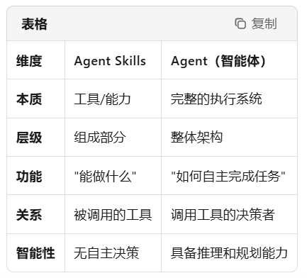

**类比示例（技能步骤）：** 如炒菜可拆成备料、热锅、下料、调味、装盘等步骤，每个步骤可对应一组规范化操作（类似「技能」）。下图为人做豆浆/炸油条等技能流程示例。

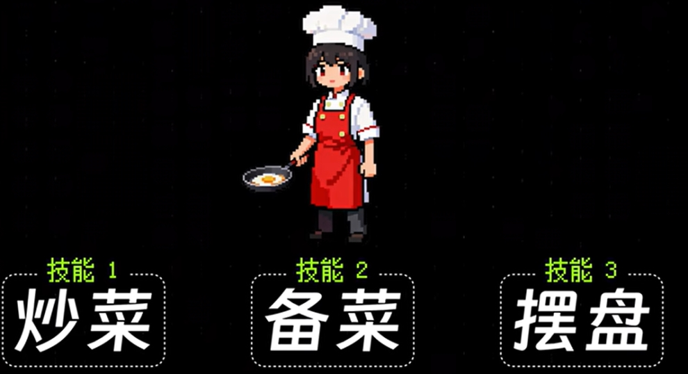

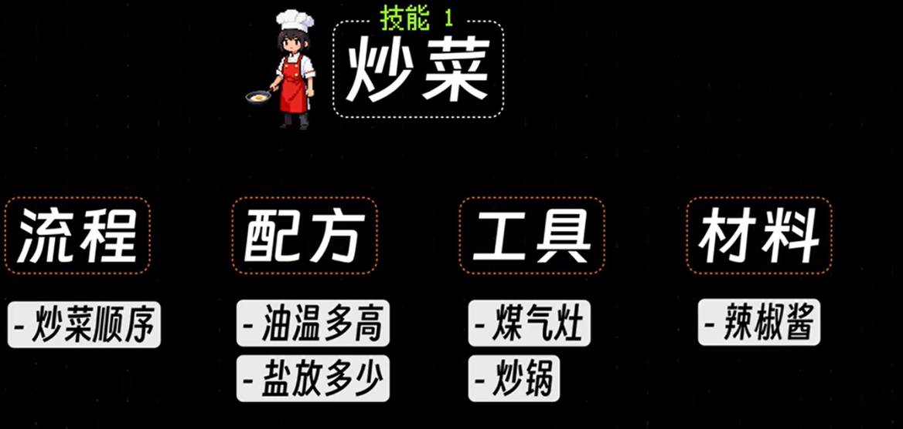

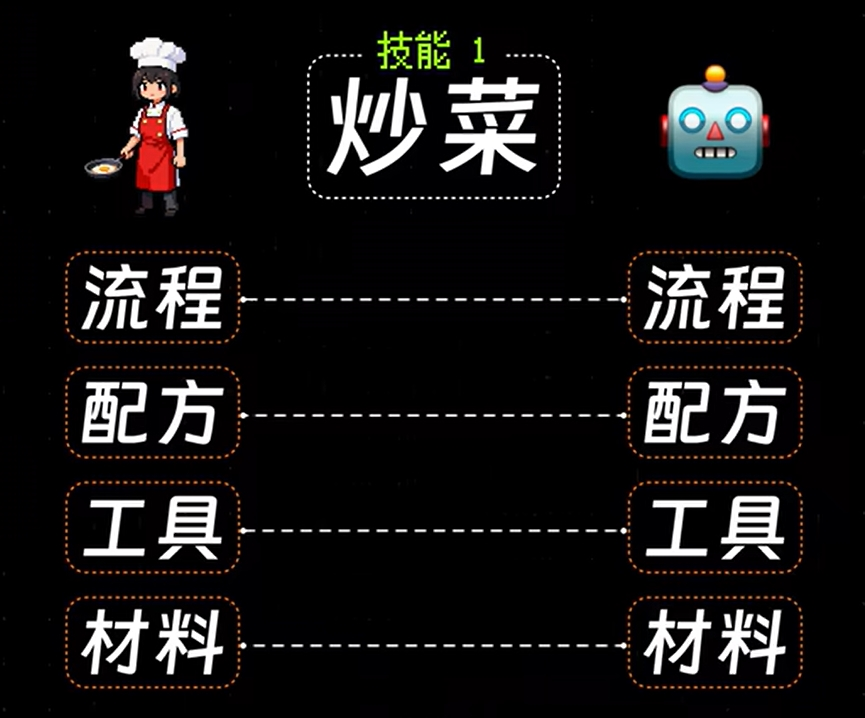

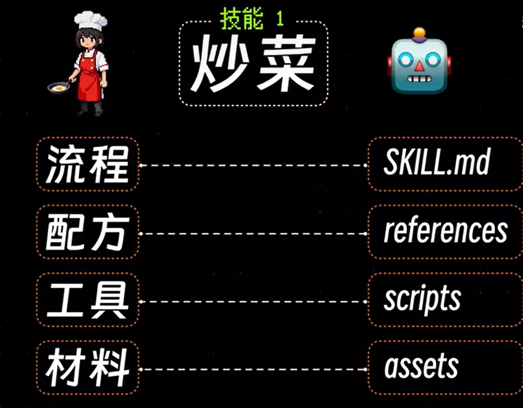

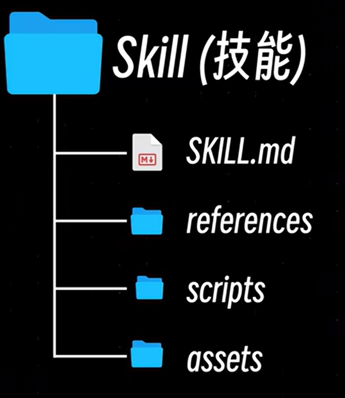

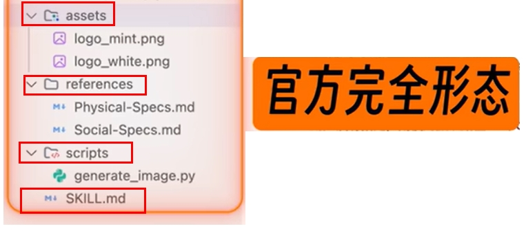

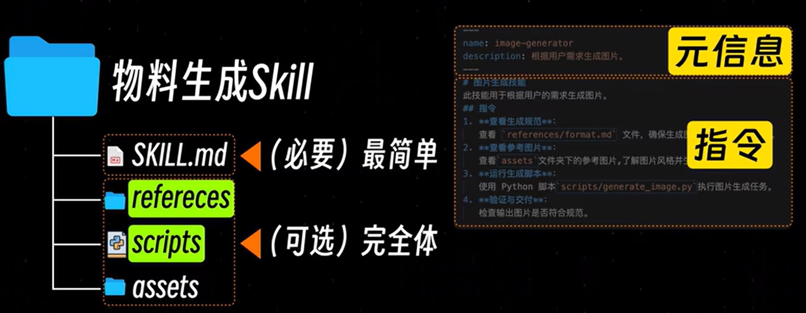

**官方说法：** 常提到「渐进式披露」与分层架构——从简单到复杂，按需暴露能力。

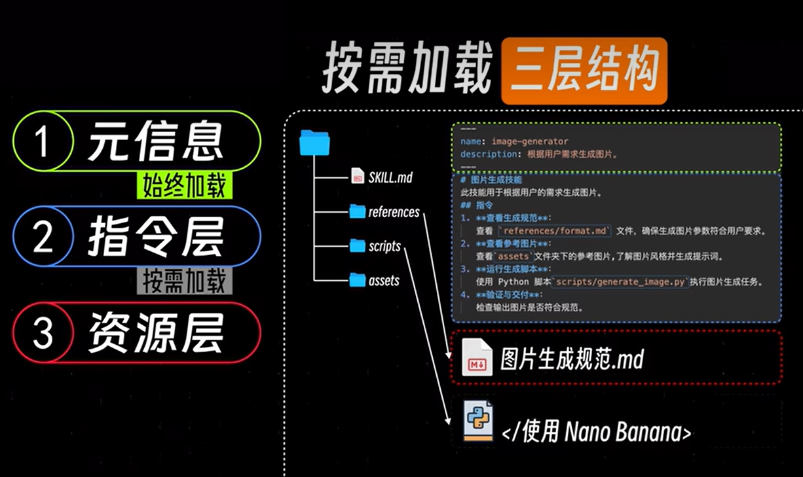

**一句话总结：** Agent Skills 可理解为**提示词的规范化与工程化落地**，类似提示词版本的「Maven 结构」——可复用、可组合、可管理的技能单元与依赖关系。

---

**本章小结：**

- **A2A 与 MCP**：MCP 侧重工具访问（模型如何调用工具、数据与资源），A2A 侧重代理协作（智能体之间如何发现、通信与协同）；二者互补，共同支撑从确定性编程到自主协作系统的演进。
- **多智能体架构**：常见形态包括单 Agent、Network、Supervisor、Supervisor as tools、Hierarchical、Custom；选型时需考虑任务复杂度、是否需要中心调度、是否需层级拆解等。
- **Supervisor**：由中央主管 Agent 接收任务、委派子 Agent、汇总结果；可使用 langgraph-supervisor 或自建图实现；案例见 SupervisorV0.3、SupervisorV1.0。
- **Handoff**：控制权与状态在 Agent 间交接，需明确目的地与传递的 State；可通过 create_handoff_tool 或自定义 Command + Send 实现，案例见 SupervisorHandoff。
- **Agent Skills**：将提示词与能力规范化为可复用、可组合的「技能」单元，便于工程化落地与维护。

**建议下一步：** 在本地运行 `案例与源码-3-LangGraph框架/08-multi_agent` 下的 LangGraphAgent、SupervisorV1.0、SupervisorHandoff，结合 [第 21 章 Agent 智能体](21-Agent智能体.md)、[第 25 章 流式、持久化、时间回溯与子图](25-LangGraphAPI：流式、持久化、时间回溯与子图.md) 巩固图、状态与多轮对话；若需将多智能体与业务系统深度集成，可继续查阅 LangGraph 官方 Multi-Agent 与 A2A 相关文档。
