# 3.5-Dify 案例：客户投诉分类助手-钉钉

## 1、功能概览

我们这里构建一个使用了钉钉群机器人的消息反馈工作流。将用户的文字问题进行分类和拆解，分析后通过钉钉群机器人发送到群中。

如下是其工作流的整体配置。

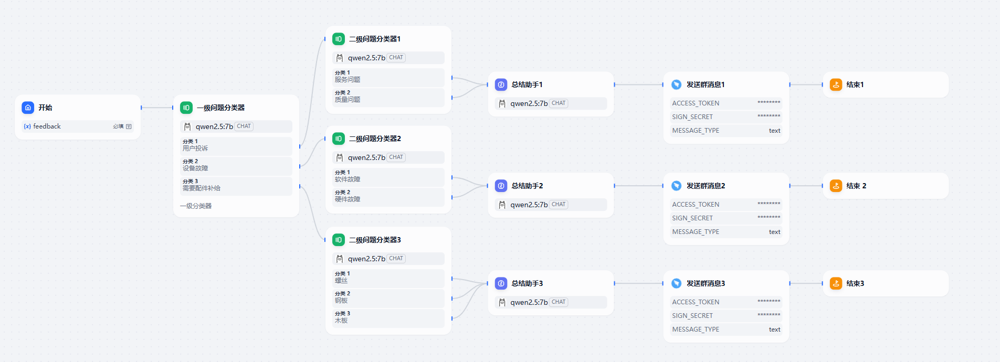

## 2、具体实现

### 2.1 开始

创建空白应用

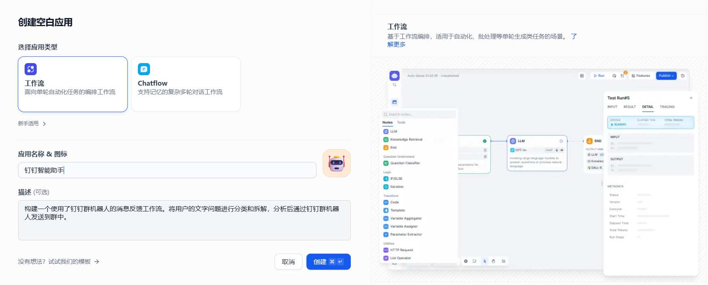

接着开始编辑工作流。

工作流从此处开始。我们在输入字段中添加自己指定的输入内容

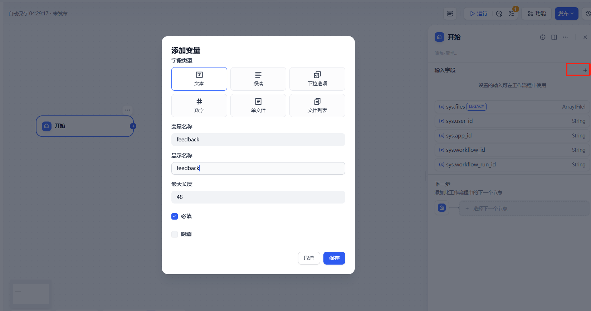

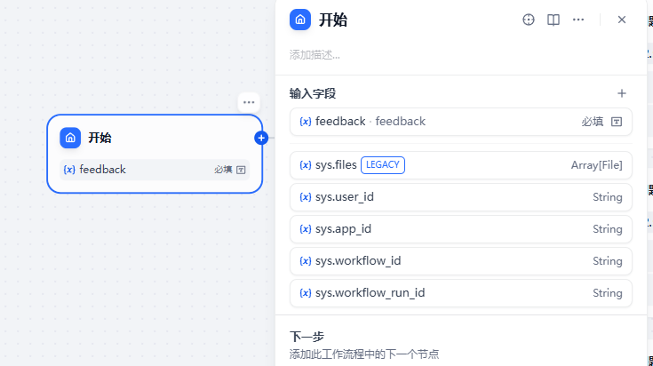

### 2.2 问题分类器

这里调用了两级问题分类器。问题分类器会调用 LLM，从问题列表中选择最与用户的提问符合的一条，然后进入该条

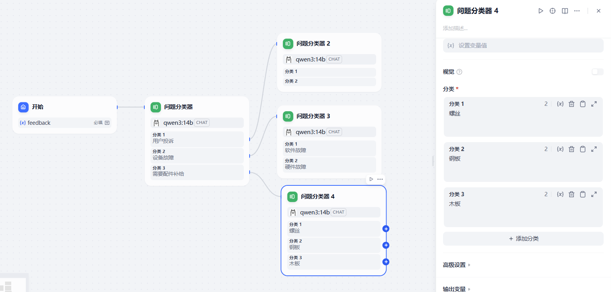

### 2.3 总结助手

是问题分类器的下游，在系统提示词中传递进两级分类的名称，以及初始问题，要求进行总结（需要输入变量的时候只需要输入一个 **/** 即可开始联想寻找）

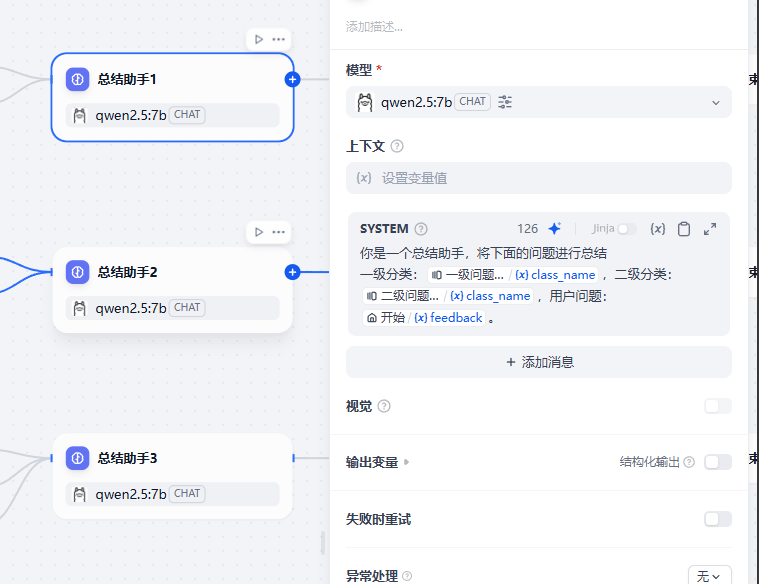

```
你是一个总结助手，将下面的问题进行总结
一级分类：{{#1763188881440.class_name#}}，二级分类：{{#1763189022754.class_name#}}，用户问题：{{#1763188813397.feedback#}}
```

### 2.4 钉钉群消息工具

首先在 Dify 的工具中添加这个钉钉群机器人工具

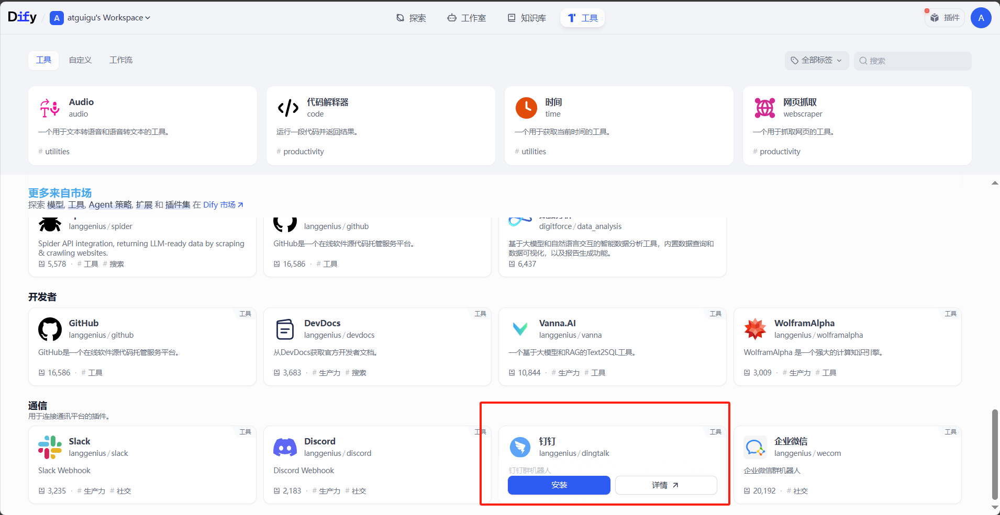

我们要使用 PC 端的钉钉进行群机器人的创建。首先你需要在一个你是管理员的组织内创建一个群，然后才能在这个群里创建机器人。

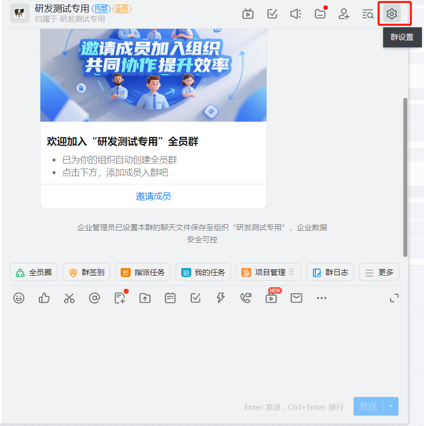

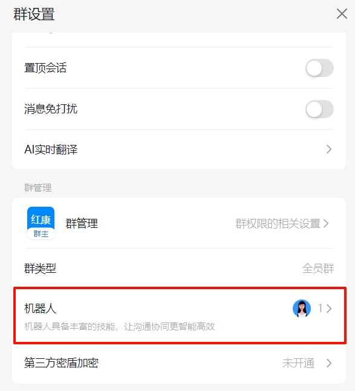

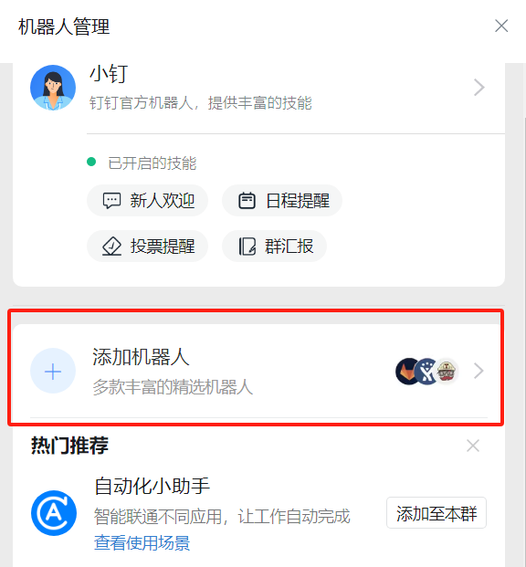

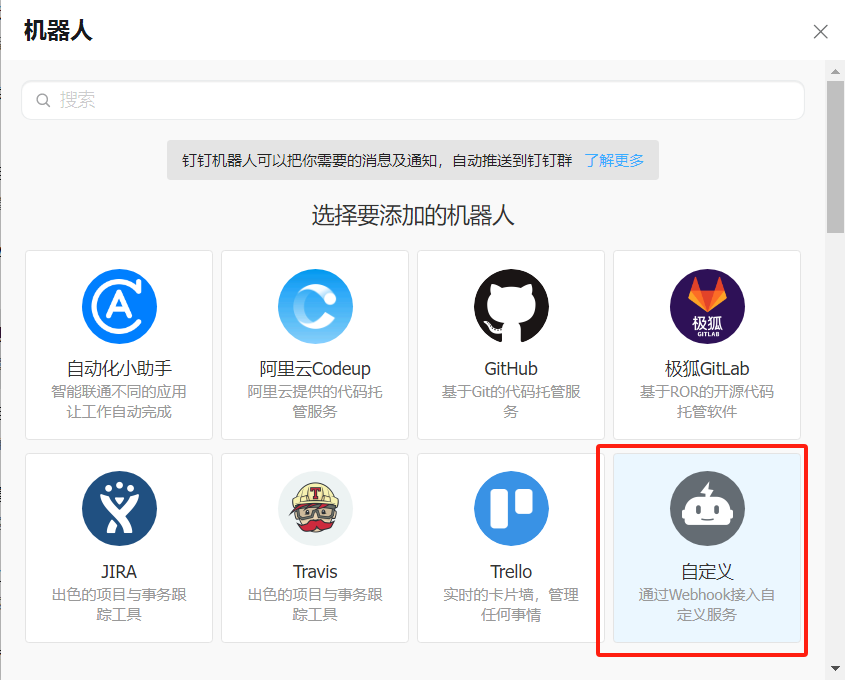

保存这个加签秘钥，之后会用到

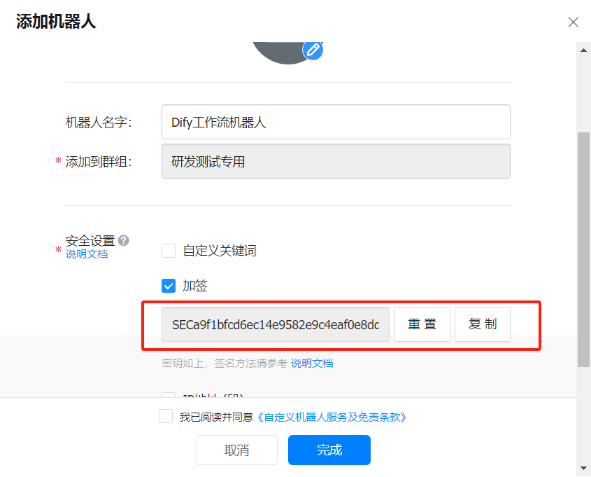

```
SEC8bf8c991ebaf99cdf04b25a1dd85f2730541e6e15ef33bf9666b6cee1922d08b

https://oapi.dingtalk.com/robot/send?access_token=c4aadb7ea5e30cab326c6f47a747a0eb3780e43d3d3addfac3cc09299d757910
```

保存下来这个 Webhook，后面也会用到

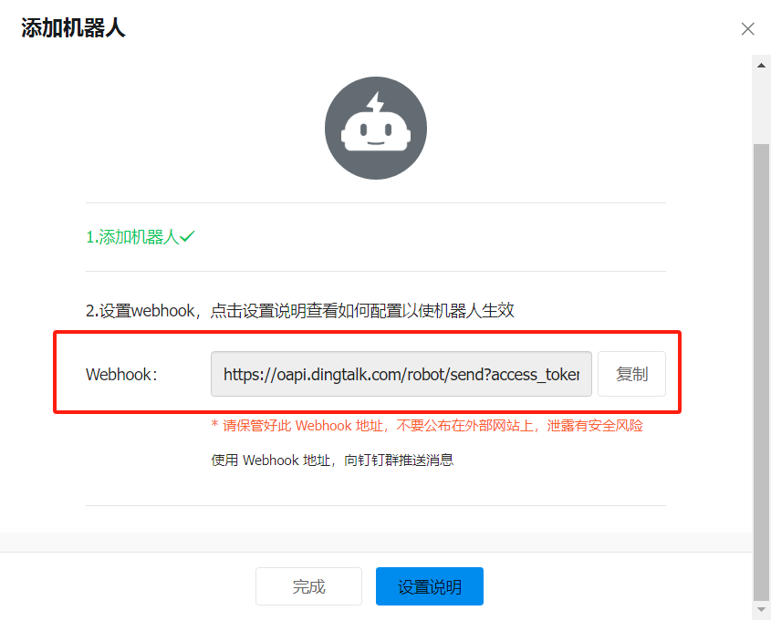

完成了创建。

之后在钉钉机器人工具中的`ACCESS TOKEN`中填入刚才复制的 Webhook 中的`access_token`的值，在`加签秘钥`中填入刚才保存的加签秘钥。

> **注意**：ACCES TOKEN 一定要填写 Webhook 中的**access_token**的值
>
> https ://oapi.dingtalk.com/robot/send?access_token=**89ab91b1ebf27b4t861650a4248e2e0b1226d4b3fd31d4dcec6b71a7f59ed0a4**

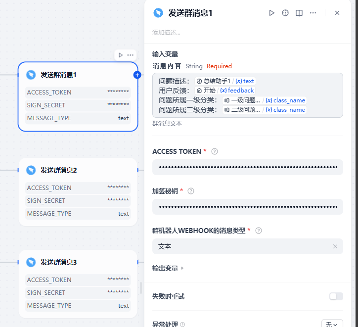

## 3、测试

点击运行，输入初始反馈信息，开始运行

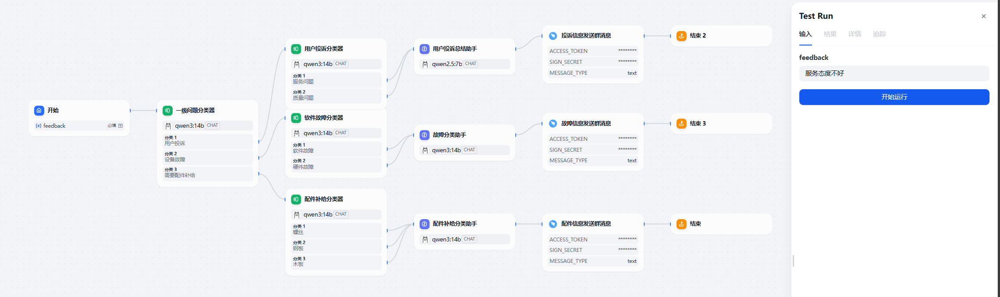

运行成功

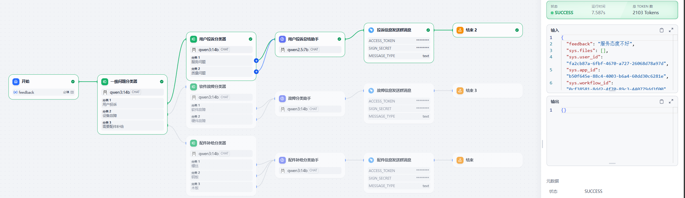

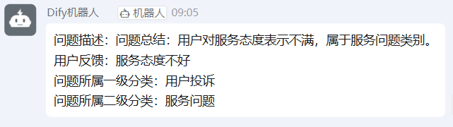
