# 7 - Dify 的 Windows 平台部署

---

## 1. Docker Desktop 安装

### 1.1 下载-安装包

官网：https://www.docker.com/

方式 1：选择版本下载：

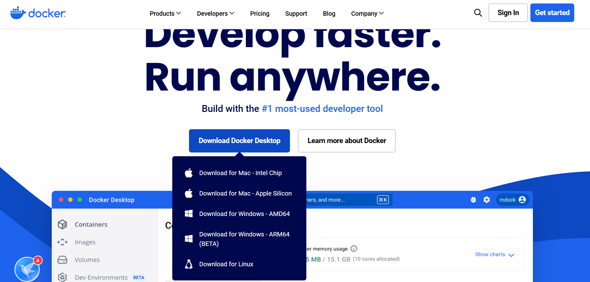

方式 2：从网盘资料里获取：

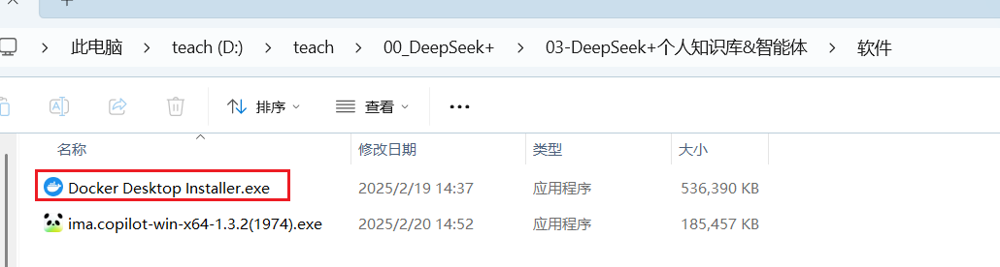

### 1.2 OK 即可

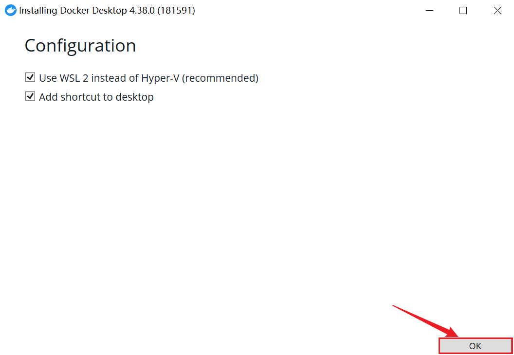

### 1.3 等待安装完成

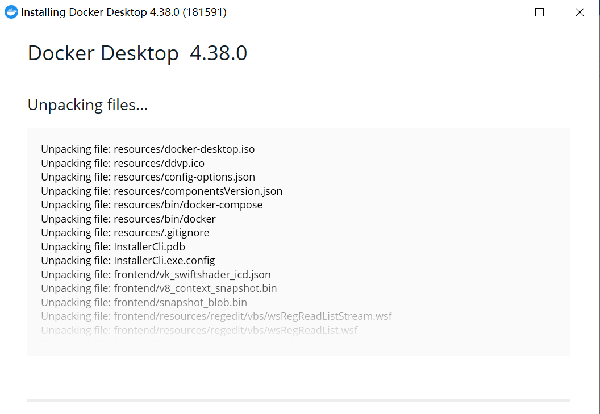

### 1.4 重启电脑

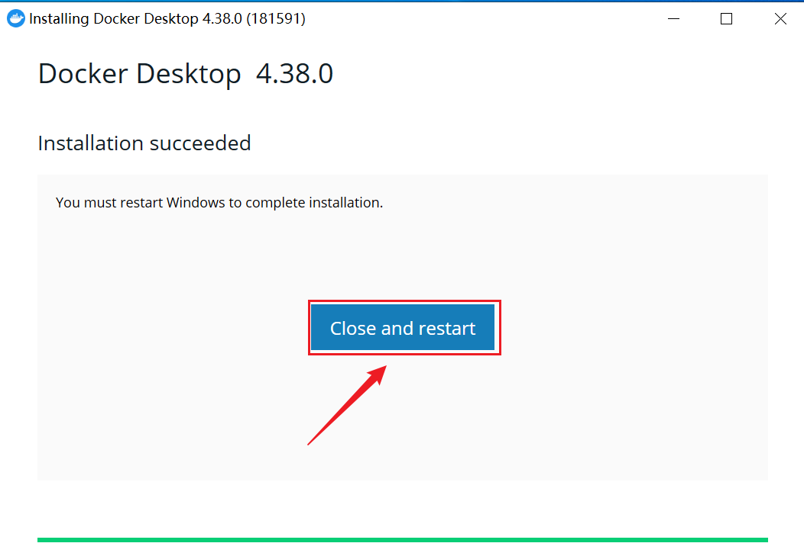

也可以关闭窗口，稍后自行重启。

### 1.5 接受服务协议

**重启后自动弹出**

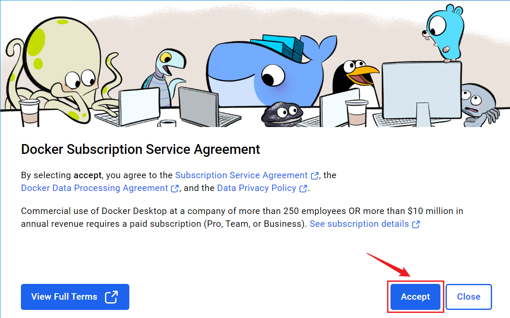

### 1.6 完成安装

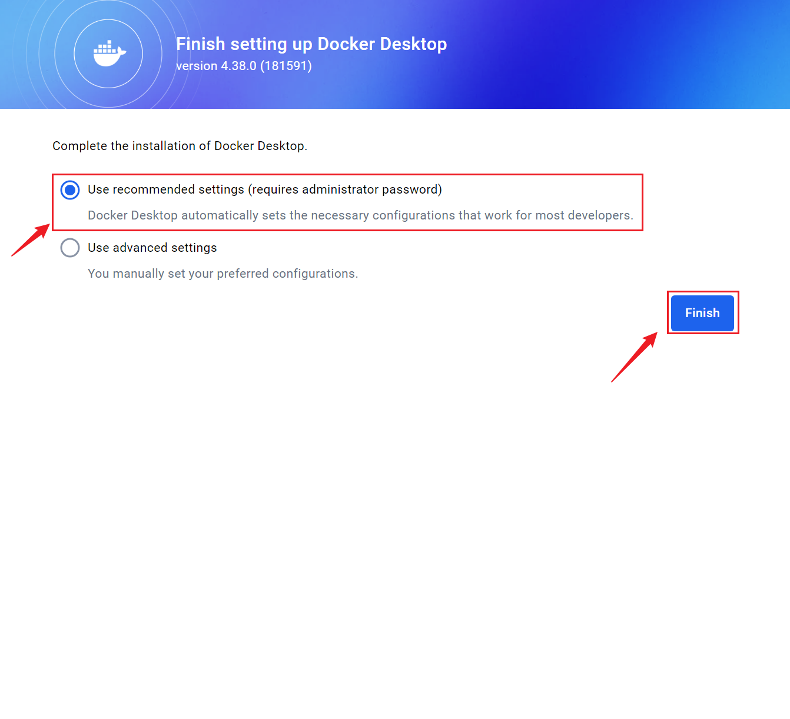

### 1.7 允许控制

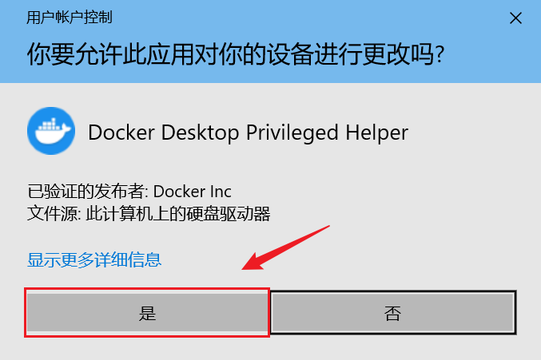

### 1.8 不登录使用

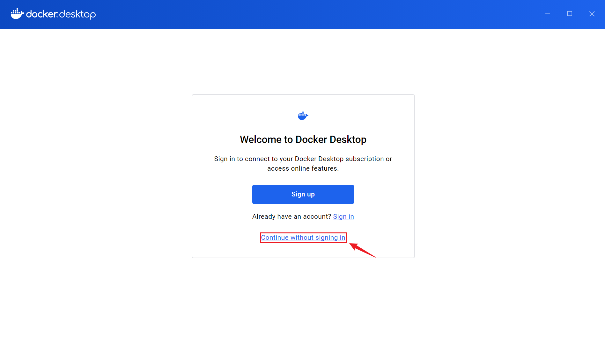

### 1.9 跳过

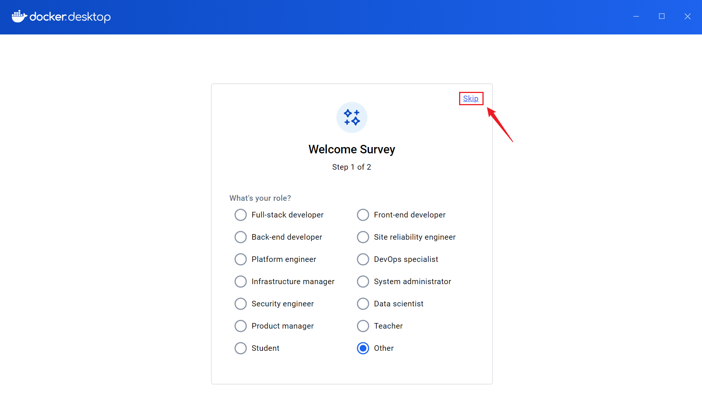

> 个别首次安装的小伙伴会被 Windows 系统提示需要安装`适用于Linux的Windows子系统`。这里选择确认安装。稍等片刻后会完成安装。

### 1.10 安装成功验证

通过 win+r 打开运行：输入 cmd

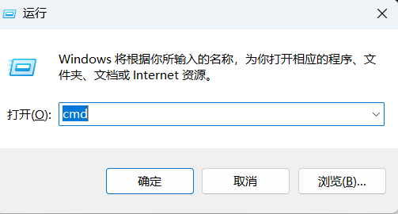

输入：docker。能显示如下内容即可成功

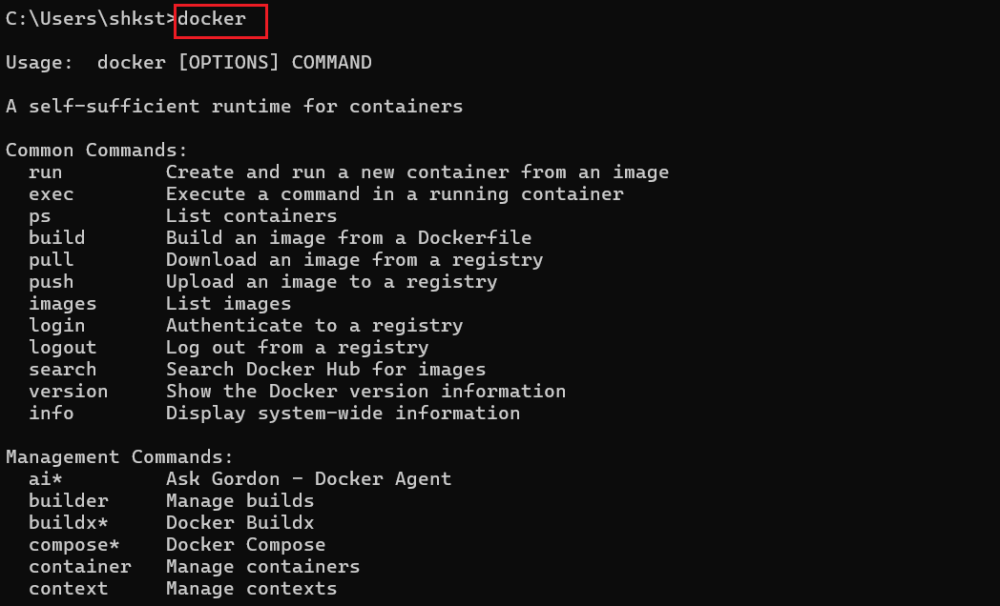

## 2. 部署 Dify

### 2.1 拉取 Dify 代码

github 地址：

> https://github.com/langgenius/Dify

或者从网盘资料中获取：

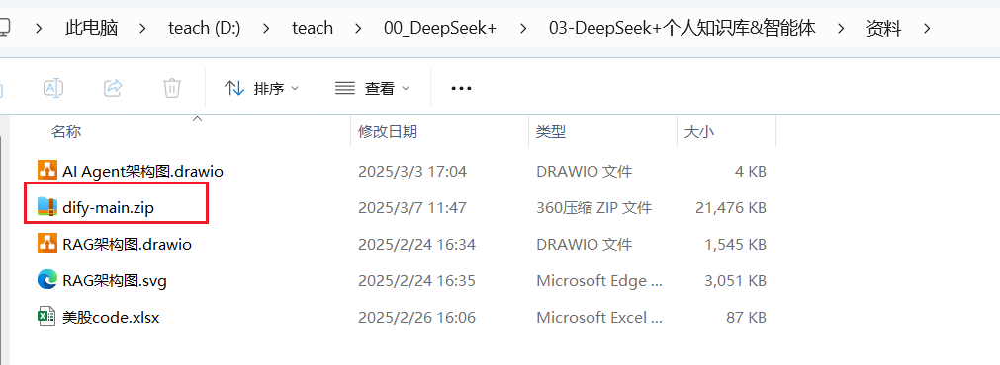

### 2.2 更改信息

> 下面的操作，在 Dify 官方文档中有。
>
> https://docs.Dify.ai/zh/self-host/quick-start/docker-compose
>
> 这里直接操作：

进入 Dify 仓库目录下的 Docker 目录

复制.env.example 为.env

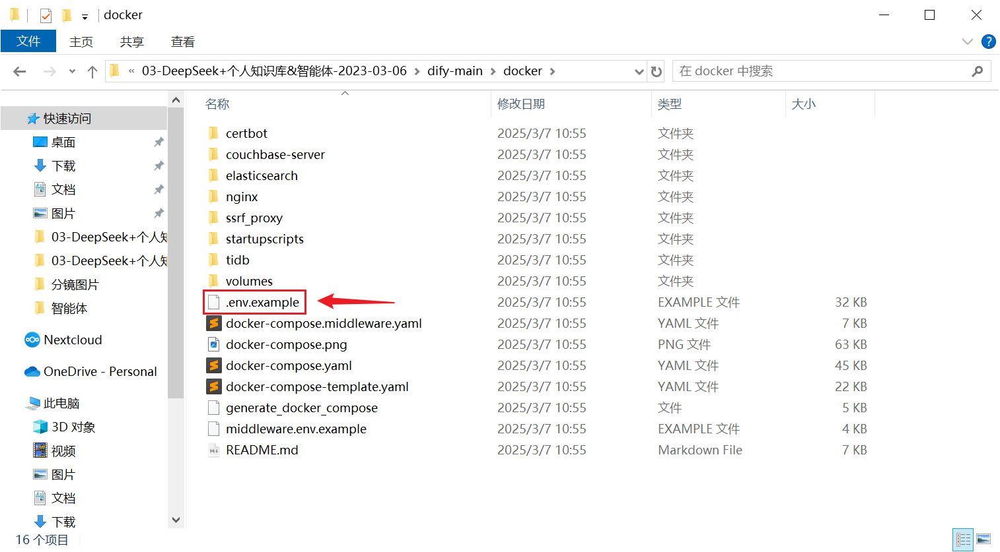

然后按需更改.env 文件的配置即可。

> 比如，修改端口号。默认端口号是 80。可以修改为 8100


### 2.3 打开终端

如下操作可以在 windows 的命令行窗口进行，或者在 Docker 客户终端中进行。

比如：在终端中进入 Docker 目录


### 2.4 安装

执行以下命令部署 Dify

> ```shell
> docker compose up -d
> ```

> 这里注意，大概率会由于网络问题或镜像缺失问题发生报错。可以再次输入命令重新执行。


安装完以后：


再次输入：docker compose up -d

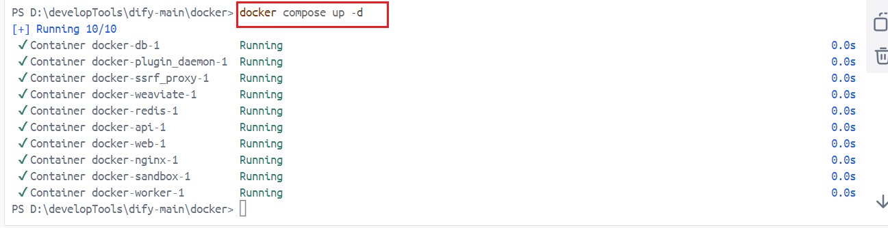

### 2.5 访问 Dify

浏览器访问 http://localhost （若修改过端口，例如改为 8100，则访问 http://localhost:8100 ） 即可。

首次访问需要设置用户名密码，略。

使用方式和官方提供的平台是一样的。

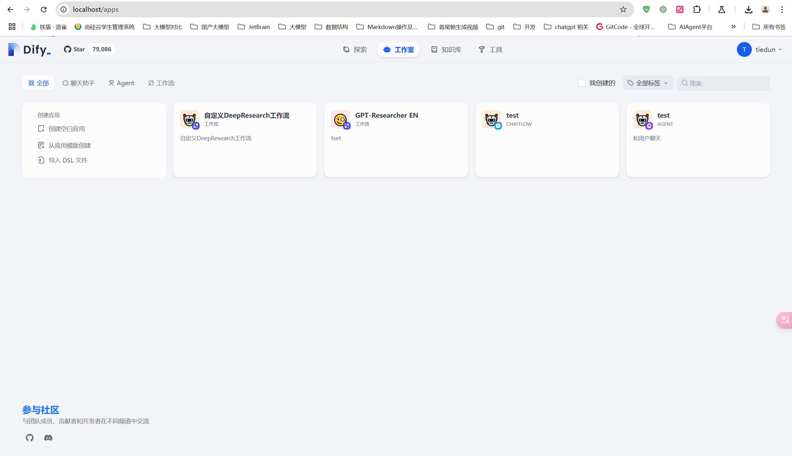
