# 9 - LangChain 概述与快速上手

---

**本章课程目标：**

- 理解 LangChain 的定位、能做什么，以及六大核心组件与版本架构。
- 完成从零到一的 HelloWorld：接入阿里百炼/通义、多模型共存、企业级封装与流式输出。
- 为后续学习 Model I/O、Ollama 本地部署、提示词与输出解析（第 10、11 章）打好基础。

**前置知识建议：** 具备 Python 基础（环境、包管理、基本语法）；对大模型与 API 调用有初步认识（可参考第 1 章「大模型智能体概述」）。

---

## 1、理论概述

### 1.1 什么是 LangChain

#### 1.1.1 LangChain 简介（Python 生态）

LangChain 是 2022 年 10 月底由哈佛大学的 Harrison Chase（哈里森·蔡斯）发起的、基于开源大语言模型的 **AI 工程开发框架**。

顾名思义，LangChain 中的 **「Lang」** 指大语言模型，**「Chain」** 即「链」——将大模型与数据源、工具、记忆等组件连接成链，借此构建完整的 AI 应用。LangChain 的发布比 ChatGPT 问世还要早约一个月，凭借先发优势迅速获得广泛关注与社区支持。

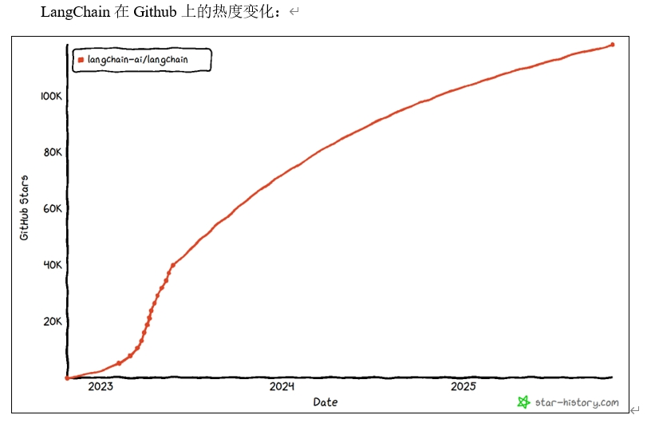

#### 1.1.2 LangChain4J

目前市场上多数 AI 框架（如 LangChain、PyTorch）以 Python 为主，Java 开发者在选型时常面临生态不足的问题。LangChain4J 即 **LangChain for Java**，面向 Spring/Java 生态，便于在现有 Java 项目中集成大模型与 RAG、Agent 等能力。

- **等价于**：LangChain for Java
- **视频教程**：https://www.bilibili.com/video/BV1mX3NzrEu6/

#### 1.1.3 开发方式对比（Before / After）

理解 LangChain 前后开发方式的差异，有助于建立「为什么要用框架」的直觉。

**Before（未使用 LangChain）**：直接调 API、手写拼接提示、自己管理上下文与工具调用，代码分散、难以复用。

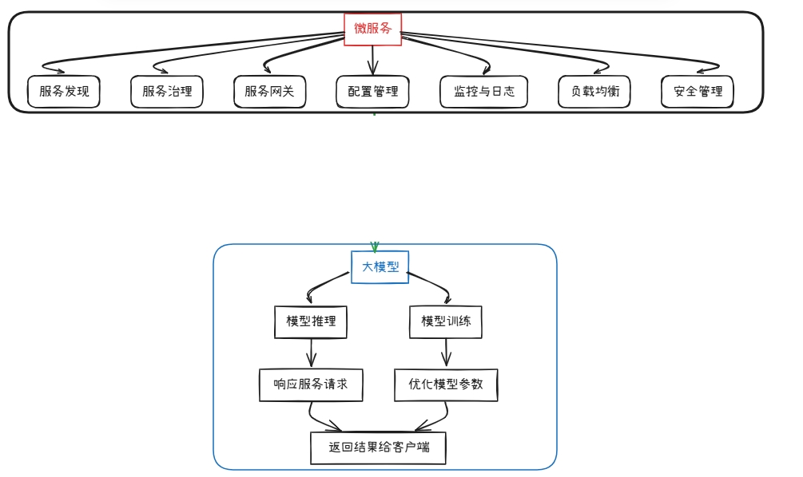

**After（使用 LangChain）**：通过 Chain、Agent、Memory 等抽象，用声明式方式组链、接入工具与记忆，开发效率与可维护性更高。

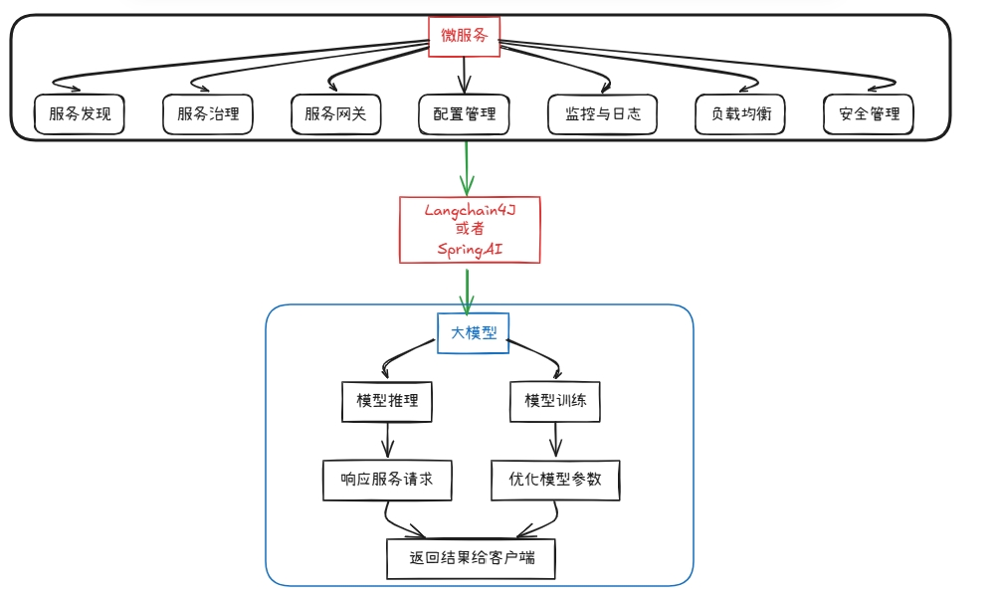

#### 1.1.4 一句话总结

**LangChain 是一套把大模型和外部世界（数据、工具、记忆等）连接起来的工具与代码框架。**

> **可以这么理解（含两处易混点）**
>
> - **类比**：LangChain 是 Python 里做「大模型应用」的**框架**，类似前端用 Vue 做页面——都是帮你把零散能力（组件/模型/知识库）按一定方式组织、串联起来。
> - **谁先调谁**：不是「先调 LangChain，再调 GPT」。而是：**你的代码调 LangChain**，LangChain 在需要时**替你去调 GPT、查知识库、调工具**。也就是说，LangChain 是**编排层**，决定什么时候调模型、什么时候查 RAG、怎么把结果拼起来。
> - **知识库在哪**：RAG 的**知识库（向量库）一般不在 LangChain 里**，而是在**单独的存储**（如 Pinecone、Chroma、Redis）。LangChain 提供「检索」等组件，去**连接、查询**这些外部知识库，把查到的内容塞进提示里再交给大模型。所以：**LangChain 连接知识库，并不「装着」知识库。**
> - **和「直接调 GPT」的区别**：
>   - **直接调大模型**：你的代码用 OpenAI SDK 或 HTTP 直接请求 GPT 等接口，自己拼提示词、自己解析返回、要做 RAG 就自己先查向量库再拼进 prompt。
>   - **改用 LangChain**：你的代码改为调 **LangChain 的接口**（例如 `chain.invoke(...)`、`init_chat_model` 得到的 model），由 LangChain 在内部去调 GPT、查知识库、拼提示、解析结果。所以可以理解为：**从「直接调大模型接口」变成「调 LangChain 的接口，由 LangChain 再去调大模型（以及知识库、工具等）」**。注意：GPT 仍然会被调用，只是改成**由 LangChain 去调**，而不是你手写每次请求；换模型、加 RAG、加工具时，你主要改 LangChain 的配置与链，而不是重写一堆拼 prompt、调 API 的代码。

---

### 1.2 LangChain 能做什么

#### 1.2.1 大模型应用开发分类

下图把大模型相关方向按「从底到顶」分成了三层：

- **基础通用大模型**：如 GPT、通义、文心、DeepSeek 等，偏模型研发与预训练。
- **行业垂直大模型**：在通用模型基础上做领域微调或专用优化（金融、医疗、法律等），偏模型训练/微调与行业落地。
- **超级个体 + 智能体**：基于上述模型，用 RAG、Agent、工作流等做成每个人、每个场景可用的应用，偏 **应用开发**。

和常见的分工方式对应起来就是：做「基础/行业模型」更多涉及 **模型训练与微调**；做「超级个体 + 智能体」对应 **应用开发（RAG、Agent、工作流等）**；再往外还有 **平台与运维**（云、算力、监控等）。**LangChain 主要服务于最上面这一层——在「超级个体 + 智能体」里做应用开发与集成**，调用下层的基础或行业模型，而不是去做模型训练本身。

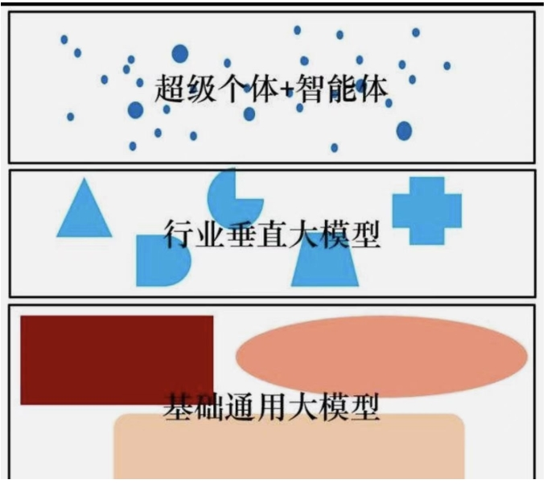

> **说明**：上图自上而下为 **超级个体 + 智能体**、**行业垂直大模型**、**基础通用大模型** 三层。LangChain 的定位在「超级个体 + 智能体」这一层：用链、智能体、检索等组件把下层模型接起来，做成可用的应用。

#### 1.2.2 岗位与招聘对标

在 Boss 直聘等招聘平台上，许多「大模型应用开发」「LLM 应用工程师」「RAG/Agent 开发」等岗位会要求熟悉 LangChain 或类似框架，可作为学习方向与简历关键词的参考。

#### 1.2.3 应用分层：一套四层结构，两幅图两个角度

下面**两幅图说的其实是同一件事**：一个大模型应用可以拆成**四层**（从用户到数据）。之所以放两张图，是因为：

- **图 1**：强调**谁调用谁**、数据怎么流动（请求从上往下传，结果从下往上返回）。
- **图 2**：还是这四层，但标出了**每层常见的技术/产品名**（如 LangChain、OpenAI、Pinecone），方便你以后在别的文章里看到这些英文时能对上号。

**先看结构，再看一张表对号入座即可。**

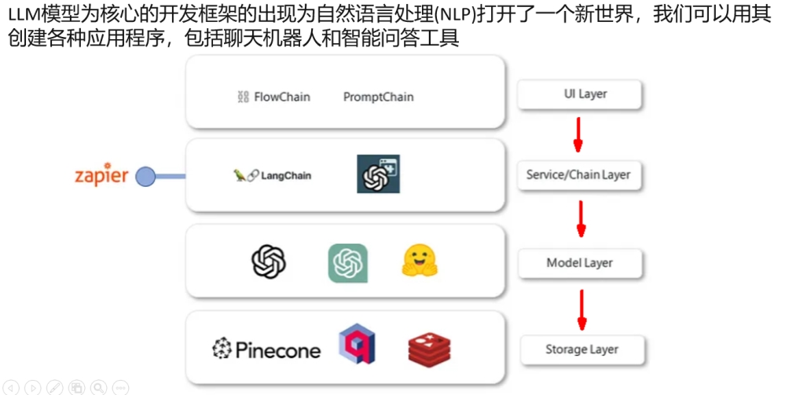

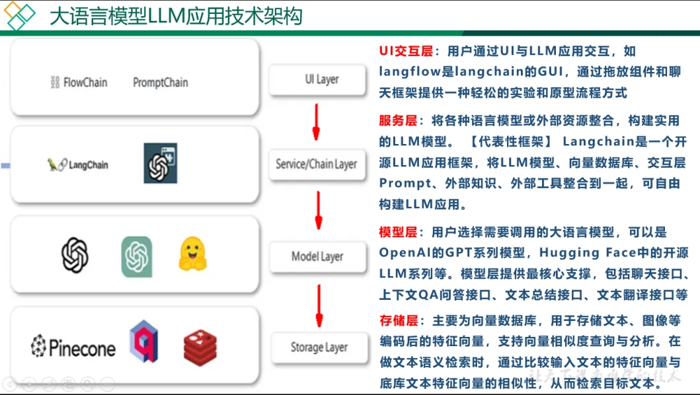

**一张表说清四层（图 1、图 2 都适用）：**

| 层级            | 这层干什么（一句话）                                        | 图 2 里常见的英文/产品        | LangChain 在哪                                       |
| --------------- | ----------------------------------------------------------- | ----------------------------- | ---------------------------------------------------- |
| **用户界面层**  | 用户输入问题、发指令（网页/App/聊天窗口），请求交给下一层   | FlowChain、PromptChain 等     | 不在这层，在下一层                                   |
| **服务 / 链层** | 编排与业务逻辑：理解意图、查库/调工具、拼提示词，再交给模型 | **LangChain**、OpenAI API     | **主要在这一层**：用 LangChain 做链、Agent、RAG 编排 |
| **模型层**      | 大模型做理解、推理、生成；需要时向存储层要数据              | OpenAI GPT、DALL·E、通用 LLM  | 通过这一层**调用**模型，不「包含」模型本身           |
| **存储层**      | 存知识库、向量库、对话记忆等，供上面检索                    | Pinecone、Vector Store、Redis | 需要时**访问**这层（如 RAG 查向量库）                |

**数据流（图 1 的箭头）**：请求 **自上而下**（用户 → 服务/链 → 模型 → 存储），结果 **自下而上**（存储 → 模型 → 服务/链 → 用户）。  
**记住一点**：**LangChain 主要在「服务/链层」**，负责把上面的界面、下面的模型和存储串起来。

---

### 1.3 学习建议与总体架构

建立「是什么、能做什么」的印象后，下面说明**怎么学更高效**、LangChain **长什么样**（版本与六大组件）。入门阶段重点看 **1.3.3 六大核心组件**，其余了解即可。

#### 1.3.1 学习时机与生态

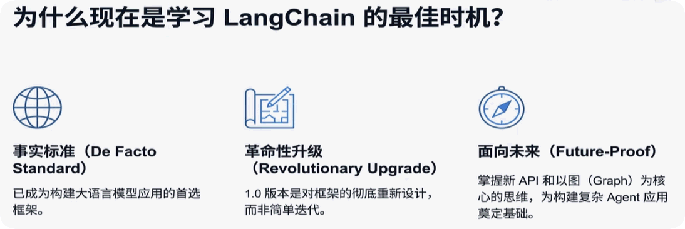

- **生态成熟**：常用工具（如 Google Search、Wikipedia、Notion、Gmail 等）和常用技术（RAG、ReAct、MapReduce 等）在 LangChain 中都有现成集成或模板。
- **定位清晰**：可类比为 AI 应用开发界的 **Spring** 或 **React**——体量大、有历史包袱，但上手快、资料多，是当前最实用的选择之一。

**学习建议：**

- 不必追求「学完所有 API」，重点搞懂 **六大核心模块** 的逻辑与用法。
- **用到什么查什么**，把 LangChain 当成 **工具箱** 而不是教科书。

#### 1.3.2 版本演进与总体架构

以下版本演进**了解即可**，当前以 **1.0** 为主，不必死记。

**V0.1 版本**：早期以「链」为主的设计，强调顺序调用与组合。

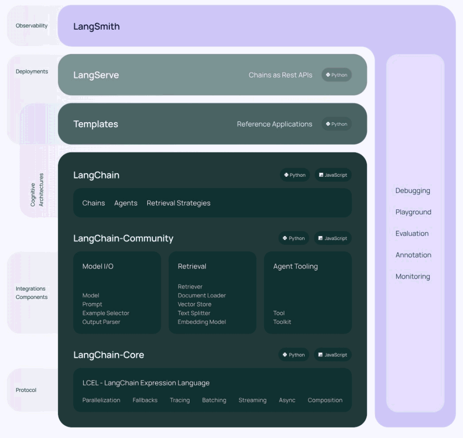

**V0.2 / V0.3 版本**：引入更清晰的层次——架构层、组件层、部署层。

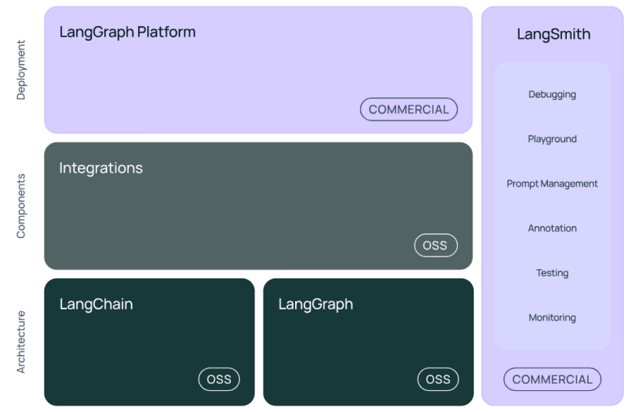

> **说明**：上图将 LangChain 生态分为三层——**架构（Architecture）**、**组件（Components）**、**部署（Deployment）**。
>
> - **最底层（架构）**：LangChain + LangGraph，均开源。LangChain 负责链式编排与基础抽象，LangGraph 提供图结构、循环与多步推理。
> - **中间层（组件）**：Integrations 等与外部 API、数据库、第三方模型的集成。
> - **最顶层（部署）**：LangGraph Cloud（云部署）、LangSmith（调试、测试、监控、提示管理等商业化能力）。

**LangChain 1.0：轻核心 + 模块化**

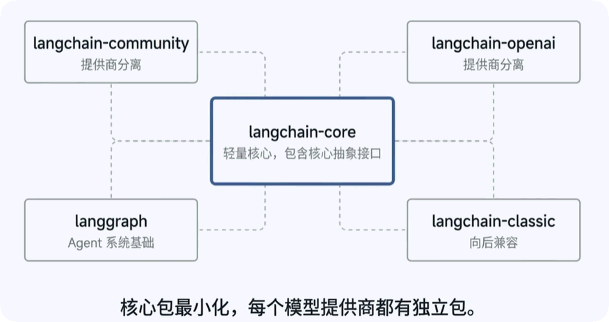

| 模块                    | 作用                                                                               |
| ----------------------- | ---------------------------------------------------------------------------------- |
| **langchain-core**      | 基础抽象与 LCEL（LangChain 表达式语言），以及 Chains、Agents、Retrieval 等核心概念 |
| **langchain-community** | 社区与第三方集成，如 langchain-openai、langchain-anthropic 等                      |
| **LangGraph**           | 在 LangChain 之上提供「图」编排，可协调多 Chain、Agent、Tools，支持循环与复杂流程  |

#### 1.3.3 六大核心组件（重点）

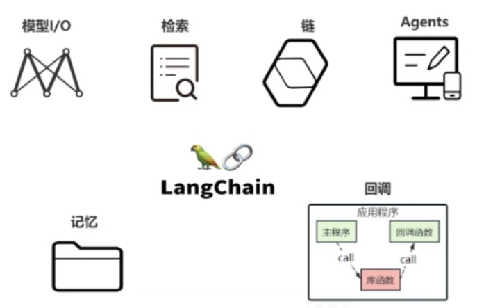

> **说明**：上图对应 LangChain 的六大核心——**Models、Memory、Retrieval、Chains、Agents、Callback**。各组件之间 **耦合松散**，无固定调用顺序，开发者可按业务自由组合。

- **Models（模型）**：对接各类 LLM、Chat、Embedding 等。
- **Memory（记忆）**：对话历史、会话状态、长期记忆等。
- **Retrieval（检索）**：与向量库、知识库集成，支撑 RAG。
- **Chains（链）**：将多步逻辑串成链，实现固定流程。
- **Agents（智能体）**：根据任务选择工具、规划步骤、执行动作。
- **Callback（回调）**：日志、监控、调试等可观测性。

**本节小结**：先建立「六大组件 + 分层架构」的整体图景，具体 API 在后续章节按需查阅即可。


更多 API 与模块可参考：https://reference.langchain.com/python/langchain/langchain/

---

### 1.4 官方文档与资源

需要查 **API、最新文档或版本说明** 时，可参考下表。初次阅读可先跳过，动手写代码时再回看。

| 类型             | 地址                                                        |
| ---------------- | ----------------------------------------------------------- |
| **官网（中文）** | https://docs.langchain.org.cn/oss/python/langchain/overview |
| **官网（英文）** | https://docs.langchain.com/oss/python/langchain/overview    |
| **GitHub**       | https://github.com/langchain-ai                             |
| **API 文档**     | https://reference.langchain.com/python/langchain/           |

---

### 1.5 常见问题与使用注意

LangChain 虽是当前主流框架，但也有一些公认的槽点，学习时需有心理预期：

1. **文档与版本不同步**：项目迭代快，文档中的示例在最新版本中可能已更名或删除，对新手不友好。
2. **抽象层次多**：为兼容多种模型与数据源，封装较深，简单需求有时要钻好几层调用，容易产生「LangChain 很慢」的错觉——往往是 **理解与调试成本高**，而非运行时性能差。
3. **版本兼容性**：升级后旧代码可能跑不通，建议锁定版本或跟随课程/项目所用版本学习。

下面两图分别展示了 **ChatModel** 与 **Agent** 在文档/实现上的复杂度，读文档时注意对应你当前使用的版本。


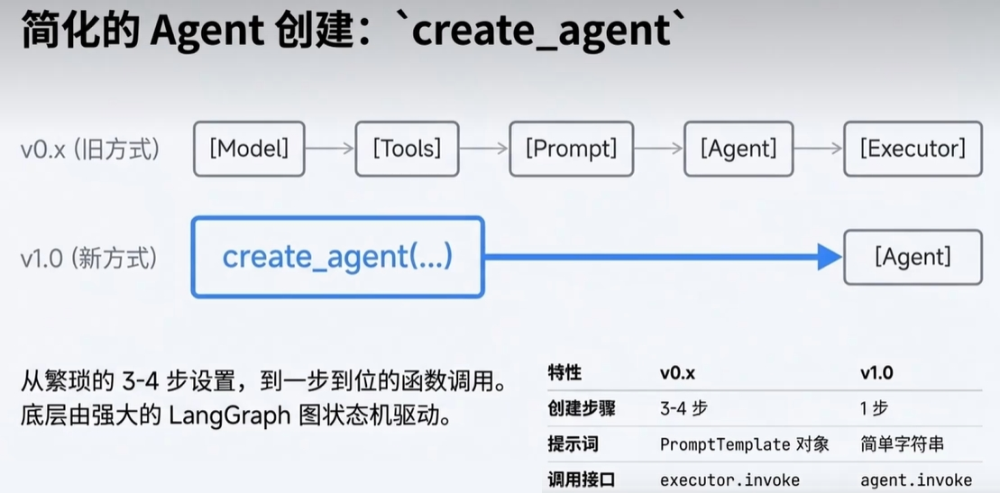

类似地，其他模块（Chains、Retrieval、Memory 等）也常有 API 或命名调整，**以官方文档与当前版本为准**。

---

### 1.6 延伸：LangChain 1.0 与未来展望

LangChain 正在从「代码库」走向「AI 开发操作系统」：不单是库，还包含 LangSmith、LangGraph Cloud 等开发与部署能力。

- 随着大模型上下文能力增强（如超长上下文），简单 RAG 的切片与检索策略可能简化，但 **Agent（规划、工具调用、多步任务）** 会越来越重要。
- 未来的 AI 应用更偏向 **「一句话完成复杂任务」**（例如：「帮我写个小游戏并发布到 App Store」），涉及代码、测试、上传等多步。LangChain 正是在为这类 **多步、可编排、可观测** 的应用打地基。

---

## 2、从 HelloWorld 上手

### 2.1 环境与约定

#### 2.1.1 支持的模型与课程选用

LangChain 通过各厂商的集成包支持多种大模型，官方文档有完整列表：

- https://docs.langchain.com/oss/python/integrations/providers/overview#popular-providers

本课程以 **阿里云百炼（通义千问）** 为主，辅以 **DeepSeek** 与 **OpenRouter**；通过统一配置规则，也适用于其他兼容 OpenAI 协议的模型，便于举一反三。

#### 2.1.2 环境与版本约定

实操前建议先确认：**Python 3.8+**、已创建虚拟环境（如 `venv` 或 `conda`）。下面三张图分别对应课程约定，可对照表格查阅：

| 图片            | 内容说明                                                     |
| --------------- | ------------------------------------------------------------ |
| 图 1（9-2-1-1） | 本课程主要使用的模型与平台（如通义、DeepSeek、OpenRouter）。 |
| 图 2（9-2-1-2） | 版本选择：LangChain 0.x 与 1.0 的选用建议。                  |

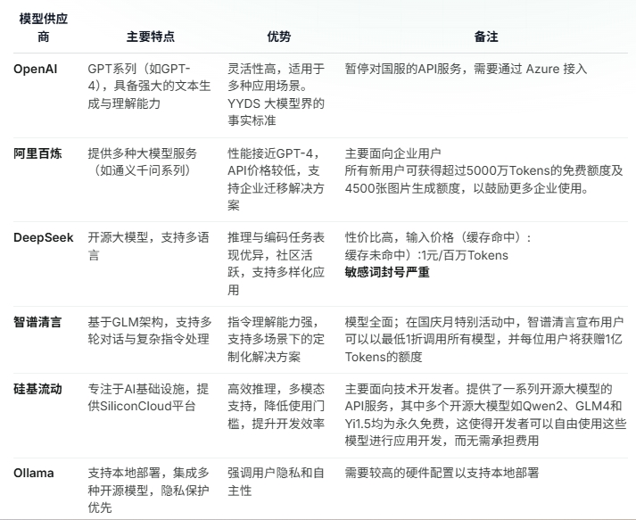

#### 2.1.3 配置原则

所有调用均基于 **OpenAI 协议** 或各模型官方推荐的兼容方式，保证接口统一，便于在多模型之间切换与扩展。

#### 2.1.4 0.x 与 1.0 版本对比

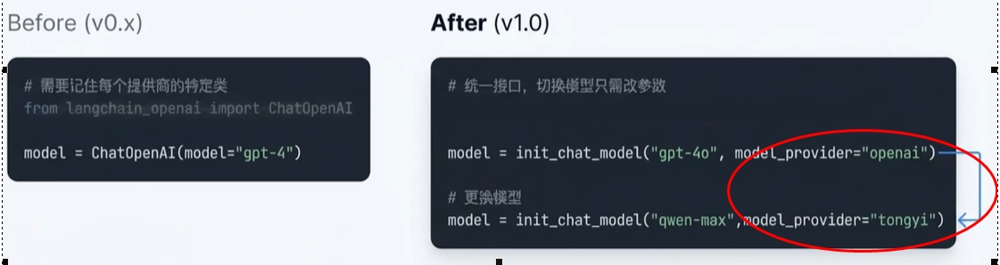

- **1.0 重要变化**：推荐使用 **`init_chat_model`** 作为统一的聊天模型入口，减少对不同厂商包的强依赖。

---

### 2.2 大模型服务平台

LangChain 不提供模型本身，需要配合 **第三方大模型服务平台**：注册、充值、创建 API Key 后，用 **API Key + Base URL** 调用对应模型。

| 平台           | 入口                                           | 说明                                               |
| -------------- | ---------------------------------------------- | -------------------------------------------------- |
| **CloseAI**    | https://platform.closeai-asia.com/             | API-Key：开发者 → API；文档与模型见官网            |
| **OpenRouter** | https://openrouter.ai/                         | 多模型聚合；Key：Settings → Keys；文档与模型见官网 |
| **阿里云百炼** | https://bailian.console.aliyun.com/            | 通义系列；API-Key、文档、模型均在控制台            |
| **百度千帆**   | https://console.bce.baidu.com/qianfan/overview | 文心等；API-Key、文档、模型见千帆控制台            |
| **硅基流动**   | https://www.siliconflow.cn/                    | API-Key：账号 → AK；文档与模型见官网               |

---

### 2.3 安装依赖（Python + LangChain）

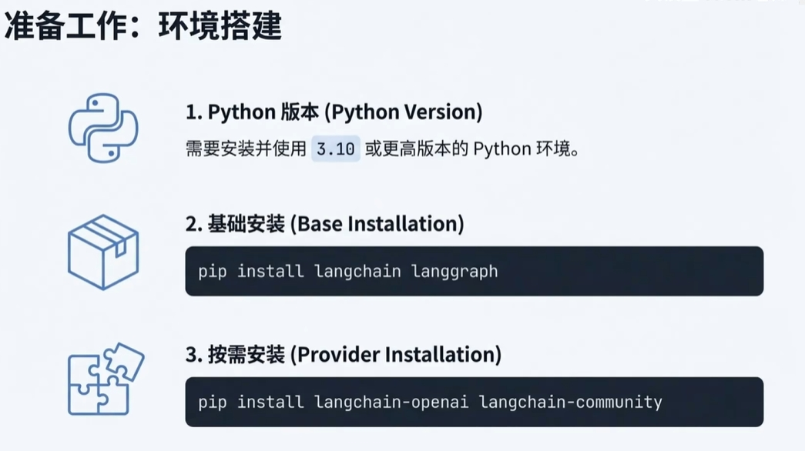

**建议**：若希望 pip 默认使用国内源，可先执行：

```bash
pip config set global.index-url https://pypi.tuna.tsinghua.edu.cn/simple
```

**安装命令示例**：

```bash
# 核心框架（Chain、Agent、Memory、Retriever 等）
pip install langchain -i https://pypi.tuna.tsinghua.edu.cn/simple

# OpenAI 兼容组件（LLM、Chat、Embeddings 等），依赖 openai SDK
pip install langchain-openai -i https://pypi.tuna.tsinghua.edu.cn/simple
pip install openai -i https://pypi.tuna.tsinghua.edu.cn/simple

# 从 .env 加载环境变量
pip install python-dotenv -i https://pypi.tuna.tsinghua.edu.cn/simple

# 核心抽象与类型
pip install langchain-core
```

> **安全提示**：请将 API Key 写在项目根目录的 **`.env`** 文件中（例如：`QWEN_API_KEY=sk-xxx`），不要写进代码或提交到版本库。使用 `python-dotenv` 的 `load_dotenv()` 可在代码中自动加载这些环境变量。

---

### 2.4 案例一：基于阿里百炼的 HelloWorld

#### 2.4.1 百炼平台入口与准备

- **官网**：https://bailian.console.aliyun.com/
- **步骤概览**：① 注册/登录阿里云 → ② 在百炼控制台创建 API Key → ③ 在模型广场确认模型名（如 `qwen-plus`）→ ④ 获取 OpenAI 兼容的 Base URL → ⑤ 在本地用 LangChain 写代码调用。

#### 2.4.2 调用三件套：API Key、模型名、Base URL

**① 获得 API Key**

在百炼控制台「API-KEY 管理」中创建并复制 Key（形如 `sk-xxx`）。

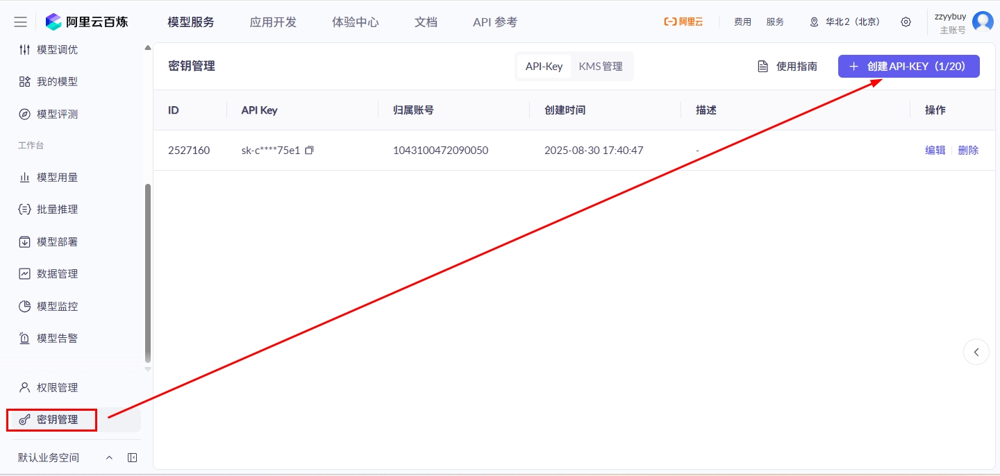

**② 获得模型名**

在模型广场或文档中确认要调用的模型标识，例如 `qwen-plus`、`qwen3-max` 等。

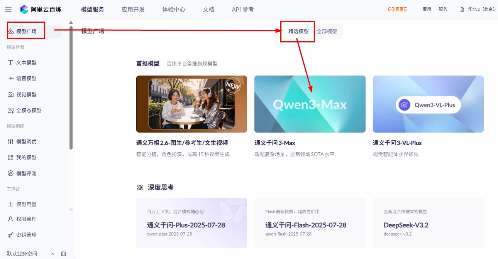

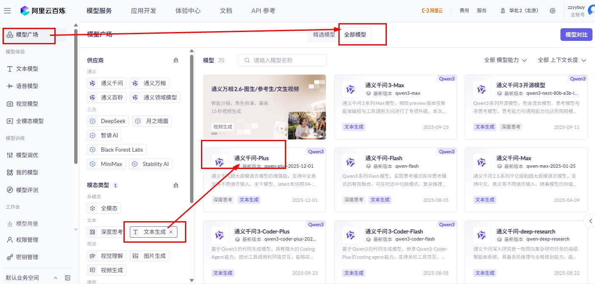

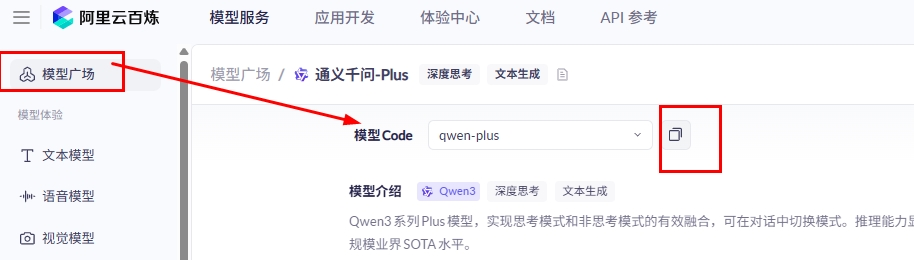

**③ 获得 Base URL（开发地址）**

使用 SDK 调用时需配置兼容 OpenAI 的接口地址，例如：

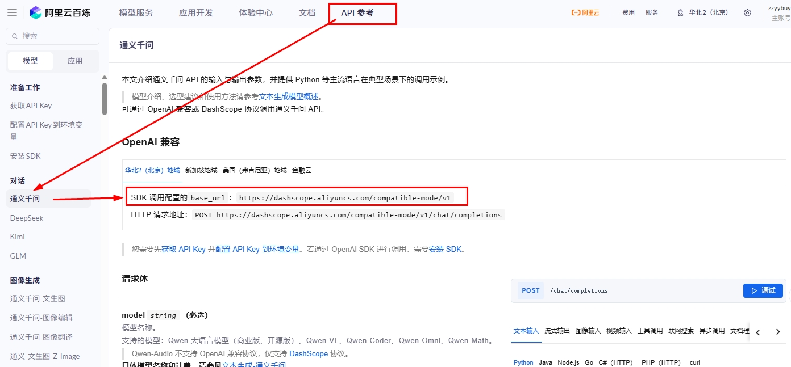

**本节小结**

| 项目         | 示例/说明                                           |
| ------------ | --------------------------------------------------- |
| **API Key**  | `sk-xxx`（在控制台创建）                            |
| **模型名**   | 如 `qwen-plus`、`qwen3-max`                         |
| **Base URL** | `https://dashscope.aliyuncs.com/compatible-mode/v1` |

#### 2.4.3 示例代码（0.3 与 1.0 两种写法）

**方式一：LangChain 0.3（了解即可，目前仍在使用）**

```python
# LangChain 0.3 使用方式
from langchain_openai import ChatOpenAI
import os
from dotenv import load_dotenv

# 推荐：用 .env 管理密钥，避免硬编码
load_dotenv(encoding='utf-8')

llm = ChatOpenAI(
    model="deepseek-v3.2",
    api_key=os.getenv("QWEN_API_KEY"),
    base_url="https://dashscope.aliyuncs.com/compatible-mode/v1"
)

response = llm.invoke("你是谁")
print(response)
print(response.content)
```

**方式二：LangChain 1.0+（推荐）**

```python
# LangChain 1.0+ 使用方式
import os
from dotenv import load_dotenv
from langchain.chat_models import init_chat_model

load_dotenv(encoding='utf-8')

model = init_chat_model(
    model="qwen-plus",
    model_provider="openai",
    api_key=os.getenv("aliQwen-api"),
    base_url="https://dashscope.aliyuncs.com/compatible-mode/v1"
)

print(model.invoke("你是谁").content)

# 若报错 Unable to infer model provider，需显式指定 model_provider="openai"
```

**两版对比小结**：1.0 通过 `init_chat_model` 统一入口，便于切换不同厂商与模型。

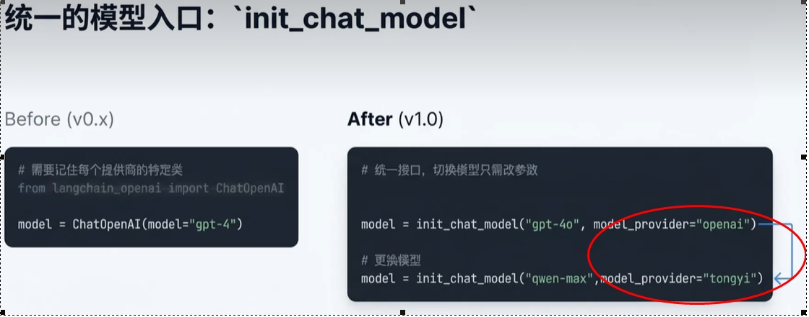

---

### 2.5 进阶：多模型共存需求

实际项目中常需要 **同一系统内接入多种大模型**（如通义 + DeepSeek），下一节的 HelloWorld V2 将演示在同一脚本中初始化并调用多个模型。

---

### 2.6 案例二：多模型共存（通义 + DeepSeek）

#### 2.6.1 DeepSeek 平台与三件套

- 使用说明：https://platform.deepseek.com/usage
- API 文档：https://api-docs.deepseek.com/zh-cn/

**三件套**：API Key、模型名、Base URL。

- **① 获得 API Key**：在 DeepSeek 平台创建并复制。

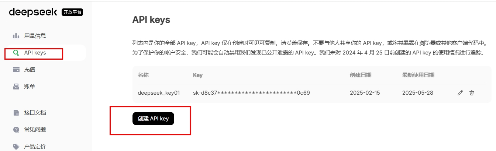

- **② 获得模型名**：如 `deepseek-chat`（非思考模式）、`deepseek-reasoner`（思考模式）。

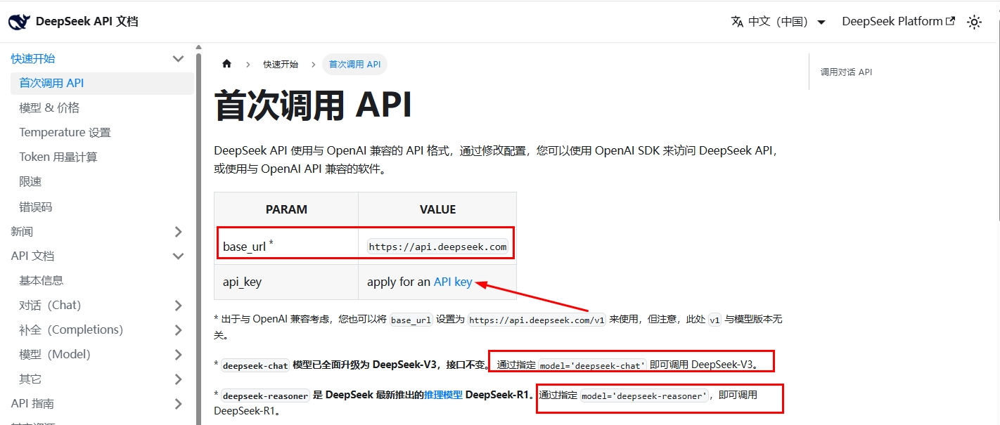

- **③ Base URL**：一般为 `https://api.deepseek.com`（以官方文档为准）。

**备注**：`deepseek-chat` 对应 DeepSeek-V3.2 的普通模式；`deepseek-reasoner` 对应思考/推理模式。

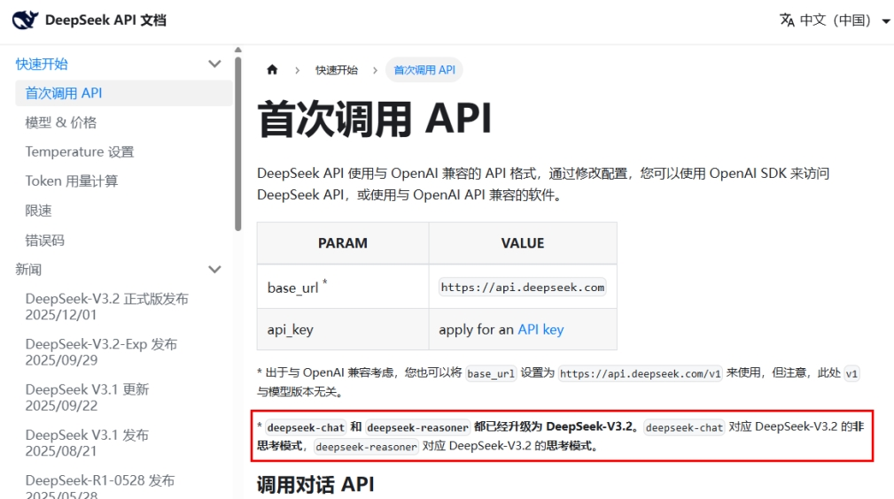

#### 2.6.2 多模型共存示例代码

下面示例使用 **不同变量名**（`model_qwen`、`model_deepseek`）保存两个模型实例，避免后者覆盖前者，便于后续扩展与维护。

```python
# LangChain 1.0+ 多模型共存（推荐用不同变量名区分）
from dotenv import load_dotenv
from langchain.chat_models import init_chat_model
import os

load_dotenv()

# 通义
model_qwen = init_chat_model(
    model="qwen-plus",
    model_provider="openai",
    api_key=os.getenv("QWEN_API_KEY"),
    base_url="https://dashscope.aliyuncs.com/compatible-mode/v1"
)
print(model_qwen.invoke("你是谁").content)

print("*" * 70)

# DeepSeek
model_deepseek = init_chat_model(
    model="deepseek-chat",
    api_key=os.getenv("deepseek-api"),
    base_url="https://api.deepseek.com"
)
print(model_deepseek.invoke("你是谁").content)
```

---

### 2.7 企业级封装与流式输出

#### 2.7.1 流式输出说明

通过 `stream()` 可逐 token 返回结果，适合长文本或实时展示。

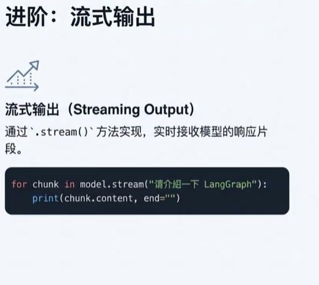

#### 2.7.2 企业级示例代码（封装、异常、流式）

下面示例将 LLM 初始化封装成函数、做环境变量校验、使用日志与异常处理，并演示流式调用。

```python
# 企业级示例：封装、异常处理、流式输出
from langchain_openai import ChatOpenAI
import os
from dotenv import load_dotenv
from langchain_core.exceptions import LangChainException
import logging

load_dotenv(encoding='utf-8')
logging.basicConfig(level=logging.INFO, format='%(asctime)s - %(levelname)s - %(message)s')
logger = logging.getLogger(__name__)


def init_llm_client() -> ChatOpenAI:
    """初始化 LLM 客户端，环境变量未配置时抛出 ValueError。"""
    api_key = os.getenv("QWEN_API_KEY")
    if not api_key:
        raise ValueError("环境变量 QWEN_API_KEY 未配置，请检查 .env 文件")

    return ChatOpenAI(
        model="deepseek-v3.2",
        api_key=api_key,
        base_url="https://dashscope.aliyuncs.com/compatible-mode/v1",
        temperature=0.7,
        max_tokens=2048,
    )


def main():
    try:
        llm = init_llm_client()
        logger.info("LLM 客户端初始化成功")

        question = "你是谁"
        response = llm.invoke(question)
        logger.info(f"问题：{question}")
        logger.info(f"回答：{response.content}")

        print("==================== 以下是流式输出 ====================")
        for chunk in llm.stream("介绍下 LangChain，300 字以内"):
            print(chunk.content, end="")

    except ValueError as e:
        logger.error(f"配置错误：{e}")
    except LangChainException as e:
        logger.error(f"模型调用失败：{e}")
    except Exception as e:
        logger.error(f"未知错误：{e}")


if __name__ == "__main__":
    main()
```

---

### 2.8 延伸：从 Chain 到 LangGraph

后续课程会深入 **LangGraph**：核心理念是从「链式」到「图状」——支持分支、循环、多 Agent 协作，更适合复杂对话与工作流。

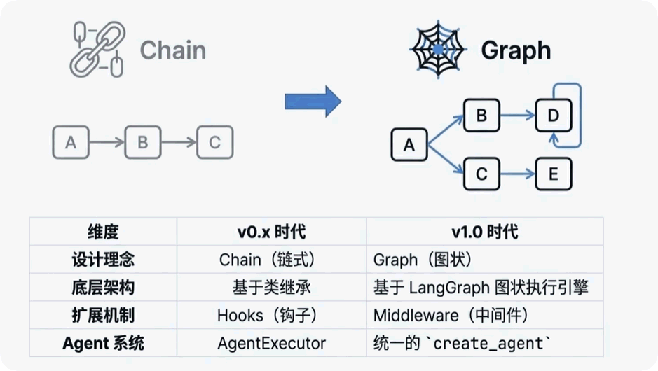

> **说明**：上图示意从单链顺序执行，演进到带状态、可分支、可循环的图结构，为后续学习 LangGraph 做铺垫。

---

## 本章小结与下一步

**本章小结：**

- **第 1 部分**：明确了 LangChain 是什么（连接大模型与外部世界的框架）、能做什么（应用开发层：RAG、Agent、链等），以及六大组件、版本架构与学习建议；并了解了文档与版本上的常见坑。
- **第 2 部分**：从环境与平台准备，到单模型 HelloWorld（0.3 / 1.0 两种写法）、多模型共存、企业级封装与流式输出，完成「从入门到能用」的闭环。

**下一步学习建议：**

| 章节         | 内容                           | 建议                                                                                                                                            |
| ------------ | ------------------------------ | ----------------------------------------------------------------------------------------------------------------------------------------------- |
| **第 10 章** | Model I/O 与 Ollama 本地部署   | 深入 Model I/O 三件套（Prompt、Model、Parser）及多平台接入；学习用 Ollama 在本地跑模型并与 LangChain 整合。                                     |
| **第 11 章** | 提示词与输出解析               | 系统学习 PromptTemplate、ChatPromptTemplate、多角色消息，以及 Output Parser（StrOutputParser、JsonOutputParser 等），让输入输出更可控、可复用。 |
| **后续课程** | Chains、Agents、RAG、LangGraph | 在掌握 Model I/O 与提示词基础上，进一步学习链式编排、智能体与工具调用、检索增强生成与图编排，向「从精通到实战」进阶。                           |
